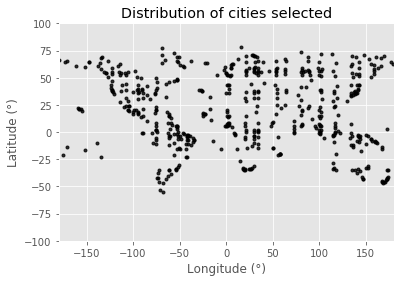
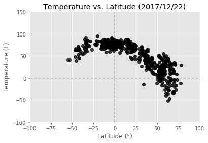
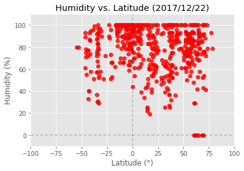
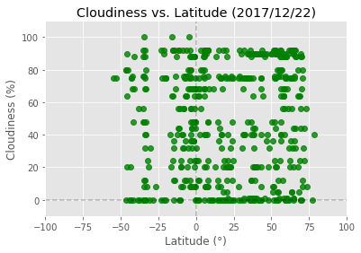
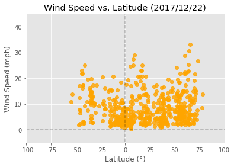

# WeatherPy
HW#6
Due: December 23, 2017

In this exercise I utilized Python libraries - requests, citipy, pandas, numpy, matplotlib.pyplot, datetime - JSON traversals, and the OpenWeatherMap API to answer a fundamental question: "What's the weather like as we approach the equator?" Weather data were collected for over five hundred randomly selected cities across the world.

## Three observable trends based on the data below

1. Weather data collected today (2017/12/22) from over 548 cities around the world, indicate that temperatures are higher for cities at/near the equator (ranging from 50 to 100F), with temperatures dropping off at latitudes lower than -35 degrees and higher than +20 degrees. Cities +60 degrees north of the equator present temperatures as low as -50F. Notice that all plots are skewed with more data points in the northern hemisphere (>0 degrees latitude), because 68% of Earth's dry land is located in the northern hemisphere, whereas the remaining 32% is located in the southern hemisphere. Note also that dry land masses are primarily situated between -60 and +80 degrees latitude.

2. There appears to be no correlation between proximity to the equator and percent humidity, as the majority of cities fell within a 20 to 100% humidity range, independent of their latitude. The only exceptions were a few cities with humidity at 0% in latitudes ranging from +60 to +70 degrees. There also appears to be no correlation between proximity to the equator and cloudiness, as cloud cover varies from 0 to 100% for cities at/near the equator.

3. Wind speed appears to peak between +5 and +20 degrees north of the equator, but it is not clear to me if this is actually a real pattern, as wind speed also peaks at the the lowest (-40 degrees) and highest latitudes (+65 degrees). A larger sample size might helps us determine if there really is a positive or negative correlation between proximity to the equator and wind speed, or not. 


```python
#Dependencies
from citipy import citipy
import pandas as pd
import numpy as np
import matplotlib.pyplot as plt
import requests
import json
from datetime import datetime
```

## Generate Cities List


```python
#Create a list of 500 lat, lng combinations and run these values in a loop to get city names with citipy
lats=np.random.uniform(low=-90, high=90, size=50)
lngs=np.random.uniform(low=-180, high=180, size=50)
#print(lats)
#print(lngs)

# #Select 500 cities using citipy library
city_list =[]
for lat in lats:
    for lng in lngs:
        city = citipy.nearest_city(lat, lng)
        if (city.city_name + "," + city.country_code) not in city_list: 
            city_list.append(city.city_name + "," + city.country_code)
#print(city_list)
print(len(city_list))

#Convert list into a dataframe
city_list_df=pd.DataFrame(city_list)
city_list_df=city_list_df.rename(columns = {0: 'City_Country'})
#city_list_df.head()
```

    629


## Perform API Calls


```python
# Save config information for OpenWeatherMap 
api_key = "6561b523131c94ac6ec73a0bab8810da"
url = "http://api.openweathermap.org/data/2.5/weather?"
units="imperial"

# Create blank columns for necessary fields
# city_list_df["Temperature (F)"] = ""
# city_list_df["Humidity (%)"] = ""
# city_list_df["Cloudiness (%)"] = ""
# city_list_df["Wind Speed (mph)"] = ""
# city_list_df["Lat"]= ""
# city_list_df["Lng"]= ""

#Counter
row_count =0

#Loop through and grab data of interest - temp, humidity, cloudiness, and wind speed
for index, row in city_list_df.iterrows():
    
    # Build partial query URL
    #query_url = url + "appid=" + api_key + "&units=" + units + "&q=" + (row["City_Country"])
    query_url= "http://api.openweathermap.org/data/2.5/weather?q=%s&units=%s&mode=json&APPID=%s" % (row["City_Country"], units, api_key) 
        
    #Print log to ensure loop is working correctly
    print("Processing record #" + str(row_count) + " " + row["City_Country"])
    print(query_url)
    row_count += 1

    #Run requests to grab the JSON at the requested URL
    selected_cities = requests.get(query_url).json()
    #print(selected_cities)
    #print(json.dumps(selected_cities, indent=4, sort_keys=True))
    
    #Append the parameters of interest to the appropriate columns
    #Use try/except to skip any cities which return an error message
    try: 
        temp = selected_cities["main"]["temp"]
        humid = selected_cities["main"]["humidity"]
        cloud= selected_cities ["clouds"]["all"]
        wind = selected_cities ["wind"]["speed"]
        lat = selected_cities ["coord"]["lat"]
        lng = selected_cities ["coord"]["lon"]
    
        
        city_list_df.set_value(index, "Temperature (F)", temp)
        city_list_df.set_value(index, "Humidity (%)", humid)
        city_list_df.set_value(index, "Cloudiness (%)", cloud)
        city_list_df.set_value(index, "Wind Speed (mph)", wind) 
        city_list_df.set_value(index, "Lat", lat)
        city_list_df.set_value(index, "Lng", lng)
          
    except:
        print("Error with city data. Skipping")
        continue
      
city_list_df.head()
```

    Processing record #0 bredasdorp,za
    http://api.openweathermap.org/data/2.5/weather?q=bredasdorp,za&units=imperial&mode=json&APPID=6561b523131c94ac6ec73a0bab8810da
    Processing record #1 cape town,za
    http://api.openweathermap.org/data/2.5/weather?q=cape town,za&units=imperial&mode=json&APPID=6561b523131c94ac6ec73a0bab8810da
    Processing record #2 mataura,pf
    http://api.openweathermap.org/data/2.5/weather?q=mataura,pf&units=imperial&mode=json&APPID=6561b523131c94ac6ec73a0bab8810da
    Error with city data. Skipping
    Processing record #3 new norfolk,au
    http://api.openweathermap.org/data/2.5/weather?q=new norfolk,au&units=imperial&mode=json&APPID=6561b523131c94ac6ec73a0bab8810da
    Processing record #4 rikitea,pf
    http://api.openweathermap.org/data/2.5/weather?q=rikitea,pf&units=imperial&mode=json&APPID=6561b523131c94ac6ec73a0bab8810da
    Processing record #5 busselton,au
    http://api.openweathermap.org/data/2.5/weather?q=busselton,au&units=imperial&mode=json&APPID=6561b523131c94ac6ec73a0bab8810da
    Processing record #6 albany,au
    http://api.openweathermap.org/data/2.5/weather?q=albany,au&units=imperial&mode=json&APPID=6561b523131c94ac6ec73a0bab8810da
    Processing record #7 hobart,au
    http://api.openweathermap.org/data/2.5/weather?q=hobart,au&units=imperial&mode=json&APPID=6561b523131c94ac6ec73a0bab8810da
    Processing record #8 punta arenas,cl
    http://api.openweathermap.org/data/2.5/weather?q=punta arenas,cl&units=imperial&mode=json&APPID=6561b523131c94ac6ec73a0bab8810da
    Processing record #9 bluff,nz
    http://api.openweathermap.org/data/2.5/weather?q=bluff,nz&units=imperial&mode=json&APPID=6561b523131c94ac6ec73a0bab8810da
    Processing record #10 taolanaro,mg
    http://api.openweathermap.org/data/2.5/weather?q=taolanaro,mg&units=imperial&mode=json&APPID=6561b523131c94ac6ec73a0bab8810da
    Error with city data. Skipping
    Processing record #11 mar del plata,ar
    http://api.openweathermap.org/data/2.5/weather?q=mar del plata,ar&units=imperial&mode=json&APPID=6561b523131c94ac6ec73a0bab8810da
    Processing record #12 chuy,uy
    http://api.openweathermap.org/data/2.5/weather?q=chuy,uy&units=imperial&mode=json&APPID=6561b523131c94ac6ec73a0bab8810da
    Processing record #13 ushuaia,ar
    http://api.openweathermap.org/data/2.5/weather?q=ushuaia,ar&units=imperial&mode=json&APPID=6561b523131c94ac6ec73a0bab8810da
    Processing record #14 cidreira,br
    http://api.openweathermap.org/data/2.5/weather?q=cidreira,br&units=imperial&mode=json&APPID=6561b523131c94ac6ec73a0bab8810da
    Processing record #15 port alfred,za
    http://api.openweathermap.org/data/2.5/weather?q=port alfred,za&units=imperial&mode=json&APPID=6561b523131c94ac6ec73a0bab8810da
    Processing record #16 kaitangata,nz
    http://api.openweathermap.org/data/2.5/weather?q=kaitangata,nz&units=imperial&mode=json&APPID=6561b523131c94ac6ec73a0bab8810da
    Processing record #17 vaini,to
    http://api.openweathermap.org/data/2.5/weather?q=vaini,to&units=imperial&mode=json&APPID=6561b523131c94ac6ec73a0bab8810da
    Processing record #18 port elizabeth,za
    http://api.openweathermap.org/data/2.5/weather?q=port elizabeth,za&units=imperial&mode=json&APPID=6561b523131c94ac6ec73a0bab8810da
    Processing record #19 tuatapere,nz
    http://api.openweathermap.org/data/2.5/weather?q=tuatapere,nz&units=imperial&mode=json&APPID=6561b523131c94ac6ec73a0bab8810da
    Processing record #20 klaipeda,lt
    http://api.openweathermap.org/data/2.5/weather?q=klaipeda,lt&units=imperial&mode=json&APPID=6561b523131c94ac6ec73a0bab8810da
    Processing record #21 den helder,nl
    http://api.openweathermap.org/data/2.5/weather?q=den helder,nl&units=imperial&mode=json&APPID=6561b523131c94ac6ec73a0bab8810da
    Processing record #22 haines junction,ca
    http://api.openweathermap.org/data/2.5/weather?q=haines junction,ca&units=imperial&mode=json&APPID=6561b523131c94ac6ec73a0bab8810da
    Processing record #23 ayan,ru
    http://api.openweathermap.org/data/2.5/weather?q=ayan,ru&units=imperial&mode=json&APPID=6561b523131c94ac6ec73a0bab8810da
    Error with city data. Skipping
    Processing record #24 sitka,us
    http://api.openweathermap.org/data/2.5/weather?q=sitka,us&units=imperial&mode=json&APPID=6561b523131c94ac6ec73a0bab8810da
    Processing record #25 chunskiy,ru
    http://api.openweathermap.org/data/2.5/weather?q=chunskiy,ru&units=imperial&mode=json&APPID=6561b523131c94ac6ec73a0bab8810da
    Processing record #26 mackenzie,ca
    http://api.openweathermap.org/data/2.5/weather?q=mackenzie,ca&units=imperial&mode=json&APPID=6561b523131c94ac6ec73a0bab8810da
    Processing record #27 ketchikan,us
    http://api.openweathermap.org/data/2.5/weather?q=ketchikan,us&units=imperial&mode=json&APPID=6561b523131c94ac6ec73a0bab8810da
    Processing record #28 dubinino,ru
    http://api.openweathermap.org/data/2.5/weather?q=dubinino,ru&units=imperial&mode=json&APPID=6561b523131c94ac6ec73a0bab8810da
    Processing record #29 bratsk,ru
    http://api.openweathermap.org/data/2.5/weather?q=bratsk,ru&units=imperial&mode=json&APPID=6561b523131c94ac6ec73a0bab8810da
    Processing record #30 taksimo,ru
    http://api.openweathermap.org/data/2.5/weather?q=taksimo,ru&units=imperial&mode=json&APPID=6561b523131c94ac6ec73a0bab8810da
    Processing record #31 okha,ru
    http://api.openweathermap.org/data/2.5/weather?q=okha,ru&units=imperial&mode=json&APPID=6561b523131c94ac6ec73a0bab8810da
    Processing record #32 chapais,ca
    http://api.openweathermap.org/data/2.5/weather?q=chapais,ca&units=imperial&mode=json&APPID=6561b523131c94ac6ec73a0bab8810da
    Processing record #33 athabasca,ca
    http://api.openweathermap.org/data/2.5/weather?q=athabasca,ca&units=imperial&mode=json&APPID=6561b523131c94ac6ec73a0bab8810da
    Processing record #34 nikolskoye,ru
    http://api.openweathermap.org/data/2.5/weather?q=nikolskoye,ru&units=imperial&mode=json&APPID=6561b523131c94ac6ec73a0bab8810da
    Processing record #35 mishkino,ru
    http://api.openweathermap.org/data/2.5/weather?q=mishkino,ru&units=imperial&mode=json&APPID=6561b523131c94ac6ec73a0bab8810da
    Processing record #36 nanortalik,gl
    http://api.openweathermap.org/data/2.5/weather?q=nanortalik,gl&units=imperial&mode=json&APPID=6561b523131c94ac6ec73a0bab8810da
    Processing record #37 sobolevo,ru
    http://api.openweathermap.org/data/2.5/weather?q=sobolevo,ru&units=imperial&mode=json&APPID=6561b523131c94ac6ec73a0bab8810da
    Processing record #38 grindavik,is
    http://api.openweathermap.org/data/2.5/weather?q=grindavik,is&units=imperial&mode=json&APPID=6561b523131c94ac6ec73a0bab8810da
    Processing record #39 paamiut,gl
    http://api.openweathermap.org/data/2.5/weather?q=paamiut,gl&units=imperial&mode=json&APPID=6561b523131c94ac6ec73a0bab8810da
    Processing record #40 saint anthony,ca
    http://api.openweathermap.org/data/2.5/weather?q=saint anthony,ca&units=imperial&mode=json&APPID=6561b523131c94ac6ec73a0bab8810da
    Error with city data. Skipping
    Processing record #41 vestmannaeyjar,is
    http://api.openweathermap.org/data/2.5/weather?q=vestmannaeyjar,is&units=imperial&mode=json&APPID=6561b523131c94ac6ec73a0bab8810da
    Processing record #42 saint-augustin,ca
    http://api.openweathermap.org/data/2.5/weather?q=saint-augustin,ca&units=imperial&mode=json&APPID=6561b523131c94ac6ec73a0bab8810da
    Processing record #43 novodugino,ru
    http://api.openweathermap.org/data/2.5/weather?q=novodugino,ru&units=imperial&mode=json&APPID=6561b523131c94ac6ec73a0bab8810da
    Processing record #44 kodiak,us
    http://api.openweathermap.org/data/2.5/weather?q=kodiak,us&units=imperial&mode=json&APPID=6561b523131c94ac6ec73a0bab8810da
    Processing record #45 meadow lake,ca
    http://api.openweathermap.org/data/2.5/weather?q=meadow lake,ca&units=imperial&mode=json&APPID=6561b523131c94ac6ec73a0bab8810da
    Processing record #46 aktanysh,ru
    http://api.openweathermap.org/data/2.5/weather?q=aktanysh,ru&units=imperial&mode=json&APPID=6561b523131c94ac6ec73a0bab8810da
    Processing record #47 beringovskiy,ru
    http://api.openweathermap.org/data/2.5/weather?q=beringovskiy,ru&units=imperial&mode=json&APPID=6561b523131c94ac6ec73a0bab8810da
    Processing record #48 sioux lookout,ca
    http://api.openweathermap.org/data/2.5/weather?q=sioux lookout,ca&units=imperial&mode=json&APPID=6561b523131c94ac6ec73a0bab8810da
    Processing record #49 chumikan,ru
    http://api.openweathermap.org/data/2.5/weather?q=chumikan,ru&units=imperial&mode=json&APPID=6561b523131c94ac6ec73a0bab8810da
    Processing record #50 bridlington,gb
    http://api.openweathermap.org/data/2.5/weather?q=bridlington,gb&units=imperial&mode=json&APPID=6561b523131c94ac6ec73a0bab8810da
    Processing record #51 ust-kamchatsk,ru
    http://api.openweathermap.org/data/2.5/weather?q=ust-kamchatsk,ru&units=imperial&mode=json&APPID=6561b523131c94ac6ec73a0bab8810da
    Error with city data. Skipping
    Processing record #52 provideniya,ru
    http://api.openweathermap.org/data/2.5/weather?q=provideniya,ru&units=imperial&mode=json&APPID=6561b523131c94ac6ec73a0bab8810da
    Processing record #53 thompson,ca
    http://api.openweathermap.org/data/2.5/weather?q=thompson,ca&units=imperial&mode=json&APPID=6561b523131c94ac6ec73a0bab8810da
    Processing record #54 tasiilaq,gl
    http://api.openweathermap.org/data/2.5/weather?q=tasiilaq,gl&units=imperial&mode=json&APPID=6561b523131c94ac6ec73a0bab8810da
    Processing record #55 haradok,by
    http://api.openweathermap.org/data/2.5/weather?q=haradok,by&units=imperial&mode=json&APPID=6561b523131c94ac6ec73a0bab8810da
    Processing record #56 bethel,us
    http://api.openweathermap.org/data/2.5/weather?q=bethel,us&units=imperial&mode=json&APPID=6561b523131c94ac6ec73a0bab8810da
    Processing record #57 esso,ru
    http://api.openweathermap.org/data/2.5/weather?q=esso,ru&units=imperial&mode=json&APPID=6561b523131c94ac6ec73a0bab8810da
    Processing record #58 terrace,ca
    http://api.openweathermap.org/data/2.5/weather?q=terrace,ca&units=imperial&mode=json&APPID=6561b523131c94ac6ec73a0bab8810da
    Processing record #59 chulym,ru
    http://api.openweathermap.org/data/2.5/weather?q=chulym,ru&units=imperial&mode=json&APPID=6561b523131c94ac6ec73a0bab8810da
    Processing record #60 coihaique,cl
    http://api.openweathermap.org/data/2.5/weather?q=coihaique,cl&units=imperial&mode=json&APPID=6561b523131c94ac6ec73a0bab8810da
    Processing record #61 saint-philippe,re
    http://api.openweathermap.org/data/2.5/weather?q=saint-philippe,re&units=imperial&mode=json&APPID=6561b523131c94ac6ec73a0bab8810da
    Processing record #62 arraial do cabo,br
    http://api.openweathermap.org/data/2.5/weather?q=arraial do cabo,br&units=imperial&mode=json&APPID=6561b523131c94ac6ec73a0bab8810da
    Processing record #63 necochea,ar
    http://api.openweathermap.org/data/2.5/weather?q=necochea,ar&units=imperial&mode=json&APPID=6561b523131c94ac6ec73a0bab8810da
    Processing record #64 rawson,ar
    http://api.openweathermap.org/data/2.5/weather?q=rawson,ar&units=imperial&mode=json&APPID=6561b523131c94ac6ec73a0bab8810da
    Processing record #65 dunedin,nz
    http://api.openweathermap.org/data/2.5/weather?q=dunedin,nz&units=imperial&mode=json&APPID=6561b523131c94ac6ec73a0bab8810da
    Processing record #66 castro,cl
    http://api.openweathermap.org/data/2.5/weather?q=castro,cl&units=imperial&mode=json&APPID=6561b523131c94ac6ec73a0bab8810da
    Processing record #67 mount gambier,au
    http://api.openweathermap.org/data/2.5/weather?q=mount gambier,au&units=imperial&mode=json&APPID=6561b523131c94ac6ec73a0bab8810da
    Processing record #68 rocha,uy
    http://api.openweathermap.org/data/2.5/weather?q=rocha,uy&units=imperial&mode=json&APPID=6561b523131c94ac6ec73a0bab8810da
    Processing record #69 mahebourg,mu
    http://api.openweathermap.org/data/2.5/weather?q=mahebourg,mu&units=imperial&mode=json&APPID=6561b523131c94ac6ec73a0bab8810da
    Processing record #70 swellendam,za
    http://api.openweathermap.org/data/2.5/weather?q=swellendam,za&units=imperial&mode=json&APPID=6561b523131c94ac6ec73a0bab8810da
    Processing record #71 luderitz,na
    http://api.openweathermap.org/data/2.5/weather?q=luderitz,na&units=imperial&mode=json&APPID=6561b523131c94ac6ec73a0bab8810da
    Processing record #72 gawler,au
    http://api.openweathermap.org/data/2.5/weather?q=gawler,au&units=imperial&mode=json&APPID=6561b523131c94ac6ec73a0bab8810da
    Processing record #73 geraldton,au
    http://api.openweathermap.org/data/2.5/weather?q=geraldton,au&units=imperial&mode=json&APPID=6561b523131c94ac6ec73a0bab8810da
    Processing record #74 collie,au
    http://api.openweathermap.org/data/2.5/weather?q=collie,au&units=imperial&mode=json&APPID=6561b523131c94ac6ec73a0bab8810da
    Processing record #75 swan hill,au
    http://api.openweathermap.org/data/2.5/weather?q=swan hill,au&units=imperial&mode=json&APPID=6561b523131c94ac6ec73a0bab8810da
    Processing record #76 constitucion,cl
    http://api.openweathermap.org/data/2.5/weather?q=constitucion,cl&units=imperial&mode=json&APPID=6561b523131c94ac6ec73a0bab8810da
    Processing record #77 mildura,au
    http://api.openweathermap.org/data/2.5/weather?q=mildura,au&units=imperial&mode=json&APPID=6561b523131c94ac6ec73a0bab8810da
    Processing record #78 ahipara,nz
    http://api.openweathermap.org/data/2.5/weather?q=ahipara,nz&units=imperial&mode=json&APPID=6561b523131c94ac6ec73a0bab8810da
    Processing record #79 souillac,mu
    http://api.openweathermap.org/data/2.5/weather?q=souillac,mu&units=imperial&mode=json&APPID=6561b523131c94ac6ec73a0bab8810da
    Processing record #80 laguna,br
    http://api.openweathermap.org/data/2.5/weather?q=laguna,br&units=imperial&mode=json&APPID=6561b523131c94ac6ec73a0bab8810da
    Error with city data. Skipping
    Processing record #81 nelson bay,au
    http://api.openweathermap.org/data/2.5/weather?q=nelson bay,au&units=imperial&mode=json&APPID=6561b523131c94ac6ec73a0bab8810da
    Processing record #82 rio grande,br
    http://api.openweathermap.org/data/2.5/weather?q=rio grande,br&units=imperial&mode=json&APPID=6561b523131c94ac6ec73a0bab8810da
    Processing record #83 jamestown,sh
    http://api.openweathermap.org/data/2.5/weather?q=jamestown,sh&units=imperial&mode=json&APPID=6561b523131c94ac6ec73a0bab8810da
    Processing record #84 lincoln,ar
    http://api.openweathermap.org/data/2.5/weather?q=lincoln,ar&units=imperial&mode=json&APPID=6561b523131c94ac6ec73a0bab8810da
    Processing record #85 santa vitoria do palmar,br
    http://api.openweathermap.org/data/2.5/weather?q=santa vitoria do palmar,br&units=imperial&mode=json&APPID=6561b523131c94ac6ec73a0bab8810da
    Processing record #86 margate,za
    http://api.openweathermap.org/data/2.5/weather?q=margate,za&units=imperial&mode=json&APPID=6561b523131c94ac6ec73a0bab8810da
    Processing record #87 russell,nz
    http://api.openweathermap.org/data/2.5/weather?q=russell,nz&units=imperial&mode=json&APPID=6561b523131c94ac6ec73a0bab8810da
    Processing record #88 lebu,cl
    http://api.openweathermap.org/data/2.5/weather?q=lebu,cl&units=imperial&mode=json&APPID=6561b523131c94ac6ec73a0bab8810da
    Processing record #89 port lincoln,au
    http://api.openweathermap.org/data/2.5/weather?q=port lincoln,au&units=imperial&mode=json&APPID=6561b523131c94ac6ec73a0bab8810da
    Processing record #90 port macquarie,au
    http://api.openweathermap.org/data/2.5/weather?q=port macquarie,au&units=imperial&mode=json&APPID=6561b523131c94ac6ec73a0bab8810da
    Processing record #91 east london,za
    http://api.openweathermap.org/data/2.5/weather?q=east london,za&units=imperial&mode=json&APPID=6561b523131c94ac6ec73a0bab8810da
    Processing record #92 junin,ar
    http://api.openweathermap.org/data/2.5/weather?q=junin,ar&units=imperial&mode=json&APPID=6561b523131c94ac6ec73a0bab8810da
    Processing record #93 bambous virieux,mu
    http://api.openweathermap.org/data/2.5/weather?q=bambous virieux,mu&units=imperial&mode=json&APPID=6561b523131c94ac6ec73a0bab8810da
    Processing record #94 longyearbyen,sj
    http://api.openweathermap.org/data/2.5/weather?q=longyearbyen,sj&units=imperial&mode=json&APPID=6561b523131c94ac6ec73a0bab8810da
    Processing record #95 barentsburg,sj
    http://api.openweathermap.org/data/2.5/weather?q=barentsburg,sj&units=imperial&mode=json&APPID=6561b523131c94ac6ec73a0bab8810da
    Error with city data. Skipping
    Processing record #96 tuktoyaktuk,ca
    http://api.openweathermap.org/data/2.5/weather?q=tuktoyaktuk,ca&units=imperial&mode=json&APPID=6561b523131c94ac6ec73a0bab8810da
    Processing record #97 nizhneyansk,ru
    http://api.openweathermap.org/data/2.5/weather?q=nizhneyansk,ru&units=imperial&mode=json&APPID=6561b523131c94ac6ec73a0bab8810da
    Error with city data. Skipping
    Processing record #98 khatanga,ru
    http://api.openweathermap.org/data/2.5/weather?q=khatanga,ru&units=imperial&mode=json&APPID=6561b523131c94ac6ec73a0bab8810da
    Processing record #99 dikson,ru
    http://api.openweathermap.org/data/2.5/weather?q=dikson,ru&units=imperial&mode=json&APPID=6561b523131c94ac6ec73a0bab8810da
    Processing record #100 saskylakh,ru
    http://api.openweathermap.org/data/2.5/weather?q=saskylakh,ru&units=imperial&mode=json&APPID=6561b523131c94ac6ec73a0bab8810da
    Processing record #101 chokurdakh,ru
    http://api.openweathermap.org/data/2.5/weather?q=chokurdakh,ru&units=imperial&mode=json&APPID=6561b523131c94ac6ec73a0bab8810da
    Processing record #102 qaanaaq,gl
    http://api.openweathermap.org/data/2.5/weather?q=qaanaaq,gl&units=imperial&mode=json&APPID=6561b523131c94ac6ec73a0bab8810da
    Processing record #103 yellowknife,ca
    http://api.openweathermap.org/data/2.5/weather?q=yellowknife,ca&units=imperial&mode=json&APPID=6561b523131c94ac6ec73a0bab8810da
    Processing record #104 pevek,ru
    http://api.openweathermap.org/data/2.5/weather?q=pevek,ru&units=imperial&mode=json&APPID=6561b523131c94ac6ec73a0bab8810da
    Processing record #105 amderma,ru
    http://api.openweathermap.org/data/2.5/weather?q=amderma,ru&units=imperial&mode=json&APPID=6561b523131c94ac6ec73a0bab8810da
    Error with city data. Skipping
    Processing record #106 upernavik,gl
    http://api.openweathermap.org/data/2.5/weather?q=upernavik,gl&units=imperial&mode=json&APPID=6561b523131c94ac6ec73a0bab8810da
    Processing record #107 illoqqortoormiut,gl
    http://api.openweathermap.org/data/2.5/weather?q=illoqqortoormiut,gl&units=imperial&mode=json&APPID=6561b523131c94ac6ec73a0bab8810da
    Error with city data. Skipping
    Processing record #108 narsaq,gl
    http://api.openweathermap.org/data/2.5/weather?q=narsaq,gl&units=imperial&mode=json&APPID=6561b523131c94ac6ec73a0bab8810da
    Processing record #109 vardo,no
    http://api.openweathermap.org/data/2.5/weather?q=vardo,no&units=imperial&mode=json&APPID=6561b523131c94ac6ec73a0bab8810da
    Processing record #110 barrow,us
    http://api.openweathermap.org/data/2.5/weather?q=barrow,us&units=imperial&mode=json&APPID=6561b523131c94ac6ec73a0bab8810da
    Processing record #111 belushya guba,ru
    http://api.openweathermap.org/data/2.5/weather?q=belushya guba,ru&units=imperial&mode=json&APPID=6561b523131c94ac6ec73a0bab8810da
    Error with city data. Skipping
    Processing record #112 cherskiy,ru
    http://api.openweathermap.org/data/2.5/weather?q=cherskiy,ru&units=imperial&mode=json&APPID=6561b523131c94ac6ec73a0bab8810da
    Processing record #113 mys shmidta,ru
    http://api.openweathermap.org/data/2.5/weather?q=mys shmidta,ru&units=imperial&mode=json&APPID=6561b523131c94ac6ec73a0bab8810da
    Error with city data. Skipping
    Processing record #114 mehamn,no
    http://api.openweathermap.org/data/2.5/weather?q=mehamn,no&units=imperial&mode=json&APPID=6561b523131c94ac6ec73a0bab8810da
    Processing record #115 ilulissat,gl
    http://api.openweathermap.org/data/2.5/weather?q=ilulissat,gl&units=imperial&mode=json&APPID=6561b523131c94ac6ec73a0bab8810da
    Processing record #116 biltine,td
    http://api.openweathermap.org/data/2.5/weather?q=biltine,td&units=imperial&mode=json&APPID=6561b523131c94ac6ec73a0bab8810da
    Processing record #117 filingue,ne
    http://api.openweathermap.org/data/2.5/weather?q=filingue,ne&units=imperial&mode=json&APPID=6561b523131c94ac6ec73a0bab8810da
    Processing record #118 hilo,us
    http://api.openweathermap.org/data/2.5/weather?q=hilo,us&units=imperial&mode=json&APPID=6561b523131c94ac6ec73a0bab8810da
    Processing record #119 airai,pw
    http://api.openweathermap.org/data/2.5/weather?q=airai,pw&units=imperial&mode=json&APPID=6561b523131c94ac6ec73a0bab8810da
    Error with city data. Skipping
    Processing record #120 chai nat,th
    http://api.openweathermap.org/data/2.5/weather?q=chai nat,th&units=imperial&mode=json&APPID=6561b523131c94ac6ec73a0bab8810da
    Processing record #121 constitucion,mx
    http://api.openweathermap.org/data/2.5/weather?q=constitucion,mx&units=imperial&mode=json&APPID=6561b523131c94ac6ec73a0bab8810da
    Processing record #122 port blair,in
    http://api.openweathermap.org/data/2.5/weather?q=port blair,in&units=imperial&mode=json&APPID=6561b523131c94ac6ec73a0bab8810da
    Processing record #123 non sung,th
    http://api.openweathermap.org/data/2.5/weather?q=non sung,th&units=imperial&mode=json&APPID=6561b523131c94ac6ec73a0bab8810da
    Processing record #124 palauig,ph
    http://api.openweathermap.org/data/2.5/weather?q=palauig,ph&units=imperial&mode=json&APPID=6561b523131c94ac6ec73a0bab8810da
    Processing record #125 morant bay,jm
    http://api.openweathermap.org/data/2.5/weather?q=morant bay,jm&units=imperial&mode=json&APPID=6561b523131c94ac6ec73a0bab8810da
    Processing record #126 cabo san lucas,mx
    http://api.openweathermap.org/data/2.5/weather?q=cabo san lucas,mx&units=imperial&mode=json&APPID=6561b523131c94ac6ec73a0bab8810da
    Processing record #127 butaritari,ki
    http://api.openweathermap.org/data/2.5/weather?q=butaritari,ki&units=imperial&mode=json&APPID=6561b523131c94ac6ec73a0bab8810da
    Processing record #128 sur,om
    http://api.openweathermap.org/data/2.5/weather?q=sur,om&units=imperial&mode=json&APPID=6561b523131c94ac6ec73a0bab8810da
    Processing record #129 cayenne,gf
    http://api.openweathermap.org/data/2.5/weather?q=cayenne,gf&units=imperial&mode=json&APPID=6561b523131c94ac6ec73a0bab8810da
    Processing record #130 kavieng,pg
    http://api.openweathermap.org/data/2.5/weather?q=kavieng,pg&units=imperial&mode=json&APPID=6561b523131c94ac6ec73a0bab8810da
    Processing record #131 sao filipe,cv
    http://api.openweathermap.org/data/2.5/weather?q=sao filipe,cv&units=imperial&mode=json&APPID=6561b523131c94ac6ec73a0bab8810da
    Processing record #132 bathsheba,bb
    http://api.openweathermap.org/data/2.5/weather?q=bathsheba,bb&units=imperial&mode=json&APPID=6561b523131c94ac6ec73a0bab8810da
    Processing record #133 sal rei,cv
    http://api.openweathermap.org/data/2.5/weather?q=sal rei,cv&units=imperial&mode=json&APPID=6561b523131c94ac6ec73a0bab8810da
    Processing record #134 pointe michel,dm
    http://api.openweathermap.org/data/2.5/weather?q=pointe michel,dm&units=imperial&mode=json&APPID=6561b523131c94ac6ec73a0bab8810da
    Processing record #135 tambul,sd
    http://api.openweathermap.org/data/2.5/weather?q=tambul,sd&units=imperial&mode=json&APPID=6561b523131c94ac6ec73a0bab8810da
    Error with city data. Skipping
    Processing record #136 san patricio,mx
    http://api.openweathermap.org/data/2.5/weather?q=san patricio,mx&units=imperial&mode=json&APPID=6561b523131c94ac6ec73a0bab8810da
    Processing record #137 salalah,om
    http://api.openweathermap.org/data/2.5/weather?q=salalah,om&units=imperial&mode=json&APPID=6561b523131c94ac6ec73a0bab8810da
    Processing record #138 gualan,gt
    http://api.openweathermap.org/data/2.5/weather?q=gualan,gt&units=imperial&mode=json&APPID=6561b523131c94ac6ec73a0bab8810da
    Processing record #139 ayorou,ne
    http://api.openweathermap.org/data/2.5/weather?q=ayorou,ne&units=imperial&mode=json&APPID=6561b523131c94ac6ec73a0bab8810da
    Processing record #140 kapaa,us
    http://api.openweathermap.org/data/2.5/weather?q=kapaa,us&units=imperial&mode=json&APPID=6561b523131c94ac6ec73a0bab8810da
    Processing record #141 salina cruz,mx
    http://api.openweathermap.org/data/2.5/weather?q=salina cruz,mx&units=imperial&mode=json&APPID=6561b523131c94ac6ec73a0bab8810da
    Processing record #142 porto novo,cv
    http://api.openweathermap.org/data/2.5/weather?q=porto novo,cv&units=imperial&mode=json&APPID=6561b523131c94ac6ec73a0bab8810da
    Processing record #143 bara,sd
    http://api.openweathermap.org/data/2.5/weather?q=bara,sd&units=imperial&mode=json&APPID=6561b523131c94ac6ec73a0bab8810da
    Error with city data. Skipping
    Processing record #144 le lorrain,mq
    http://api.openweathermap.org/data/2.5/weather?q=le lorrain,mq&units=imperial&mode=json&APPID=6561b523131c94ac6ec73a0bab8810da
    Processing record #145 guerrero negro,mx
    http://api.openweathermap.org/data/2.5/weather?q=guerrero negro,mx&units=imperial&mode=json&APPID=6561b523131c94ac6ec73a0bab8810da
    Processing record #146 ouallam,ne
    http://api.openweathermap.org/data/2.5/weather?q=ouallam,ne&units=imperial&mode=json&APPID=6561b523131c94ac6ec73a0bab8810da
    Processing record #147 avanigadda,in
    http://api.openweathermap.org/data/2.5/weather?q=avanigadda,in&units=imperial&mode=json&APPID=6561b523131c94ac6ec73a0bab8810da
    Processing record #148 hermanus,za
    http://api.openweathermap.org/data/2.5/weather?q=hermanus,za&units=imperial&mode=json&APPID=6561b523131c94ac6ec73a0bab8810da
    Processing record #149 ndele,cf
    http://api.openweathermap.org/data/2.5/weather?q=ndele,cf&units=imperial&mode=json&APPID=6561b523131c94ac6ec73a0bab8810da
    Processing record #150 iseyin,ng
    http://api.openweathermap.org/data/2.5/weather?q=iseyin,ng&units=imperial&mode=json&APPID=6561b523131c94ac6ec73a0bab8810da
    Processing record #151 atuona,pf
    http://api.openweathermap.org/data/2.5/weather?q=atuona,pf&units=imperial&mode=json&APPID=6561b523131c94ac6ec73a0bab8810da
    Processing record #152 ranot,th
    http://api.openweathermap.org/data/2.5/weather?q=ranot,th&units=imperial&mode=json&APPID=6561b523131c94ac6ec73a0bab8810da
    Processing record #153 yaring,th
    http://api.openweathermap.org/data/2.5/weather?q=yaring,th&units=imperial&mode=json&APPID=6561b523131c94ac6ec73a0bab8810da
    Processing record #154 balabac,ph
    http://api.openweathermap.org/data/2.5/weather?q=balabac,ph&units=imperial&mode=json&APPID=6561b523131c94ac6ec73a0bab8810da
    Processing record #155 caucasia,co
    http://api.openweathermap.org/data/2.5/weather?q=caucasia,co&units=imperial&mode=json&APPID=6561b523131c94ac6ec73a0bab8810da
    Processing record #156 kavaratti,in
    http://api.openweathermap.org/data/2.5/weather?q=kavaratti,in&units=imperial&mode=json&APPID=6561b523131c94ac6ec73a0bab8810da
    Processing record #157 carutapera,br
    http://api.openweathermap.org/data/2.5/weather?q=carutapera,br&units=imperial&mode=json&APPID=6561b523131c94ac6ec73a0bab8810da
    Processing record #158 mana,gf
    http://api.openweathermap.org/data/2.5/weather?q=mana,gf&units=imperial&mode=json&APPID=6561b523131c94ac6ec73a0bab8810da
    Processing record #159 bubaque,gw
    http://api.openweathermap.org/data/2.5/weather?q=bubaque,gw&units=imperial&mode=json&APPID=6561b523131c94ac6ec73a0bab8810da
    Processing record #160 upata,ve
    http://api.openweathermap.org/data/2.5/weather?q=upata,ve&units=imperial&mode=json&APPID=6561b523131c94ac6ec73a0bab8810da
    Processing record #161 sinnamary,gf
    http://api.openweathermap.org/data/2.5/weather?q=sinnamary,gf&units=imperial&mode=json&APPID=6561b523131c94ac6ec73a0bab8810da
    Processing record #162 gambela,et
    http://api.openweathermap.org/data/2.5/weather?q=gambela,et&units=imperial&mode=json&APPID=6561b523131c94ac6ec73a0bab8810da
    Processing record #163 lazaro cardenas,mx
    http://api.openweathermap.org/data/2.5/weather?q=lazaro cardenas,mx&units=imperial&mode=json&APPID=6561b523131c94ac6ec73a0bab8810da
    Processing record #164 bandarbeyla,so
    http://api.openweathermap.org/data/2.5/weather?q=bandarbeyla,so&units=imperial&mode=json&APPID=6561b523131c94ac6ec73a0bab8810da
    Processing record #165 santa cruz,cr
    http://api.openweathermap.org/data/2.5/weather?q=santa cruz,cr&units=imperial&mode=json&APPID=6561b523131c94ac6ec73a0bab8810da
    Processing record #166 meyungs,pw
    http://api.openweathermap.org/data/2.5/weather?q=meyungs,pw&units=imperial&mode=json&APPID=6561b523131c94ac6ec73a0bab8810da
    Error with city data. Skipping
    Processing record #167 atakpame,tg
    http://api.openweathermap.org/data/2.5/weather?q=atakpame,tg&units=imperial&mode=json&APPID=6561b523131c94ac6ec73a0bab8810da
    Processing record #168 vaitupu,wf
    http://api.openweathermap.org/data/2.5/weather?q=vaitupu,wf&units=imperial&mode=json&APPID=6561b523131c94ac6ec73a0bab8810da
    Error with city data. Skipping
    Processing record #169 champerico,gt
    http://api.openweathermap.org/data/2.5/weather?q=champerico,gt&units=imperial&mode=json&APPID=6561b523131c94ac6ec73a0bab8810da
    Processing record #170 ler,sd
    http://api.openweathermap.org/data/2.5/weather?q=ler,sd&units=imperial&mode=json&APPID=6561b523131c94ac6ec73a0bab8810da
    Error with city data. Skipping
    Processing record #171 mabaruma,gy
    http://api.openweathermap.org/data/2.5/weather?q=mabaruma,gy&units=imperial&mode=json&APPID=6561b523131c94ac6ec73a0bab8810da
    Processing record #172 savalou,bj
    http://api.openweathermap.org/data/2.5/weather?q=savalou,bj&units=imperial&mode=json&APPID=6561b523131c94ac6ec73a0bab8810da
    Processing record #173 eravur,lk
    http://api.openweathermap.org/data/2.5/weather?q=eravur,lk&units=imperial&mode=json&APPID=6561b523131c94ac6ec73a0bab8810da
    Processing record #174 methoni,gr
    http://api.openweathermap.org/data/2.5/weather?q=methoni,gr&units=imperial&mode=json&APPID=6561b523131c94ac6ec73a0bab8810da
    Processing record #175 medea,dz
    http://api.openweathermap.org/data/2.5/weather?q=medea,dz&units=imperial&mode=json&APPID=6561b523131c94ac6ec73a0bab8810da
    Processing record #176 fortuna,us
    http://api.openweathermap.org/data/2.5/weather?q=fortuna,us&units=imperial&mode=json&APPID=6561b523131c94ac6ec73a0bab8810da
    Processing record #177 tomioka,jp
    http://api.openweathermap.org/data/2.5/weather?q=tomioka,jp&units=imperial&mode=json&APPID=6561b523131c94ac6ec73a0bab8810da
    Processing record #178 xining,cn
    http://api.openweathermap.org/data/2.5/weather?q=xining,cn&units=imperial&mode=json&APPID=6561b523131c94ac6ec73a0bab8810da
    Processing record #179 pacific grove,us
    http://api.openweathermap.org/data/2.5/weather?q=pacific grove,us&units=imperial&mode=json&APPID=6561b523131c94ac6ec73a0bab8810da
    Processing record #180 korla,cn
    http://api.openweathermap.org/data/2.5/weather?q=korla,cn&units=imperial&mode=json&APPID=6561b523131c94ac6ec73a0bab8810da
    Processing record #181 pingyin,cn
    http://api.openweathermap.org/data/2.5/weather?q=pingyin,cn&units=imperial&mode=json&APPID=6561b523131c94ac6ec73a0bab8810da
    Processing record #182 hasaki,jp
    http://api.openweathermap.org/data/2.5/weather?q=hasaki,jp&units=imperial&mode=json&APPID=6561b523131c94ac6ec73a0bab8810da
    Processing record #183 elizabeth city,us
    http://api.openweathermap.org/data/2.5/weather?q=elizabeth city,us&units=imperial&mode=json&APPID=6561b523131c94ac6ec73a0bab8810da
    Processing record #184 saint george,us
    http://api.openweathermap.org/data/2.5/weather?q=saint george,us&units=imperial&mode=json&APPID=6561b523131c94ac6ec73a0bab8810da
    Processing record #185 severo-kurilsk,ru
    http://api.openweathermap.org/data/2.5/weather?q=severo-kurilsk,ru&units=imperial&mode=json&APPID=6561b523131c94ac6ec73a0bab8810da
    Processing record #186 dawlatabad,af
    http://api.openweathermap.org/data/2.5/weather?q=dawlatabad,af&units=imperial&mode=json&APPID=6561b523131c94ac6ec73a0bab8810da
    Processing record #187 ribeira grande,pt
    http://api.openweathermap.org/data/2.5/weather?q=ribeira grande,pt&units=imperial&mode=json&APPID=6561b523131c94ac6ec73a0bab8810da
    Processing record #188 sentyabrskiy,ru
    http://api.openweathermap.org/data/2.5/weather?q=sentyabrskiy,ru&units=imperial&mode=json&APPID=6561b523131c94ac6ec73a0bab8810da
    Error with city data. Skipping
    Processing record #189 vila franca do campo,pt
    http://api.openweathermap.org/data/2.5/weather?q=vila franca do campo,pt&units=imperial&mode=json&APPID=6561b523131c94ac6ec73a0bab8810da
    Processing record #190 torbay,ca
    http://api.openweathermap.org/data/2.5/weather?q=torbay,ca&units=imperial&mode=json&APPID=6561b523131c94ac6ec73a0bab8810da
    Processing record #191 saint-pierre,pm
    http://api.openweathermap.org/data/2.5/weather?q=saint-pierre,pm&units=imperial&mode=json&APPID=6561b523131c94ac6ec73a0bab8810da
    Processing record #192 ponta do sol,pt
    http://api.openweathermap.org/data/2.5/weather?q=ponta do sol,pt&units=imperial&mode=json&APPID=6561b523131c94ac6ec73a0bab8810da
    Processing record #193 saint george,bm
    http://api.openweathermap.org/data/2.5/weather?q=saint george,bm&units=imperial&mode=json&APPID=6561b523131c94ac6ec73a0bab8810da
    Processing record #194 erdemli,tr
    http://api.openweathermap.org/data/2.5/weather?q=erdemli,tr&units=imperial&mode=json&APPID=6561b523131c94ac6ec73a0bab8810da
    Processing record #195 ahuimanu,us
    http://api.openweathermap.org/data/2.5/weather?q=ahuimanu,us&units=imperial&mode=json&APPID=6561b523131c94ac6ec73a0bab8810da
    Processing record #196 bloomfield,us
    http://api.openweathermap.org/data/2.5/weather?q=bloomfield,us&units=imperial&mode=json&APPID=6561b523131c94ac6ec73a0bab8810da
    Processing record #197 damghan,ir
    http://api.openweathermap.org/data/2.5/weather?q=damghan,ir&units=imperial&mode=json&APPID=6561b523131c94ac6ec73a0bab8810da
    Processing record #198 dyersburg,us
    http://api.openweathermap.org/data/2.5/weather?q=dyersburg,us&units=imperial&mode=json&APPID=6561b523131c94ac6ec73a0bab8810da
    Processing record #199 tottori,jp
    http://api.openweathermap.org/data/2.5/weather?q=tottori,jp&units=imperial&mode=json&APPID=6561b523131c94ac6ec73a0bab8810da
    Processing record #200 sidi ali,dz
    http://api.openweathermap.org/data/2.5/weather?q=sidi ali,dz&units=imperial&mode=json&APPID=6561b523131c94ac6ec73a0bab8810da
    Processing record #201 tahlequah,us
    http://api.openweathermap.org/data/2.5/weather?q=tahlequah,us&units=imperial&mode=json&APPID=6561b523131c94ac6ec73a0bab8810da
    Processing record #202 kumluca,tr
    http://api.openweathermap.org/data/2.5/weather?q=kumluca,tr&units=imperial&mode=json&APPID=6561b523131c94ac6ec73a0bab8810da
    Processing record #203 ukiah,us
    http://api.openweathermap.org/data/2.5/weather?q=ukiah,us&units=imperial&mode=json&APPID=6561b523131c94ac6ec73a0bab8810da
    Processing record #204 leh,in
    http://api.openweathermap.org/data/2.5/weather?q=leh,in&units=imperial&mode=json&APPID=6561b523131c94ac6ec73a0bab8810da
    Processing record #205 suluq,ly
    http://api.openweathermap.org/data/2.5/weather?q=suluq,ly&units=imperial&mode=json&APPID=6561b523131c94ac6ec73a0bab8810da
    Processing record #206 warqla,dz
    http://api.openweathermap.org/data/2.5/weather?q=warqla,dz&units=imperial&mode=json&APPID=6561b523131c94ac6ec73a0bab8810da
    Error with city data. Skipping
    Processing record #207 shimoda,jp
    http://api.openweathermap.org/data/2.5/weather?q=shimoda,jp&units=imperial&mode=json&APPID=6561b523131c94ac6ec73a0bab8810da
    Processing record #208 yaan,cn
    http://api.openweathermap.org/data/2.5/weather?q=yaan,cn&units=imperial&mode=json&APPID=6561b523131c94ac6ec73a0bab8810da
    Error with city data. Skipping
    Processing record #209 lompoc,us
    http://api.openweathermap.org/data/2.5/weather?q=lompoc,us&units=imperial&mode=json&APPID=6561b523131c94ac6ec73a0bab8810da
    Processing record #210 half moon bay,us
    http://api.openweathermap.org/data/2.5/weather?q=half moon bay,us&units=imperial&mode=json&APPID=6561b523131c94ac6ec73a0bab8810da
    Processing record #211 lasa,cn
    http://api.openweathermap.org/data/2.5/weather?q=lasa,cn&units=imperial&mode=json&APPID=6561b523131c94ac6ec73a0bab8810da
    Error with city data. Skipping
    Processing record #212 linqiong,cn
    http://api.openweathermap.org/data/2.5/weather?q=linqiong,cn&units=imperial&mode=json&APPID=6561b523131c94ac6ec73a0bab8810da
    Processing record #213 luan,cn
    http://api.openweathermap.org/data/2.5/weather?q=luan,cn&units=imperial&mode=json&APPID=6561b523131c94ac6ec73a0bab8810da
    Error with city data. Skipping
    Processing record #214 katsuura,jp
    http://api.openweathermap.org/data/2.5/weather?q=katsuura,jp&units=imperial&mode=json&APPID=6561b523131c94ac6ec73a0bab8810da
    Processing record #215 havelock,us
    http://api.openweathermap.org/data/2.5/weather?q=havelock,us&units=imperial&mode=json&APPID=6561b523131c94ac6ec73a0bab8810da
    Processing record #216 sonoita,mx
    http://api.openweathermap.org/data/2.5/weather?q=sonoita,mx&units=imperial&mode=json&APPID=6561b523131c94ac6ec73a0bab8810da
    Error with city data. Skipping
    Processing record #217 geresk,af
    http://api.openweathermap.org/data/2.5/weather?q=geresk,af&units=imperial&mode=json&APPID=6561b523131c94ac6ec73a0bab8810da
    Error with city data. Skipping
    Processing record #218 ashqelon,il
    http://api.openweathermap.org/data/2.5/weather?q=ashqelon,il&units=imperial&mode=json&APPID=6561b523131c94ac6ec73a0bab8810da
    Processing record #219 kahului,us
    http://api.openweathermap.org/data/2.5/weather?q=kahului,us&units=imperial&mode=json&APPID=6561b523131c94ac6ec73a0bab8810da
    Processing record #220 puerto palomas,mx
    http://api.openweathermap.org/data/2.5/weather?q=puerto palomas,mx&units=imperial&mode=json&APPID=6561b523131c94ac6ec73a0bab8810da
    Processing record #221 taft,ir
    http://api.openweathermap.org/data/2.5/weather?q=taft,ir&units=imperial&mode=json&APPID=6561b523131c94ac6ec73a0bab8810da
    Processing record #222 laurel,us
    http://api.openweathermap.org/data/2.5/weather?q=laurel,us&units=imperial&mode=json&APPID=6561b523131c94ac6ec73a0bab8810da
    Processing record #223 muroto,jp
    http://api.openweathermap.org/data/2.5/weather?q=muroto,jp&units=imperial&mode=json&APPID=6561b523131c94ac6ec73a0bab8810da
    Processing record #224 aflu,dz
    http://api.openweathermap.org/data/2.5/weather?q=aflu,dz&units=imperial&mode=json&APPID=6561b523131c94ac6ec73a0bab8810da
    Error with city data. Skipping
    Processing record #225 jacksonville,us
    http://api.openweathermap.org/data/2.5/weather?q=jacksonville,us&units=imperial&mode=json&APPID=6561b523131c94ac6ec73a0bab8810da
    Processing record #226 rosetta,eg
    http://api.openweathermap.org/data/2.5/weather?q=rosetta,eg&units=imperial&mode=json&APPID=6561b523131c94ac6ec73a0bab8810da
    Processing record #227 dharchula,in
    http://api.openweathermap.org/data/2.5/weather?q=dharchula,in&units=imperial&mode=json&APPID=6561b523131c94ac6ec73a0bab8810da
    Processing record #228 bambari,cf
    http://api.openweathermap.org/data/2.5/weather?q=bambari,cf&units=imperial&mode=json&APPID=6561b523131c94ac6ec73a0bab8810da
    Processing record #229 lagos,ng
    http://api.openweathermap.org/data/2.5/weather?q=lagos,ng&units=imperial&mode=json&APPID=6561b523131c94ac6ec73a0bab8810da
    Processing record #230 gurun,my
    http://api.openweathermap.org/data/2.5/weather?q=gurun,my&units=imperial&mode=json&APPID=6561b523131c94ac6ec73a0bab8810da
    Processing record #231 sabang,id
    http://api.openweathermap.org/data/2.5/weather?q=sabang,id&units=imperial&mode=json&APPID=6561b523131c94ac6ec73a0bab8810da
    Processing record #232 tanah merah,my
    http://api.openweathermap.org/data/2.5/weather?q=tanah merah,my&units=imperial&mode=json&APPID=6561b523131c94ac6ec73a0bab8810da
    Processing record #233 ranau,my
    http://api.openweathermap.org/data/2.5/weather?q=ranau,my&units=imperial&mode=json&APPID=6561b523131c94ac6ec73a0bab8810da
    Processing record #234 vanimo,pg
    http://api.openweathermap.org/data/2.5/weather?q=vanimo,pg&units=imperial&mode=json&APPID=6561b523131c94ac6ec73a0bab8810da
    Processing record #235 sonson,co
    http://api.openweathermap.org/data/2.5/weather?q=sonson,co&units=imperial&mode=json&APPID=6561b523131c94ac6ec73a0bab8810da
    Processing record #236 ugoofaaru,mv
    http://api.openweathermap.org/data/2.5/weather?q=ugoofaaru,mv&units=imperial&mode=json&APPID=6561b523131c94ac6ec73a0bab8810da
    Processing record #237 iracoubo,gf
    http://api.openweathermap.org/data/2.5/weather?q=iracoubo,gf&units=imperial&mode=json&APPID=6561b523131c94ac6ec73a0bab8810da
    Processing record #238 kapoeta,sd
    http://api.openweathermap.org/data/2.5/weather?q=kapoeta,sd&units=imperial&mode=json&APPID=6561b523131c94ac6ec73a0bab8810da
    Error with city data. Skipping
    Processing record #239 ixtapa,mx
    http://api.openweathermap.org/data/2.5/weather?q=ixtapa,mx&units=imperial&mode=json&APPID=6561b523131c94ac6ec73a0bab8810da
    Processing record #240 eyl,so
    http://api.openweathermap.org/data/2.5/weather?q=eyl,so&units=imperial&mode=json&APPID=6561b523131c94ac6ec73a0bab8810da
    Processing record #241 kloulklubed,pw
    http://api.openweathermap.org/data/2.5/weather?q=kloulklubed,pw&units=imperial&mode=json&APPID=6561b523131c94ac6ec73a0bab8810da
    Processing record #242 aflao,gh
    http://api.openweathermap.org/data/2.5/weather?q=aflao,gh&units=imperial&mode=json&APPID=6561b523131c94ac6ec73a0bab8810da
    Error with city data. Skipping
    Processing record #243 puerto ayora,ec
    http://api.openweathermap.org/data/2.5/weather?q=puerto ayora,ec&units=imperial&mode=json&APPID=6561b523131c94ac6ec73a0bab8810da
    Processing record #244 jardim,br
    http://api.openweathermap.org/data/2.5/weather?q=jardim,br&units=imperial&mode=json&APPID=6561b523131c94ac6ec73a0bab8810da
    Processing record #245 yirol,sd
    http://api.openweathermap.org/data/2.5/weather?q=yirol,sd&units=imperial&mode=json&APPID=6561b523131c94ac6ec73a0bab8810da
    Error with city data. Skipping
    Processing record #246 makakilo city,us
    http://api.openweathermap.org/data/2.5/weather?q=makakilo city,us&units=imperial&mode=json&APPID=6561b523131c94ac6ec73a0bab8810da
    Processing record #247 bartica,gy
    http://api.openweathermap.org/data/2.5/weather?q=bartica,gy&units=imperial&mode=json&APPID=6561b523131c94ac6ec73a0bab8810da
    Processing record #248 namatanai,pg
    http://api.openweathermap.org/data/2.5/weather?q=namatanai,pg&units=imperial&mode=json&APPID=6561b523131c94ac6ec73a0bab8810da
    Processing record #249 cotonou,bj
    http://api.openweathermap.org/data/2.5/weather?q=cotonou,bj&units=imperial&mode=json&APPID=6561b523131c94ac6ec73a0bab8810da
    Processing record #250 cururupu,br
    http://api.openweathermap.org/data/2.5/weather?q=cururupu,br&units=imperial&mode=json&APPID=6561b523131c94ac6ec73a0bab8810da
    Processing record #251 hambantota,lk
    http://api.openweathermap.org/data/2.5/weather?q=hambantota,lk&units=imperial&mode=json&APPID=6561b523131c94ac6ec73a0bab8810da
    Processing record #252 paracuru,br
    http://api.openweathermap.org/data/2.5/weather?q=paracuru,br&units=imperial&mode=json&APPID=6561b523131c94ac6ec73a0bab8810da
    Processing record #253 grobina,lv
    http://api.openweathermap.org/data/2.5/weather?q=grobina,lv&units=imperial&mode=json&APPID=6561b523131c94ac6ec73a0bab8810da
    Processing record #254 varhaug,no
    http://api.openweathermap.org/data/2.5/weather?q=varhaug,no&units=imperial&mode=json&APPID=6561b523131c94ac6ec73a0bab8810da
    Processing record #255 itatskiy,ru
    http://api.openweathermap.org/data/2.5/weather?q=itatskiy,ru&units=imperial&mode=json&APPID=6561b523131c94ac6ec73a0bab8810da
    Processing record #256 shadrinsk,ru
    http://api.openweathermap.org/data/2.5/weather?q=shadrinsk,ru&units=imperial&mode=json&APPID=6561b523131c94ac6ec73a0bab8810da
    Processing record #257 zubtsov,ru
    http://api.openweathermap.org/data/2.5/weather?q=zubtsov,ru&units=imperial&mode=json&APPID=6561b523131c94ac6ec73a0bab8810da
    Processing record #258 sigayevo,ru
    http://api.openweathermap.org/data/2.5/weather?q=sigayevo,ru&units=imperial&mode=json&APPID=6561b523131c94ac6ec73a0bab8810da
    Processing record #259 scarborough,gb
    http://api.openweathermap.org/data/2.5/weather?q=scarborough,gb&units=imperial&mode=json&APPID=6561b523131c94ac6ec73a0bab8810da
    Processing record #260 novosokolniki,ru
    http://api.openweathermap.org/data/2.5/weather?q=novosokolniki,ru&units=imperial&mode=json&APPID=6561b523131c94ac6ec73a0bab8810da
    Processing record #261 bakchar,ru
    http://api.openweathermap.org/data/2.5/weather?q=bakchar,ru&units=imperial&mode=json&APPID=6561b523131c94ac6ec73a0bab8810da
    Processing record #262 kalabo,zm
    http://api.openweathermap.org/data/2.5/weather?q=kalabo,zm&units=imperial&mode=json&APPID=6561b523131c94ac6ec73a0bab8810da
    Processing record #263 alyangula,au
    http://api.openweathermap.org/data/2.5/weather?q=alyangula,au&units=imperial&mode=json&APPID=6561b523131c94ac6ec73a0bab8810da
    Processing record #264 palabuhanratu,id
    http://api.openweathermap.org/data/2.5/weather?q=palabuhanratu,id&units=imperial&mode=json&APPID=6561b523131c94ac6ec73a0bab8810da
    Error with city data. Skipping
    Processing record #265 bengkulu,id
    http://api.openweathermap.org/data/2.5/weather?q=bengkulu,id&units=imperial&mode=json&APPID=6561b523131c94ac6ec73a0bab8810da
    Error with city data. Skipping
    Processing record #266 port hedland,au
    http://api.openweathermap.org/data/2.5/weather?q=port hedland,au&units=imperial&mode=json&APPID=6561b523131c94ac6ec73a0bab8810da
    Processing record #267 mareeba,au
    http://api.openweathermap.org/data/2.5/weather?q=mareeba,au&units=imperial&mode=json&APPID=6561b523131c94ac6ec73a0bab8810da
    Processing record #268 marcona,pe
    http://api.openweathermap.org/data/2.5/weather?q=marcona,pe&units=imperial&mode=json&APPID=6561b523131c94ac6ec73a0bab8810da
    Error with city data. Skipping
    Processing record #269 luganville,vu
    http://api.openweathermap.org/data/2.5/weather?q=luganville,vu&units=imperial&mode=json&APPID=6561b523131c94ac6ec73a0bab8810da
    Processing record #270 grand gaube,mu
    http://api.openweathermap.org/data/2.5/weather?q=grand gaube,mu&units=imperial&mode=json&APPID=6561b523131c94ac6ec73a0bab8810da
    Processing record #271 monte azul,br
    http://api.openweathermap.org/data/2.5/weather?q=monte azul,br&units=imperial&mode=json&APPID=6561b523131c94ac6ec73a0bab8810da
    Processing record #272 samarai,pg
    http://api.openweathermap.org/data/2.5/weather?q=samarai,pg&units=imperial&mode=json&APPID=6561b523131c94ac6ec73a0bab8810da
    Processing record #273 maragogi,br
    http://api.openweathermap.org/data/2.5/weather?q=maragogi,br&units=imperial&mode=json&APPID=6561b523131c94ac6ec73a0bab8810da
    Processing record #274 rubiataba,br
    http://api.openweathermap.org/data/2.5/weather?q=rubiataba,br&units=imperial&mode=json&APPID=6561b523131c94ac6ec73a0bab8810da
    Processing record #275 barra do garcas,br
    http://api.openweathermap.org/data/2.5/weather?q=barra do garcas,br&units=imperial&mode=json&APPID=6561b523131c94ac6ec73a0bab8810da
    Processing record #276 georgetown,sh
    http://api.openweathermap.org/data/2.5/weather?q=georgetown,sh&units=imperial&mode=json&APPID=6561b523131c94ac6ec73a0bab8810da
    Processing record #277 san ignacio,bo
    http://api.openweathermap.org/data/2.5/weather?q=san ignacio,bo&units=imperial&mode=json&APPID=6561b523131c94ac6ec73a0bab8810da
    Error with city data. Skipping
    Processing record #278 mozarlandia,br
    http://api.openweathermap.org/data/2.5/weather?q=mozarlandia,br&units=imperial&mode=json&APPID=6561b523131c94ac6ec73a0bab8810da
    Processing record #279 ntcheu,mw
    http://api.openweathermap.org/data/2.5/weather?q=ntcheu,mw&units=imperial&mode=json&APPID=6561b523131c94ac6ec73a0bab8810da
    Processing record #280 faanui,pf
    http://api.openweathermap.org/data/2.5/weather?q=faanui,pf&units=imperial&mode=json&APPID=6561b523131c94ac6ec73a0bab8810da
    Processing record #281 vila,vu
    http://api.openweathermap.org/data/2.5/weather?q=vila,vu&units=imperial&mode=json&APPID=6561b523131c94ac6ec73a0bab8810da
    Error with city data. Skipping
    Processing record #282 antalaha,mg
    http://api.openweathermap.org/data/2.5/weather?q=antalaha,mg&units=imperial&mode=json&APPID=6561b523131c94ac6ec73a0bab8810da
    Processing record #283 huarmey,pe
    http://api.openweathermap.org/data/2.5/weather?q=huarmey,pe&units=imperial&mode=json&APPID=6561b523131c94ac6ec73a0bab8810da
    Processing record #284 ngukurr,au
    http://api.openweathermap.org/data/2.5/weather?q=ngukurr,au&units=imperial&mode=json&APPID=6561b523131c94ac6ec73a0bab8810da
    Error with city data. Skipping
    Processing record #285 kirakira,sb
    http://api.openweathermap.org/data/2.5/weather?q=kirakira,sb&units=imperial&mode=json&APPID=6561b523131c94ac6ec73a0bab8810da
    Processing record #286 halalo,wf
    http://api.openweathermap.org/data/2.5/weather?q=halalo,wf&units=imperial&mode=json&APPID=6561b523131c94ac6ec73a0bab8810da
    Error with city data. Skipping
    Processing record #287 conde,br
    http://api.openweathermap.org/data/2.5/weather?q=conde,br&units=imperial&mode=json&APPID=6561b523131c94ac6ec73a0bab8810da
    Processing record #288 luangwa,zm
    http://api.openweathermap.org/data/2.5/weather?q=luangwa,zm&units=imperial&mode=json&APPID=6561b523131c94ac6ec73a0bab8810da
    Processing record #289 satitoa,ws
    http://api.openweathermap.org/data/2.5/weather?q=satitoa,ws&units=imperial&mode=json&APPID=6561b523131c94ac6ec73a0bab8810da
    Error with city data. Skipping
    Processing record #290 vitoria da conquista,br
    http://api.openweathermap.org/data/2.5/weather?q=vitoria da conquista,br&units=imperial&mode=json&APPID=6561b523131c94ac6ec73a0bab8810da
    Error with city data. Skipping
    Processing record #291 hithadhoo,mv
    http://api.openweathermap.org/data/2.5/weather?q=hithadhoo,mv&units=imperial&mode=json&APPID=6561b523131c94ac6ec73a0bab8810da
    Processing record #292 kruisfontein,za
    http://api.openweathermap.org/data/2.5/weather?q=kruisfontein,za&units=imperial&mode=json&APPID=6561b523131c94ac6ec73a0bab8810da
    Processing record #293 cazaje,ao
    http://api.openweathermap.org/data/2.5/weather?q=cazaje,ao&units=imperial&mode=json&APPID=6561b523131c94ac6ec73a0bab8810da
    Error with city data. Skipping
    Processing record #294 namibe,ao
    http://api.openweathermap.org/data/2.5/weather?q=namibe,ao&units=imperial&mode=json&APPID=6561b523131c94ac6ec73a0bab8810da
    Processing record #295 nhulunbuy,au
    http://api.openweathermap.org/data/2.5/weather?q=nhulunbuy,au&units=imperial&mode=json&APPID=6561b523131c94ac6ec73a0bab8810da
    Processing record #296 labuhan,id
    http://api.openweathermap.org/data/2.5/weather?q=labuhan,id&units=imperial&mode=json&APPID=6561b523131c94ac6ec73a0bab8810da
    Processing record #297 praya,id
    http://api.openweathermap.org/data/2.5/weather?q=praya,id&units=imperial&mode=json&APPID=6561b523131c94ac6ec73a0bab8810da
    Processing record #298 daru,pg
    http://api.openweathermap.org/data/2.5/weather?q=daru,pg&units=imperial&mode=json&APPID=6561b523131c94ac6ec73a0bab8810da
    Processing record #299 perene,pe
    http://api.openweathermap.org/data/2.5/weather?q=perene,pe&units=imperial&mode=json&APPID=6561b523131c94ac6ec73a0bab8810da
    Processing record #300 lata,sb
    http://api.openweathermap.org/data/2.5/weather?q=lata,sb&units=imperial&mode=json&APPID=6561b523131c94ac6ec73a0bab8810da
    Error with city data. Skipping
    Processing record #301 victoria,sc
    http://api.openweathermap.org/data/2.5/weather?q=victoria,sc&units=imperial&mode=json&APPID=6561b523131c94ac6ec73a0bab8810da
    Processing record #302 xique-xique,br
    http://api.openweathermap.org/data/2.5/weather?q=xique-xique,br&units=imperial&mode=json&APPID=6561b523131c94ac6ec73a0bab8810da
    Processing record #303 gizo,sb
    http://api.openweathermap.org/data/2.5/weather?q=gizo,sb&units=imperial&mode=json&APPID=6561b523131c94ac6ec73a0bab8810da
    Processing record #304 olinda,br
    http://api.openweathermap.org/data/2.5/weather?q=olinda,br&units=imperial&mode=json&APPID=6561b523131c94ac6ec73a0bab8810da
    Processing record #305 formoso do araguaia,br
    http://api.openweathermap.org/data/2.5/weather?q=formoso do araguaia,br&units=imperial&mode=json&APPID=6561b523131c94ac6ec73a0bab8810da
    Error with city data. Skipping
    Processing record #306 alta floresta,br
    http://api.openweathermap.org/data/2.5/weather?q=alta floresta,br&units=imperial&mode=json&APPID=6561b523131c94ac6ec73a0bab8810da
    Processing record #307 ji-parana,br
    http://api.openweathermap.org/data/2.5/weather?q=ji-parana,br&units=imperial&mode=json&APPID=6561b523131c94ac6ec73a0bab8810da
    Error with city data. Skipping
    Processing record #308 liuli,tz
    http://api.openweathermap.org/data/2.5/weather?q=liuli,tz&units=imperial&mode=json&APPID=6561b523131c94ac6ec73a0bab8810da
    Processing record #309 sola,vu
    http://api.openweathermap.org/data/2.5/weather?q=sola,vu&units=imperial&mode=json&APPID=6561b523131c94ac6ec73a0bab8810da
    Processing record #310 sambava,mg
    http://api.openweathermap.org/data/2.5/weather?q=sambava,mg&units=imperial&mode=json&APPID=6561b523131c94ac6ec73a0bab8810da
    Processing record #311 asau,tv
    http://api.openweathermap.org/data/2.5/weather?q=asau,tv&units=imperial&mode=json&APPID=6561b523131c94ac6ec73a0bab8810da
    Error with city data. Skipping
    Processing record #312 san cristobal,ec
    http://api.openweathermap.org/data/2.5/weather?q=san cristobal,ec&units=imperial&mode=json&APPID=6561b523131c94ac6ec73a0bab8810da
    Processing record #313 maningrida,au
    http://api.openweathermap.org/data/2.5/weather?q=maningrida,au&units=imperial&mode=json&APPID=6561b523131c94ac6ec73a0bab8810da
    Processing record #314 luwingu,zm
    http://api.openweathermap.org/data/2.5/weather?q=luwingu,zm&units=imperial&mode=json&APPID=6561b523131c94ac6ec73a0bab8810da
    Processing record #315 samusu,ws
    http://api.openweathermap.org/data/2.5/weather?q=samusu,ws&units=imperial&mode=json&APPID=6561b523131c94ac6ec73a0bab8810da
    Error with city data. Skipping
    Processing record #316 pimenta bueno,br
    http://api.openweathermap.org/data/2.5/weather?q=pimenta bueno,br&units=imperial&mode=json&APPID=6561b523131c94ac6ec73a0bab8810da
    Processing record #317 honiara,sb
    http://api.openweathermap.org/data/2.5/weather?q=honiara,sb&units=imperial&mode=json&APPID=6561b523131c94ac6ec73a0bab8810da
    Processing record #318 jacobina,br
    http://api.openweathermap.org/data/2.5/weather?q=jacobina,br&units=imperial&mode=json&APPID=6561b523131c94ac6ec73a0bab8810da
    Processing record #319 aklavik,ca
    http://api.openweathermap.org/data/2.5/weather?q=aklavik,ca&units=imperial&mode=json&APPID=6561b523131c94ac6ec73a0bab8810da
    Processing record #320 talnakh,ru
    http://api.openweathermap.org/data/2.5/weather?q=talnakh,ru&units=imperial&mode=json&APPID=6561b523131c94ac6ec73a0bab8810da
    Processing record #321 komsomolskiy,ru
    http://api.openweathermap.org/data/2.5/weather?q=komsomolskiy,ru&units=imperial&mode=json&APPID=6561b523131c94ac6ec73a0bab8810da
    Processing record #322 berlevag,no
    http://api.openweathermap.org/data/2.5/weather?q=berlevag,no&units=imperial&mode=json&APPID=6561b523131c94ac6ec73a0bab8810da
    Processing record #323 bongandanga,cd
    http://api.openweathermap.org/data/2.5/weather?q=bongandanga,cd&units=imperial&mode=json&APPID=6561b523131c94ac6ec73a0bab8810da
    Processing record #324 yenagoa,ng
    http://api.openweathermap.org/data/2.5/weather?q=yenagoa,ng&units=imperial&mode=json&APPID=6561b523131c94ac6ec73a0bab8810da
    Processing record #325 biak,id
    http://api.openweathermap.org/data/2.5/weather?q=biak,id&units=imperial&mode=json&APPID=6561b523131c94ac6ec73a0bab8810da
    Processing record #326 rantauprapat,id
    http://api.openweathermap.org/data/2.5/weather?q=rantauprapat,id&units=imperial&mode=json&APPID=6561b523131c94ac6ec73a0bab8810da
    Processing record #327 banda aceh,id
    http://api.openweathermap.org/data/2.5/weather?q=banda aceh,id&units=imperial&mode=json&APPID=6561b523131c94ac6ec73a0bab8810da
    Processing record #328 bengkalis,id
    http://api.openweathermap.org/data/2.5/weather?q=bengkalis,id&units=imperial&mode=json&APPID=6561b523131c94ac6ec73a0bab8810da
    Error with city data. Skipping
    Processing record #329 bontang,id
    http://api.openweathermap.org/data/2.5/weather?q=bontang,id&units=imperial&mode=json&APPID=6561b523131c94ac6ec73a0bab8810da
    Processing record #330 el paujil,co
    http://api.openweathermap.org/data/2.5/weather?q=el paujil,co&units=imperial&mode=json&APPID=6561b523131c94ac6ec73a0bab8810da
    Processing record #331 kudahuvadhoo,mv
    http://api.openweathermap.org/data/2.5/weather?q=kudahuvadhoo,mv&units=imperial&mode=json&APPID=6561b523131c94ac6ec73a0bab8810da
    Processing record #332 touros,br
    http://api.openweathermap.org/data/2.5/weather?q=touros,br&units=imperial&mode=json&APPID=6561b523131c94ac6ec73a0bab8810da
    Processing record #333 amapa,br
    http://api.openweathermap.org/data/2.5/weather?q=amapa,br&units=imperial&mode=json&APPID=6561b523131c94ac6ec73a0bab8810da
    Processing record #334 camopi,gf
    http://api.openweathermap.org/data/2.5/weather?q=camopi,gf&units=imperial&mode=json&APPID=6561b523131c94ac6ec73a0bab8810da
    Processing record #335 goderich,sl
    http://api.openweathermap.org/data/2.5/weather?q=goderich,sl&units=imperial&mode=json&APPID=6561b523131c94ac6ec73a0bab8810da
    Error with city data. Skipping
    Processing record #336 boa vista,br
    http://api.openweathermap.org/data/2.5/weather?q=boa vista,br&units=imperial&mode=json&APPID=6561b523131c94ac6ec73a0bab8810da
    Processing record #337 kapchorwa,ug
    http://api.openweathermap.org/data/2.5/weather?q=kapchorwa,ug&units=imperial&mode=json&APPID=6561b523131c94ac6ec73a0bab8810da
    Processing record #338 buariki,ki
    http://api.openweathermap.org/data/2.5/weather?q=buariki,ki&units=imperial&mode=json&APPID=6561b523131c94ac6ec73a0bab8810da
    Error with city data. Skipping
    Processing record #339 acapulco,mx
    http://api.openweathermap.org/data/2.5/weather?q=acapulco,mx&units=imperial&mode=json&APPID=6561b523131c94ac6ec73a0bab8810da
    Processing record #340 rawannawi,ki
    http://api.openweathermap.org/data/2.5/weather?q=rawannawi,ki&units=imperial&mode=json&APPID=6561b523131c94ac6ec73a0bab8810da
    Error with city data. Skipping
    Processing record #341 puerto baquerizo moreno,ec
    http://api.openweathermap.org/data/2.5/weather?q=puerto baquerizo moreno,ec&units=imperial&mode=json&APPID=6561b523131c94ac6ec73a0bab8810da
    Processing record #342 manokwari,id
    http://api.openweathermap.org/data/2.5/weather?q=manokwari,id&units=imperial&mode=json&APPID=6561b523131c94ac6ec73a0bab8810da
    Processing record #343 winneba,gh
    http://api.openweathermap.org/data/2.5/weather?q=winneba,gh&units=imperial&mode=json&APPID=6561b523131c94ac6ec73a0bab8810da
    Processing record #344 buala,sb
    http://api.openweathermap.org/data/2.5/weather?q=buala,sb&units=imperial&mode=json&APPID=6561b523131c94ac6ec73a0bab8810da
    Processing record #345 bunia,cd
    http://api.openweathermap.org/data/2.5/weather?q=bunia,cd&units=imperial&mode=json&APPID=6561b523131c94ac6ec73a0bab8810da
    Processing record #346 saleaula,ws
    http://api.openweathermap.org/data/2.5/weather?q=saleaula,ws&units=imperial&mode=json&APPID=6561b523131c94ac6ec73a0bab8810da
    Error with city data. Skipping
    Processing record #347 anloga,gh
    http://api.openweathermap.org/data/2.5/weather?q=anloga,gh&units=imperial&mode=json&APPID=6561b523131c94ac6ec73a0bab8810da
    Processing record #348 camocim,br
    http://api.openweathermap.org/data/2.5/weather?q=camocim,br&units=imperial&mode=json&APPID=6561b523131c94ac6ec73a0bab8810da
    Processing record #349 matara,lk
    http://api.openweathermap.org/data/2.5/weather?q=matara,lk&units=imperial&mode=json&APPID=6561b523131c94ac6ec73a0bab8810da
    Processing record #350 ventspils,lv
    http://api.openweathermap.org/data/2.5/weather?q=ventspils,lv&units=imperial&mode=json&APPID=6561b523131c94ac6ec73a0bab8810da
    Processing record #351 visnes,no
    http://api.openweathermap.org/data/2.5/weather?q=visnes,no&units=imperial&mode=json&APPID=6561b523131c94ac6ec73a0bab8810da
    Processing record #352 kodinsk,ru
    http://api.openweathermap.org/data/2.5/weather?q=kodinsk,ru&units=imperial&mode=json&APPID=6561b523131c94ac6ec73a0bab8810da
    Processing record #353 fort nelson,ca
    http://api.openweathermap.org/data/2.5/weather?q=fort nelson,ca&units=imperial&mode=json&APPID=6561b523131c94ac6ec73a0bab8810da
    Processing record #354 juneau,us
    http://api.openweathermap.org/data/2.5/weather?q=juneau,us&units=imperial&mode=json&APPID=6561b523131c94ac6ec73a0bab8810da
    Processing record #355 teguldet,ru
    http://api.openweathermap.org/data/2.5/weather?q=teguldet,ru&units=imperial&mode=json&APPID=6561b523131c94ac6ec73a0bab8810da
    Processing record #356 ust-ilimsk,ru
    http://api.openweathermap.org/data/2.5/weather?q=ust-ilimsk,ru&units=imperial&mode=json&APPID=6561b523131c94ac6ec73a0bab8810da
    Processing record #357 kropotkin,ru
    http://api.openweathermap.org/data/2.5/weather?q=kropotkin,ru&units=imperial&mode=json&APPID=6561b523131c94ac6ec73a0bab8810da
    Processing record #358 okhotsk,ru
    http://api.openweathermap.org/data/2.5/weather?q=okhotsk,ru&units=imperial&mode=json&APPID=6561b523131c94ac6ec73a0bab8810da
    Processing record #359 slave lake,ca
    http://api.openweathermap.org/data/2.5/weather?q=slave lake,ca&units=imperial&mode=json&APPID=6561b523131c94ac6ec73a0bab8810da
    Processing record #360 ossora,ru
    http://api.openweathermap.org/data/2.5/weather?q=ossora,ru&units=imperial&mode=json&APPID=6561b523131c94ac6ec73a0bab8810da
    Processing record #361 turinsk,ru
    http://api.openweathermap.org/data/2.5/weather?q=turinsk,ru&units=imperial&mode=json&APPID=6561b523131c94ac6ec73a0bab8810da
    Processing record #362 tigil,ru
    http://api.openweathermap.org/data/2.5/weather?q=tigil,ru&units=imperial&mode=json&APPID=6561b523131c94ac6ec73a0bab8810da
    Processing record #363 krasnomayskiy,ru
    http://api.openweathermap.org/data/2.5/weather?q=krasnomayskiy,ru&units=imperial&mode=json&APPID=6561b523131c94ac6ec73a0bab8810da
    Processing record #364 tilichiki,ru
    http://api.openweathermap.org/data/2.5/weather?q=tilichiki,ru&units=imperial&mode=json&APPID=6561b523131c94ac6ec73a0bab8810da
    Processing record #365 kez,ru
    http://api.openweathermap.org/data/2.5/weather?q=kez,ru&units=imperial&mode=json&APPID=6561b523131c94ac6ec73a0bab8810da
    Processing record #366 ust-maya,ru
    http://api.openweathermap.org/data/2.5/weather?q=ust-maya,ru&units=imperial&mode=json&APPID=6561b523131c94ac6ec73a0bab8810da
    Processing record #367 peterhead,gb
    http://api.openweathermap.org/data/2.5/weather?q=peterhead,gb&units=imperial&mode=json&APPID=6561b523131c94ac6ec73a0bab8810da
    Processing record #368 dno,ru
    http://api.openweathermap.org/data/2.5/weather?q=dno,ru&units=imperial&mode=json&APPID=6561b523131c94ac6ec73a0bab8810da
    Processing record #369 parabel,ru
    http://api.openweathermap.org/data/2.5/weather?q=parabel,ru&units=imperial&mode=json&APPID=6561b523131c94ac6ec73a0bab8810da
    Processing record #370 ilebo,cd
    http://api.openweathermap.org/data/2.5/weather?q=ilebo,cd&units=imperial&mode=json&APPID=6561b523131c94ac6ec73a0bab8810da
    Processing record #371 port-gentil,ga
    http://api.openweathermap.org/data/2.5/weather?q=port-gentil,ga&units=imperial&mode=json&APPID=6561b523131c94ac6ec73a0bab8810da
    Processing record #372 meulaboh,id
    http://api.openweathermap.org/data/2.5/weather?q=meulaboh,id&units=imperial&mode=json&APPID=6561b523131c94ac6ec73a0bab8810da
    Processing record #373 martapura,id
    http://api.openweathermap.org/data/2.5/weather?q=martapura,id&units=imperial&mode=json&APPID=6561b523131c94ac6ec73a0bab8810da
    Processing record #374 ambunti,pg
    http://api.openweathermap.org/data/2.5/weather?q=ambunti,pg&units=imperial&mode=json&APPID=6561b523131c94ac6ec73a0bab8810da
    Processing record #375 lagunas,pe
    http://api.openweathermap.org/data/2.5/weather?q=lagunas,pe&units=imperial&mode=json&APPID=6561b523131c94ac6ec73a0bab8810da
    Processing record #376 auki,sb
    http://api.openweathermap.org/data/2.5/weather?q=auki,sb&units=imperial&mode=json&APPID=6561b523131c94ac6ec73a0bab8810da
    Processing record #377 barras,br
    http://api.openweathermap.org/data/2.5/weather?q=barras,br&units=imperial&mode=json&APPID=6561b523131c94ac6ec73a0bab8810da
    Processing record #378 arawa,pg
    http://api.openweathermap.org/data/2.5/weather?q=arawa,pg&units=imperial&mode=json&APPID=6561b523131c94ac6ec73a0bab8810da
    Processing record #379 cabedelo,br
    http://api.openweathermap.org/data/2.5/weather?q=cabedelo,br&units=imperial&mode=json&APPID=6561b523131c94ac6ec73a0bab8810da
    Processing record #380 tucurui,br
    http://api.openweathermap.org/data/2.5/weather?q=tucurui,br&units=imperial&mode=json&APPID=6561b523131c94ac6ec73a0bab8810da
    Processing record #381 altamira,br
    http://api.openweathermap.org/data/2.5/weather?q=altamira,br&units=imperial&mode=json&APPID=6561b523131c94ac6ec73a0bab8810da
    Processing record #382 anori,br
    http://api.openweathermap.org/data/2.5/weather?q=anori,br&units=imperial&mode=json&APPID=6561b523131c94ac6ec73a0bab8810da
    Processing record #383 kiomboi,tz
    http://api.openweathermap.org/data/2.5/weather?q=kiomboi,tz&units=imperial&mode=json&APPID=6561b523131c94ac6ec73a0bab8810da
    Processing record #384 utiroa,ki
    http://api.openweathermap.org/data/2.5/weather?q=utiroa,ki&units=imperial&mode=json&APPID=6561b523131c94ac6ec73a0bab8810da
    Error with city data. Skipping
    Processing record #385 lolua,tv
    http://api.openweathermap.org/data/2.5/weather?q=lolua,tv&units=imperial&mode=json&APPID=6561b523131c94ac6ec73a0bab8810da
    Error with city data. Skipping
    Processing record #386 nabire,id
    http://api.openweathermap.org/data/2.5/weather?q=nabire,id&units=imperial&mode=json&APPID=6561b523131c94ac6ec73a0bab8810da
    Processing record #387 rutana,bi
    http://api.openweathermap.org/data/2.5/weather?q=rutana,bi&units=imperial&mode=json&APPID=6561b523131c94ac6ec73a0bab8810da
    Processing record #388 manacapuru,br
    http://api.openweathermap.org/data/2.5/weather?q=manacapuru,br&units=imperial&mode=json&APPID=6561b523131c94ac6ec73a0bab8810da
    Processing record #389 kieta,pg
    http://api.openweathermap.org/data/2.5/weather?q=kieta,pg&units=imperial&mode=json&APPID=6561b523131c94ac6ec73a0bab8810da
    Processing record #390 ibiapina,br
    http://api.openweathermap.org/data/2.5/weather?q=ibiapina,br&units=imperial&mode=json&APPID=6561b523131c94ac6ec73a0bab8810da
    Processing record #391 kobylka,pl
    http://api.openweathermap.org/data/2.5/weather?q=kobylka,pl&units=imperial&mode=json&APPID=6561b523131c94ac6ec73a0bab8810da
    Processing record #392 goedereede,nl
    http://api.openweathermap.org/data/2.5/weather?q=goedereede,nl&units=imperial&mode=json&APPID=6561b523131c94ac6ec73a0bab8810da
    Processing record #393 mago,ru
    http://api.openweathermap.org/data/2.5/weather?q=mago,ru&units=imperial&mode=json&APPID=6561b523131c94ac6ec73a0bab8810da
    Processing record #394 orlik,ru
    http://api.openweathermap.org/data/2.5/weather?q=orlik,ru&units=imperial&mode=json&APPID=6561b523131c94ac6ec73a0bab8810da
    Processing record #395 quesnel,ca
    http://api.openweathermap.org/data/2.5/weather?q=quesnel,ca&units=imperial&mode=json&APPID=6561b523131c94ac6ec73a0bab8810da
    Processing record #396 tashtyp,ru
    http://api.openweathermap.org/data/2.5/weather?q=tashtyp,ru&units=imperial&mode=json&APPID=6561b523131c94ac6ec73a0bab8810da
    Processing record #397 kyren,ru
    http://api.openweathermap.org/data/2.5/weather?q=kyren,ru&units=imperial&mode=json&APPID=6561b523131c94ac6ec73a0bab8810da
    Processing record #398 nerchinsk,ru
    http://api.openweathermap.org/data/2.5/weather?q=nerchinsk,ru&units=imperial&mode=json&APPID=6561b523131c94ac6ec73a0bab8810da
    Processing record #399 nogliki,ru
    http://api.openweathermap.org/data/2.5/weather?q=nogliki,ru&units=imperial&mode=json&APPID=6561b523131c94ac6ec73a0bab8810da
    Processing record #400 ponoka,ca
    http://api.openweathermap.org/data/2.5/weather?q=ponoka,ca&units=imperial&mode=json&APPID=6561b523131c94ac6ec73a0bab8810da
    Processing record #401 qostanay,kz
    http://api.openweathermap.org/data/2.5/weather?q=qostanay,kz&units=imperial&mode=json&APPID=6561b523131c94ac6ec73a0bab8810da
    Processing record #402 oktyabrskiy,ru
    http://api.openweathermap.org/data/2.5/weather?q=oktyabrskiy,ru&units=imperial&mode=json&APPID=6561b523131c94ac6ec73a0bab8810da
    Processing record #403 bonavista,ca
    http://api.openweathermap.org/data/2.5/weather?q=bonavista,ca&units=imperial&mode=json&APPID=6561b523131c94ac6ec73a0bab8810da
    Processing record #404 dingle,ie
    http://api.openweathermap.org/data/2.5/weather?q=dingle,ie&units=imperial&mode=json&APPID=6561b523131c94ac6ec73a0bab8810da
    Processing record #405 lokot,ru
    http://api.openweathermap.org/data/2.5/weather?q=lokot,ru&units=imperial&mode=json&APPID=6561b523131c94ac6ec73a0bab8810da
    Processing record #406 biggar,ca
    http://api.openweathermap.org/data/2.5/weather?q=biggar,ca&units=imperial&mode=json&APPID=6561b523131c94ac6ec73a0bab8810da
    Processing record #407 novosergiyevka,ru
    http://api.openweathermap.org/data/2.5/weather?q=novosergiyevka,ru&units=imperial&mode=json&APPID=6561b523131c94ac6ec73a0bab8810da
    Processing record #408 sofiysk,ru
    http://api.openweathermap.org/data/2.5/weather?q=sofiysk,ru&units=imperial&mode=json&APPID=6561b523131c94ac6ec73a0bab8810da
    Error with city data. Skipping
    Processing record #409 norwich,gb
    http://api.openweathermap.org/data/2.5/weather?q=norwich,gb&units=imperial&mode=json&APPID=6561b523131c94ac6ec73a0bab8810da
    Processing record #410 lac du bonnet,ca
    http://api.openweathermap.org/data/2.5/weather?q=lac du bonnet,ca&units=imperial&mode=json&APPID=6561b523131c94ac6ec73a0bab8810da
    Processing record #411 zlobin,by
    http://api.openweathermap.org/data/2.5/weather?q=zlobin,by&units=imperial&mode=json&APPID=6561b523131c94ac6ec73a0bab8810da
    Error with city data. Skipping
    Processing record #412 petropavlovsk-kamchatskiy,ru
    http://api.openweathermap.org/data/2.5/weather?q=petropavlovsk-kamchatskiy,ru&units=imperial&mode=json&APPID=6561b523131c94ac6ec73a0bab8810da
    Processing record #413 kitimat,ca
    http://api.openweathermap.org/data/2.5/weather?q=kitimat,ca&units=imperial&mode=json&APPID=6561b523131c94ac6ec73a0bab8810da
    Processing record #414 lowestoft,gb
    http://api.openweathermap.org/data/2.5/weather?q=lowestoft,gb&units=imperial&mode=json&APPID=6561b523131c94ac6ec73a0bab8810da
    Processing record #415 novichikha,ru
    http://api.openweathermap.org/data/2.5/weather?q=novichikha,ru&units=imperial&mode=json&APPID=6561b523131c94ac6ec73a0bab8810da
    Processing record #416 la montanita,co
    http://api.openweathermap.org/data/2.5/weather?q=la montanita,co&units=imperial&mode=json&APPID=6561b523131c94ac6ec73a0bab8810da
    Processing record #417 thinadhoo,mv
    http://api.openweathermap.org/data/2.5/weather?q=thinadhoo,mv&units=imperial&mode=json&APPID=6561b523131c94ac6ec73a0bab8810da
    Processing record #418 tshikapa,cd
    http://api.openweathermap.org/data/2.5/weather?q=tshikapa,cd&units=imperial&mode=json&APPID=6561b523131c94ac6ec73a0bab8810da
    Processing record #419 gamba,ga
    http://api.openweathermap.org/data/2.5/weather?q=gamba,ga&units=imperial&mode=json&APPID=6561b523131c94ac6ec73a0bab8810da
    Processing record #420 merauke,id
    http://api.openweathermap.org/data/2.5/weather?q=merauke,id&units=imperial&mode=json&APPID=6561b523131c94ac6ec73a0bab8810da
    Processing record #421 padang,id
    http://api.openweathermap.org/data/2.5/weather?q=padang,id&units=imperial&mode=json&APPID=6561b523131c94ac6ec73a0bab8810da
    Processing record #422 mataram,id
    http://api.openweathermap.org/data/2.5/weather?q=mataram,id&units=imperial&mode=json&APPID=6561b523131c94ac6ec73a0bab8810da
    Processing record #423 mendi,pg
    http://api.openweathermap.org/data/2.5/weather?q=mendi,pg&units=imperial&mode=json&APPID=6561b523131c94ac6ec73a0bab8810da
    Processing record #424 contamana,pe
    http://api.openweathermap.org/data/2.5/weather?q=contamana,pe&units=imperial&mode=json&APPID=6561b523131c94ac6ec73a0bab8810da
    Processing record #425 oeiras,br
    http://api.openweathermap.org/data/2.5/weather?q=oeiras,br&units=imperial&mode=json&APPID=6561b523131c94ac6ec73a0bab8810da
    Processing record #426 buin,pg
    http://api.openweathermap.org/data/2.5/weather?q=buin,pg&units=imperial&mode=json&APPID=6561b523131c94ac6ec73a0bab8810da
    Error with city data. Skipping
    Processing record #427 pitimbu,br
    http://api.openweathermap.org/data/2.5/weather?q=pitimbu,br&units=imperial&mode=json&APPID=6561b523131c94ac6ec73a0bab8810da
    Processing record #428 sao geraldo do araguaia,br
    http://api.openweathermap.org/data/2.5/weather?q=sao geraldo do araguaia,br&units=imperial&mode=json&APPID=6561b523131c94ac6ec73a0bab8810da
    Processing record #429 sao felix do xingu,br
    http://api.openweathermap.org/data/2.5/weather?q=sao felix do xingu,br&units=imperial&mode=json&APPID=6561b523131c94ac6ec73a0bab8810da
    Processing record #430 manicore,br
    http://api.openweathermap.org/data/2.5/weather?q=manicore,br&units=imperial&mode=json&APPID=6561b523131c94ac6ec73a0bab8810da
    Processing record #431 mafinga,tz
    http://api.openweathermap.org/data/2.5/weather?q=mafinga,tz&units=imperial&mode=json&APPID=6561b523131c94ac6ec73a0bab8810da
    Error with city data. Skipping
    Processing record #432 tual,id
    http://api.openweathermap.org/data/2.5/weather?q=tual,id&units=imperial&mode=json&APPID=6561b523131c94ac6ec73a0bab8810da
    Processing record #433 omboue,ga
    http://api.openweathermap.org/data/2.5/weather?q=omboue,ga&units=imperial&mode=json&APPID=6561b523131c94ac6ec73a0bab8810da
    Processing record #434 karema,tz
    http://api.openweathermap.org/data/2.5/weather?q=karema,tz&units=imperial&mode=json&APPID=6561b523131c94ac6ec73a0bab8810da
    Processing record #435 lufilufi,ws
    http://api.openweathermap.org/data/2.5/weather?q=lufilufi,ws&units=imperial&mode=json&APPID=6561b523131c94ac6ec73a0bab8810da
    Processing record #436 pio ix,br
    http://api.openweathermap.org/data/2.5/weather?q=pio ix,br&units=imperial&mode=json&APPID=6561b523131c94ac6ec73a0bab8810da
    Processing record #437 skjervoy,no
    http://api.openweathermap.org/data/2.5/weather?q=skjervoy,no&units=imperial&mode=json&APPID=6561b523131c94ac6ec73a0bab8810da
    Processing record #438 sorland,no
    http://api.openweathermap.org/data/2.5/weather?q=sorland,no&units=imperial&mode=json&APPID=6561b523131c94ac6ec73a0bab8810da
    Processing record #439 norman wells,ca
    http://api.openweathermap.org/data/2.5/weather?q=norman wells,ca&units=imperial&mode=json&APPID=6561b523131c94ac6ec73a0bab8810da
    Processing record #440 deputatskiy,ru
    http://api.openweathermap.org/data/2.5/weather?q=deputatskiy,ru&units=imperial&mode=json&APPID=6561b523131c94ac6ec73a0bab8810da
    Processing record #441 srednekolymsk,ru
    http://api.openweathermap.org/data/2.5/weather?q=srednekolymsk,ru&units=imperial&mode=json&APPID=6561b523131c94ac6ec73a0bab8810da
    Processing record #442 skalistyy,ru
    http://api.openweathermap.org/data/2.5/weather?q=skalistyy,ru&units=imperial&mode=json&APPID=6561b523131c94ac6ec73a0bab8810da
    Error with city data. Skipping
    Processing record #443 roald,no
    http://api.openweathermap.org/data/2.5/weather?q=roald,no&units=imperial&mode=json&APPID=6561b523131c94ac6ec73a0bab8810da
    Processing record #444 lavrentiya,ru
    http://api.openweathermap.org/data/2.5/weather?q=lavrentiya,ru&units=imperial&mode=json&APPID=6561b523131c94ac6ec73a0bab8810da
    Processing record #445 bud,no
    http://api.openweathermap.org/data/2.5/weather?q=bud,no&units=imperial&mode=json&APPID=6561b523131c94ac6ec73a0bab8810da
    Processing record #446 katokhi,gr
    http://api.openweathermap.org/data/2.5/weather?q=katokhi,gr&units=imperial&mode=json&APPID=6561b523131c94ac6ec73a0bab8810da
    Error with city data. Skipping
    Processing record #447 felanitx,es
    http://api.openweathermap.org/data/2.5/weather?q=felanitx,es&units=imperial&mode=json&APPID=6561b523131c94ac6ec73a0bab8810da
    Processing record #448 niigata,jp
    http://api.openweathermap.org/data/2.5/weather?q=niigata,jp&units=imperial&mode=json&APPID=6561b523131c94ac6ec73a0bab8810da
    Processing record #449 zhangye,cn
    http://api.openweathermap.org/data/2.5/weather?q=zhangye,cn&units=imperial&mode=json&APPID=6561b523131c94ac6ec73a0bab8810da
    Processing record #450 rohnert park,us
    http://api.openweathermap.org/data/2.5/weather?q=rohnert park,us&units=imperial&mode=json&APPID=6561b523131c94ac6ec73a0bab8810da
    Processing record #451 jinchang,cn
    http://api.openweathermap.org/data/2.5/weather?q=jinchang,cn&units=imperial&mode=json&APPID=6561b523131c94ac6ec73a0bab8810da
    Processing record #452 botou,cn
    http://api.openweathermap.org/data/2.5/weather?q=botou,cn&units=imperial&mode=json&APPID=6561b523131c94ac6ec73a0bab8810da
    Processing record #453 kamaishi,jp
    http://api.openweathermap.org/data/2.5/weather?q=kamaishi,jp&units=imperial&mode=json&APPID=6561b523131c94ac6ec73a0bab8810da
    Processing record #454 salisbury,us
    http://api.openweathermap.org/data/2.5/weather?q=salisbury,us&units=imperial&mode=json&APPID=6561b523131c94ac6ec73a0bab8810da
    Processing record #455 ofunato,jp
    http://api.openweathermap.org/data/2.5/weather?q=ofunato,jp&units=imperial&mode=json&APPID=6561b523131c94ac6ec73a0bab8810da
    Processing record #456 cedar city,us
    http://api.openweathermap.org/data/2.5/weather?q=cedar city,us&units=imperial&mode=json&APPID=6561b523131c94ac6ec73a0bab8810da
    Processing record #457 sayat,tm
    http://api.openweathermap.org/data/2.5/weather?q=sayat,tm&units=imperial&mode=json&APPID=6561b523131c94ac6ec73a0bab8810da
    Processing record #458 rabo de peixe,pt
    http://api.openweathermap.org/data/2.5/weather?q=rabo de peixe,pt&units=imperial&mode=json&APPID=6561b523131c94ac6ec73a0bab8810da
    Processing record #459 liverpool,ca
    http://api.openweathermap.org/data/2.5/weather?q=liverpool,ca&units=imperial&mode=json&APPID=6561b523131c94ac6ec73a0bab8810da
    Processing record #460 nigde,tr
    http://api.openweathermap.org/data/2.5/weather?q=nigde,tr&units=imperial&mode=json&APPID=6561b523131c94ac6ec73a0bab8810da
    Processing record #461 montrose,us
    http://api.openweathermap.org/data/2.5/weather?q=montrose,us&units=imperial&mode=json&APPID=6561b523131c94ac6ec73a0bab8810da
    Processing record #462 gumdag,tm
    http://api.openweathermap.org/data/2.5/weather?q=gumdag,tm&units=imperial&mode=json&APPID=6561b523131c94ac6ec73a0bab8810da
    Processing record #463 centralia,us
    http://api.openweathermap.org/data/2.5/weather?q=centralia,us&units=imperial&mode=json&APPID=6561b523131c94ac6ec73a0bab8810da
    Processing record #464 santa eulalia del rio,es
    http://api.openweathermap.org/data/2.5/weather?q=santa eulalia del rio,es&units=imperial&mode=json&APPID=6561b523131c94ac6ec73a0bab8810da
    Error with city data. Skipping
    Processing record #465 ottawa,us
    http://api.openweathermap.org/data/2.5/weather?q=ottawa,us&units=imperial&mode=json&APPID=6561b523131c94ac6ec73a0bab8810da
    Processing record #466 dinar,tr
    http://api.openweathermap.org/data/2.5/weather?q=dinar,tr&units=imperial&mode=json&APPID=6561b523131c94ac6ec73a0bab8810da
    Processing record #467 aksu,cn
    http://api.openweathermap.org/data/2.5/weather?q=aksu,cn&units=imperial&mode=json&APPID=6561b523131c94ac6ec73a0bab8810da
    Processing record #468 melaka,my
    http://api.openweathermap.org/data/2.5/weather?q=melaka,my&units=imperial&mode=json&APPID=6561b523131c94ac6ec73a0bab8810da
    Processing record #469 tarakan,id
    http://api.openweathermap.org/data/2.5/weather?q=tarakan,id&units=imperial&mode=json&APPID=6561b523131c94ac6ec73a0bab8810da
    Processing record #470 el doncello,co
    http://api.openweathermap.org/data/2.5/weather?q=el doncello,co&units=imperial&mode=json&APPID=6561b523131c94ac6ec73a0bab8810da
    Processing record #471 nakapiripirit,ug
    http://api.openweathermap.org/data/2.5/weather?q=nakapiripirit,ug&units=imperial&mode=json&APPID=6561b523131c94ac6ec73a0bab8810da
    Processing record #472 hobyo,so
    http://api.openweathermap.org/data/2.5/weather?q=hobyo,so&units=imperial&mode=json&APPID=6561b523131c94ac6ec73a0bab8810da
    Processing record #473 taburao,ki
    http://api.openweathermap.org/data/2.5/weather?q=taburao,ki&units=imperial&mode=json&APPID=6561b523131c94ac6ec73a0bab8810da
    Error with city data. Skipping
    Processing record #474 fairbanks,us
    http://api.openweathermap.org/data/2.5/weather?q=fairbanks,us&units=imperial&mode=json&APPID=6561b523131c94ac6ec73a0bab8810da
    Processing record #475 clyde river,ca
    http://api.openweathermap.org/data/2.5/weather?q=clyde river,ca&units=imperial&mode=json&APPID=6561b523131c94ac6ec73a0bab8810da
    Processing record #476 bilibino,ru
    http://api.openweathermap.org/data/2.5/weather?q=bilibino,ru&units=imperial&mode=json&APPID=6561b523131c94ac6ec73a0bab8810da
    Processing record #477 aasiaat,gl
    http://api.openweathermap.org/data/2.5/weather?q=aasiaat,gl&units=imperial&mode=json&APPID=6561b523131c94ac6ec73a0bab8810da
    Processing record #478 polyarnyy,ru
    http://api.openweathermap.org/data/2.5/weather?q=polyarnyy,ru&units=imperial&mode=json&APPID=6561b523131c94ac6ec73a0bab8810da
    Processing record #479 ust-kuyga,ru
    http://api.openweathermap.org/data/2.5/weather?q=ust-kuyga,ru&units=imperial&mode=json&APPID=6561b523131c94ac6ec73a0bab8810da
    Processing record #480 vadso,no
    http://api.openweathermap.org/data/2.5/weather?q=vadso,no&units=imperial&mode=json&APPID=6561b523131c94ac6ec73a0bab8810da
    Processing record #481 karaul,ru
    http://api.openweathermap.org/data/2.5/weather?q=karaul,ru&units=imperial&mode=json&APPID=6561b523131c94ac6ec73a0bab8810da
    Error with city data. Skipping
    Processing record #482 skelleftea,se
    http://api.openweathermap.org/data/2.5/weather?q=skelleftea,se&units=imperial&mode=json&APPID=6561b523131c94ac6ec73a0bab8810da
    Processing record #483 raudeberg,no
    http://api.openweathermap.org/data/2.5/weather?q=raudeberg,no&units=imperial&mode=json&APPID=6561b523131c94ac6ec73a0bab8810da
    Processing record #484 khandyga,ru
    http://api.openweathermap.org/data/2.5/weather?q=khandyga,ru&units=imperial&mode=json&APPID=6561b523131c94ac6ec73a0bab8810da
    Processing record #485 mayo,ca
    http://api.openweathermap.org/data/2.5/weather?q=mayo,ca&units=imperial&mode=json&APPID=6561b523131c94ac6ec73a0bab8810da
    Processing record #486 tura,ru
    http://api.openweathermap.org/data/2.5/weather?q=tura,ru&units=imperial&mode=json&APPID=6561b523131c94ac6ec73a0bab8810da
    Processing record #487 turukhansk,ru
    http://api.openweathermap.org/data/2.5/weather?q=turukhansk,ru&units=imperial&mode=json&APPID=6561b523131c94ac6ec73a0bab8810da
    Processing record #488 nyurba,ru
    http://api.openweathermap.org/data/2.5/weather?q=nyurba,ru&units=imperial&mode=json&APPID=6561b523131c94ac6ec73a0bab8810da
    Processing record #489 ust-nera,ru
    http://api.openweathermap.org/data/2.5/weather?q=ust-nera,ru&units=imperial&mode=json&APPID=6561b523131c94ac6ec73a0bab8810da
    Processing record #490 iqaluit,ca
    http://api.openweathermap.org/data/2.5/weather?q=iqaluit,ca&units=imperial&mode=json&APPID=6561b523131c94ac6ec73a0bab8810da
    Processing record #491 kamenskoye,ru
    http://api.openweathermap.org/data/2.5/weather?q=kamenskoye,ru&units=imperial&mode=json&APPID=6561b523131c94ac6ec73a0bab8810da
    Error with city data. Skipping
    Processing record #492 muzhi,ru
    http://api.openweathermap.org/data/2.5/weather?q=muzhi,ru&units=imperial&mode=json&APPID=6561b523131c94ac6ec73a0bab8810da
    Processing record #493 dukat,ru
    http://api.openweathermap.org/data/2.5/weather?q=dukat,ru&units=imperial&mode=json&APPID=6561b523131c94ac6ec73a0bab8810da
    Processing record #494 olafsvik,is
    http://api.openweathermap.org/data/2.5/weather?q=olafsvik,is&units=imperial&mode=json&APPID=6561b523131c94ac6ec73a0bab8810da
    Error with city data. Skipping
    Processing record #495 nuuk,gl
    http://api.openweathermap.org/data/2.5/weather?q=nuuk,gl&units=imperial&mode=json&APPID=6561b523131c94ac6ec73a0bab8810da
    Processing record #496 maniitsoq,gl
    http://api.openweathermap.org/data/2.5/weather?q=maniitsoq,gl&units=imperial&mode=json&APPID=6561b523131c94ac6ec73a0bab8810da
    Processing record #497 hvammstangi,is
    http://api.openweathermap.org/data/2.5/weather?q=hvammstangi,is&units=imperial&mode=json&APPID=6561b523131c94ac6ec73a0bab8810da
    Error with city data. Skipping
    Processing record #498 pangnirtung,ca
    http://api.openweathermap.org/data/2.5/weather?q=pangnirtung,ca&units=imperial&mode=json&APPID=6561b523131c94ac6ec73a0bab8810da
    Processing record #499 kem,ru
    http://api.openweathermap.org/data/2.5/weather?q=kem,ru&units=imperial&mode=json&APPID=6561b523131c94ac6ec73a0bab8810da
    Processing record #500 college,us
    http://api.openweathermap.org/data/2.5/weather?q=college,us&units=imperial&mode=json&APPID=6561b523131c94ac6ec73a0bab8810da
    Processing record #501 izhma,ru
    http://api.openweathermap.org/data/2.5/weather?q=izhma,ru&units=imperial&mode=json&APPID=6561b523131c94ac6ec73a0bab8810da
    Processing record #502 anadyr,ru
    http://api.openweathermap.org/data/2.5/weather?q=anadyr,ru&units=imperial&mode=json&APPID=6561b523131c94ac6ec73a0bab8810da
    Processing record #503 egvekinot,ru
    http://api.openweathermap.org/data/2.5/weather?q=egvekinot,ru&units=imperial&mode=json&APPID=6561b523131c94ac6ec73a0bab8810da
    Processing record #504 kostomuksha,ru
    http://api.openweathermap.org/data/2.5/weather?q=kostomuksha,ru&units=imperial&mode=json&APPID=6561b523131c94ac6ec73a0bab8810da
    Processing record #505 nome,us
    http://api.openweathermap.org/data/2.5/weather?q=nome,us&units=imperial&mode=json&APPID=6561b523131c94ac6ec73a0bab8810da
    Processing record #506 evensk,ru
    http://api.openweathermap.org/data/2.5/weather?q=evensk,ru&units=imperial&mode=json&APPID=6561b523131c94ac6ec73a0bab8810da
    Processing record #507 krasnoselkup,ru
    http://api.openweathermap.org/data/2.5/weather?q=krasnoselkup,ru&units=imperial&mode=json&APPID=6561b523131c94ac6ec73a0bab8810da
    Error with city data. Skipping
    Processing record #508 faya,td
    http://api.openweathermap.org/data/2.5/weather?q=faya,td&units=imperial&mode=json&APPID=6561b523131c94ac6ec73a0bab8810da
    Error with city data. Skipping
    Processing record #509 tessalit,ml
    http://api.openweathermap.org/data/2.5/weather?q=tessalit,ml&units=imperial&mode=json&APPID=6561b523131c94ac6ec73a0bab8810da
    Processing record #510 naze,jp
    http://api.openweathermap.org/data/2.5/weather?q=naze,jp&units=imperial&mode=json&APPID=6561b523131c94ac6ec73a0bab8810da
    Processing record #511 mae sai,th
    http://api.openweathermap.org/data/2.5/weather?q=mae sai,th&units=imperial&mode=json&APPID=6561b523131c94ac6ec73a0bab8810da
    Processing record #512 harindanga,in
    http://api.openweathermap.org/data/2.5/weather?q=harindanga,in&units=imperial&mode=json&APPID=6561b523131c94ac6ec73a0bab8810da
    Processing record #513 nam tha,la
    http://api.openweathermap.org/data/2.5/weather?q=nam tha,la&units=imperial&mode=json&APPID=6561b523131c94ac6ec73a0bab8810da
    Error with city data. Skipping
    Processing record #514 jieshi,cn
    http://api.openweathermap.org/data/2.5/weather?q=jieshi,cn&units=imperial&mode=json&APPID=6561b523131c94ac6ec73a0bab8810da
    Processing record #515 sagua de tanamo,cu
    http://api.openweathermap.org/data/2.5/weather?q=sagua de tanamo,cu&units=imperial&mode=json&APPID=6561b523131c94ac6ec73a0bab8810da
    Processing record #516 pasni,pk
    http://api.openweathermap.org/data/2.5/weather?q=pasni,pk&units=imperial&mode=json&APPID=6561b523131c94ac6ec73a0bab8810da
    Processing record #517 ponta do sol,cv
    http://api.openweathermap.org/data/2.5/weather?q=ponta do sol,cv&units=imperial&mode=json&APPID=6561b523131c94ac6ec73a0bab8810da
    Processing record #518 saint-francois,gp
    http://api.openweathermap.org/data/2.5/weather?q=saint-francois,gp&units=imperial&mode=json&APPID=6561b523131c94ac6ec73a0bab8810da
    Processing record #519 codrington,ag
    http://api.openweathermap.org/data/2.5/weather?q=codrington,ag&units=imperial&mode=json&APPID=6561b523131c94ac6ec73a0bab8810da
    Error with city data. Skipping
    Processing record #520 nouadhibou,mr
    http://api.openweathermap.org/data/2.5/weather?q=nouadhibou,mr&units=imperial&mode=json&APPID=6561b523131c94ac6ec73a0bab8810da
    Processing record #521 the valley,ai
    http://api.openweathermap.org/data/2.5/weather?q=the valley,ai&units=imperial&mode=json&APPID=6561b523131c94ac6ec73a0bab8810da
    Processing record #522 barbar,sd
    http://api.openweathermap.org/data/2.5/weather?q=barbar,sd&units=imperial&mode=json&APPID=6561b523131c94ac6ec73a0bab8810da
    Error with city data. Skipping
    Processing record #523 abu dhabi,ae
    http://api.openweathermap.org/data/2.5/weather?q=abu dhabi,ae&units=imperial&mode=json&APPID=6561b523131c94ac6ec73a0bab8810da
    Processing record #524 acanceh,mx
    http://api.openweathermap.org/data/2.5/weather?q=acanceh,mx&units=imperial&mode=json&APPID=6561b523131c94ac6ec73a0bab8810da
    Processing record #525 nishihara,jp
    http://api.openweathermap.org/data/2.5/weather?q=nishihara,jp&units=imperial&mode=json&APPID=6561b523131c94ac6ec73a0bab8810da
    Processing record #526 vega de alatorre,mx
    http://api.openweathermap.org/data/2.5/weather?q=vega de alatorre,mx&units=imperial&mode=json&APPID=6561b523131c94ac6ec73a0bab8810da
    Processing record #527 marawi,sd
    http://api.openweathermap.org/data/2.5/weather?q=marawi,sd&units=imperial&mode=json&APPID=6561b523131c94ac6ec73a0bab8810da
    Processing record #528 san quintin,mx
    http://api.openweathermap.org/data/2.5/weather?q=san quintin,mx&units=imperial&mode=json&APPID=6561b523131c94ac6ec73a0bab8810da
    Error with city data. Skipping
    Processing record #529 balod,in
    http://api.openweathermap.org/data/2.5/weather?q=balod,in&units=imperial&mode=json&APPID=6561b523131c94ac6ec73a0bab8810da
    Processing record #530 sungaipenuh,id
    http://api.openweathermap.org/data/2.5/weather?q=sungaipenuh,id&units=imperial&mode=json&APPID=6561b523131c94ac6ec73a0bab8810da
    Processing record #531 barabai,id
    http://api.openweathermap.org/data/2.5/weather?q=barabai,id&units=imperial&mode=json&APPID=6561b523131c94ac6ec73a0bab8810da
    Processing record #532 wewak,pg
    http://api.openweathermap.org/data/2.5/weather?q=wewak,pg&units=imperial&mode=json&APPID=6561b523131c94ac6ec73a0bab8810da
    Processing record #533 matias olimpio,br
    http://api.openweathermap.org/data/2.5/weather?q=matias olimpio,br&units=imperial&mode=json&APPID=6561b523131c94ac6ec73a0bab8810da
    Processing record #534 ijaki,ki
    http://api.openweathermap.org/data/2.5/weather?q=ijaki,ki&units=imperial&mode=json&APPID=6561b523131c94ac6ec73a0bab8810da
    Error with city data. Skipping
    Processing record #535 ruyigi,bi
    http://api.openweathermap.org/data/2.5/weather?q=ruyigi,bi&units=imperial&mode=json&APPID=6561b523131c94ac6ec73a0bab8810da
    Processing record #536 tiangua,br
    http://api.openweathermap.org/data/2.5/weather?q=tiangua,br&units=imperial&mode=json&APPID=6561b523131c94ac6ec73a0bab8810da
    Processing record #537 boende,cd
    http://api.openweathermap.org/data/2.5/weather?q=boende,cd&units=imperial&mode=json&APPID=6561b523131c94ac6ec73a0bab8810da
    Processing record #538 payakumbuh,id
    http://api.openweathermap.org/data/2.5/weather?q=payakumbuh,id&units=imperial&mode=json&APPID=6561b523131c94ac6ec73a0bab8810da
    Processing record #539 sijunjung,id
    http://api.openweathermap.org/data/2.5/weather?q=sijunjung,id&units=imperial&mode=json&APPID=6561b523131c94ac6ec73a0bab8810da
    Processing record #540 loa janan,id
    http://api.openweathermap.org/data/2.5/weather?q=loa janan,id&units=imperial&mode=json&APPID=6561b523131c94ac6ec73a0bab8810da
    Processing record #541 aitape,pg
    http://api.openweathermap.org/data/2.5/weather?q=aitape,pg&units=imperial&mode=json&APPID=6561b523131c94ac6ec73a0bab8810da
    Processing record #542 puerto leguizamo,co
    http://api.openweathermap.org/data/2.5/weather?q=puerto leguizamo,co&units=imperial&mode=json&APPID=6561b523131c94ac6ec73a0bab8810da
    Processing record #543 coahuayana,mx
    http://api.openweathermap.org/data/2.5/weather?q=coahuayana,mx&units=imperial&mode=json&APPID=6561b523131c94ac6ec73a0bab8810da
    Processing record #544 bairiki,ki
    http://api.openweathermap.org/data/2.5/weather?q=bairiki,ki&units=imperial&mode=json&APPID=6561b523131c94ac6ec73a0bab8810da
    Error with city data. Skipping
    Processing record #545 tutoia,br
    http://api.openweathermap.org/data/2.5/weather?q=tutoia,br&units=imperial&mode=json&APPID=6561b523131c94ac6ec73a0bab8810da
    Processing record #546 tucuma,br
    http://api.openweathermap.org/data/2.5/weather?q=tucuma,br&units=imperial&mode=json&APPID=6561b523131c94ac6ec73a0bab8810da
    Error with city data. Skipping
    Processing record #547 almeirim,br
    http://api.openweathermap.org/data/2.5/weather?q=almeirim,br&units=imperial&mode=json&APPID=6561b523131c94ac6ec73a0bab8810da
    Processing record #548 barcelos,br
    http://api.openweathermap.org/data/2.5/weather?q=barcelos,br&units=imperial&mode=json&APPID=6561b523131c94ac6ec73a0bab8810da
    Processing record #549 mazagao,br
    http://api.openweathermap.org/data/2.5/weather?q=mazagao,br&units=imperial&mode=json&APPID=6561b523131c94ac6ec73a0bab8810da
    Processing record #550 yala,ke
    http://api.openweathermap.org/data/2.5/weather?q=yala,ke&units=imperial&mode=json&APPID=6561b523131c94ac6ec73a0bab8810da
    Processing record #551 tabiauea,ki
    http://api.openweathermap.org/data/2.5/weather?q=tabiauea,ki&units=imperial&mode=json&APPID=6561b523131c94ac6ec73a0bab8810da
    Error with city data. Skipping
    Processing record #552 temaraia,ki
    http://api.openweathermap.org/data/2.5/weather?q=temaraia,ki&units=imperial&mode=json&APPID=6561b523131c94ac6ec73a0bab8810da
    Error with city data. Skipping
    Processing record #553 mumford,gh
    http://api.openweathermap.org/data/2.5/weather?q=mumford,gh&units=imperial&mode=json&APPID=6561b523131c94ac6ec73a0bab8810da
    Processing record #554 kilembe,ug
    http://api.openweathermap.org/data/2.5/weather?q=kilembe,ug&units=imperial&mode=json&APPID=6561b523131c94ac6ec73a0bab8810da
    Processing record #555 karla,ee
    http://api.openweathermap.org/data/2.5/weather?q=karla,ee&units=imperial&mode=json&APPID=6561b523131c94ac6ec73a0bab8810da
    Processing record #556 solnechnyy,ru
    http://api.openweathermap.org/data/2.5/weather?q=solnechnyy,ru&units=imperial&mode=json&APPID=6561b523131c94ac6ec73a0bab8810da
    Processing record #557 hay river,ca
    http://api.openweathermap.org/data/2.5/weather?q=hay river,ca&units=imperial&mode=json&APPID=6561b523131c94ac6ec73a0bab8810da
    Processing record #558 tabory,ru
    http://api.openweathermap.org/data/2.5/weather?q=tabory,ru&units=imperial&mode=json&APPID=6561b523131c94ac6ec73a0bab8810da
    Processing record #559 talaya,ru
    http://api.openweathermap.org/data/2.5/weather?q=talaya,ru&units=imperial&mode=json&APPID=6561b523131c94ac6ec73a0bab8810da
    Processing record #560 khvoynaya,ru
    http://api.openweathermap.org/data/2.5/weather?q=khvoynaya,ru&units=imperial&mode=json&APPID=6561b523131c94ac6ec73a0bab8810da
    Processing record #561 homer,us
    http://api.openweathermap.org/data/2.5/weather?q=homer,us&units=imperial&mode=json&APPID=6561b523131c94ac6ec73a0bab8810da
    Processing record #562 la ronge,ca
    http://api.openweathermap.org/data/2.5/weather?q=la ronge,ca&units=imperial&mode=json&APPID=6561b523131c94ac6ec73a0bab8810da
    Processing record #563 yurla,ru
    http://api.openweathermap.org/data/2.5/weather?q=yurla,ru&units=imperial&mode=json&APPID=6561b523131c94ac6ec73a0bab8810da
    Processing record #564 lerwick,gb
    http://api.openweathermap.org/data/2.5/weather?q=lerwick,gb&units=imperial&mode=json&APPID=6561b523131c94ac6ec73a0bab8810da
    Processing record #565 druzhnaya gorka,ru
    http://api.openweathermap.org/data/2.5/weather?q=druzhnaya gorka,ru&units=imperial&mode=json&APPID=6561b523131c94ac6ec73a0bab8810da
    Processing record #566 holme,no
    http://api.openweathermap.org/data/2.5/weather?q=holme,no&units=imperial&mode=json&APPID=6561b523131c94ac6ec73a0bab8810da
    Error with city data. Skipping
    Processing record #567 portland,au
    http://api.openweathermap.org/data/2.5/weather?q=portland,au&units=imperial&mode=json&APPID=6561b523131c94ac6ec73a0bab8810da
    Processing record #568 burnie,au
    http://api.openweathermap.org/data/2.5/weather?q=burnie,au&units=imperial&mode=json&APPID=6561b523131c94ac6ec73a0bab8810da
    Processing record #569 te anau,nz
    http://api.openweathermap.org/data/2.5/weather?q=te anau,nz&units=imperial&mode=json&APPID=6561b523131c94ac6ec73a0bab8810da
    Processing record #570 viedma,ar
    http://api.openweathermap.org/data/2.5/weather?q=viedma,ar&units=imperial&mode=json&APPID=6561b523131c94ac6ec73a0bab8810da
    Processing record #571 rakaia,nz
    http://api.openweathermap.org/data/2.5/weather?q=rakaia,nz&units=imperial&mode=json&APPID=6561b523131c94ac6ec73a0bab8810da
    Processing record #572 amberley,nz
    http://api.openweathermap.org/data/2.5/weather?q=amberley,nz&units=imperial&mode=json&APPID=6561b523131c94ac6ec73a0bab8810da
    Processing record #573 christchurch,nz
    http://api.openweathermap.org/data/2.5/weather?q=christchurch,nz&units=imperial&mode=json&APPID=6561b523131c94ac6ec73a0bab8810da
    Processing record #574 medveda,rs
    http://api.openweathermap.org/data/2.5/weather?q=medveda,rs&units=imperial&mode=json&APPID=6561b523131c94ac6ec73a0bab8810da
    Error with city data. Skipping
    Processing record #575 beziers,fr
    http://api.openweathermap.org/data/2.5/weather?q=beziers,fr&units=imperial&mode=json&APPID=6561b523131c94ac6ec73a0bab8810da
    Processing record #576 iwanai,jp
    http://api.openweathermap.org/data/2.5/weather?q=iwanai,jp&units=imperial&mode=json&APPID=6561b523131c94ac6ec73a0bab8810da
    Processing record #577 hovd,mn
    http://api.openweathermap.org/data/2.5/weather?q=hovd,mn&units=imperial&mode=json&APPID=6561b523131c94ac6ec73a0bab8810da
    Processing record #578 springfield,us
    http://api.openweathermap.org/data/2.5/weather?q=springfield,us&units=imperial&mode=json&APPID=6561b523131c94ac6ec73a0bab8810da
    Processing record #579 north bend,us
    http://api.openweathermap.org/data/2.5/weather?q=north bend,us&units=imperial&mode=json&APPID=6561b523131c94ac6ec73a0bab8810da
    Processing record #580 urumqi,cn
    http://api.openweathermap.org/data/2.5/weather?q=urumqi,cn&units=imperial&mode=json&APPID=6561b523131c94ac6ec73a0bab8810da
    Error with city data. Skipping
    Processing record #581 mujiayingzi,cn
    http://api.openweathermap.org/data/2.5/weather?q=mujiayingzi,cn&units=imperial&mode=json&APPID=6561b523131c94ac6ec73a0bab8810da
    Processing record #582 otofuke,jp
    http://api.openweathermap.org/data/2.5/weather?q=otofuke,jp&units=imperial&mode=json&APPID=6561b523131c94ac6ec73a0bab8810da
    Processing record #583 rome,us
    http://api.openweathermap.org/data/2.5/weather?q=rome,us&units=imperial&mode=json&APPID=6561b523131c94ac6ec73a0bab8810da
    Processing record #584 furano,jp
    http://api.openweathermap.org/data/2.5/weather?q=furano,jp&units=imperial&mode=json&APPID=6561b523131c94ac6ec73a0bab8810da
    Processing record #585 blackfoot,us
    http://api.openweathermap.org/data/2.5/weather?q=blackfoot,us&units=imperial&mode=json&APPID=6561b523131c94ac6ec73a0bab8810da
    Processing record #586 dzhusaly,kz
    http://api.openweathermap.org/data/2.5/weather?q=dzhusaly,kz&units=imperial&mode=json&APPID=6561b523131c94ac6ec73a0bab8810da
    Error with city data. Skipping
    Processing record #587 praia da vitoria,pt
    http://api.openweathermap.org/data/2.5/weather?q=praia da vitoria,pt&units=imperial&mode=json&APPID=6561b523131c94ac6ec73a0bab8810da
    Processing record #588 bay roberts,ca
    http://api.openweathermap.org/data/2.5/weather?q=bay roberts,ca&units=imperial&mode=json&APPID=6561b523131c94ac6ec73a0bab8810da
    Processing record #589 port hawkesbury,ca
    http://api.openweathermap.org/data/2.5/weather?q=port hawkesbury,ca&units=imperial&mode=json&APPID=6561b523131c94ac6ec73a0bab8810da
    Processing record #590 oreanda,ua
    http://api.openweathermap.org/data/2.5/weather?q=oreanda,ua&units=imperial&mode=json&APPID=6561b523131c94ac6ec73a0bab8810da
    Error with city data. Skipping
    Processing record #591 worland,us
    http://api.openweathermap.org/data/2.5/weather?q=worland,us&units=imperial&mode=json&APPID=6561b523131c94ac6ec73a0bab8810da
    Processing record #592 zhanaozen,kz
    http://api.openweathermap.org/data/2.5/weather?q=zhanaozen,kz&units=imperial&mode=json&APPID=6561b523131c94ac6ec73a0bab8810da
    Processing record #593 portage,us
    http://api.openweathermap.org/data/2.5/weather?q=portage,us&units=imperial&mode=json&APPID=6561b523131c94ac6ec73a0bab8810da
    Processing record #594 preobrazheniye,ru
    http://api.openweathermap.org/data/2.5/weather?q=preobrazheniye,ru&units=imperial&mode=json&APPID=6561b523131c94ac6ec73a0bab8810da
    Processing record #595 cugnaux,fr
    http://api.openweathermap.org/data/2.5/weather?q=cugnaux,fr&units=imperial&mode=json&APPID=6561b523131c94ac6ec73a0bab8810da
    Processing record #596 spencer,us
    http://api.openweathermap.org/data/2.5/weather?q=spencer,us&units=imperial&mode=json&APPID=6561b523131c94ac6ec73a0bab8810da
    Processing record #597 sfantu gheorghe,ro
    http://api.openweathermap.org/data/2.5/weather?q=sfantu gheorghe,ro&units=imperial&mode=json&APPID=6561b523131c94ac6ec73a0bab8810da
    Processing record #598 port hardy,ca
    http://api.openweathermap.org/data/2.5/weather?q=port hardy,ca&units=imperial&mode=json&APPID=6561b523131c94ac6ec73a0bab8810da
    Processing record #599 castres,fr
    http://api.openweathermap.org/data/2.5/weather?q=castres,fr&units=imperial&mode=json&APPID=6561b523131c94ac6ec73a0bab8810da
    Processing record #600 yining,cn
    http://api.openweathermap.org/data/2.5/weather?q=yining,cn&units=imperial&mode=json&APPID=6561b523131c94ac6ec73a0bab8810da
    Processing record #601 jalu,ly
    http://api.openweathermap.org/data/2.5/weather?q=jalu,ly&units=imperial&mode=json&APPID=6561b523131c94ac6ec73a0bab8810da
    Processing record #602 shingu,jp
    http://api.openweathermap.org/data/2.5/weather?q=shingu,jp&units=imperial&mode=json&APPID=6561b523131c94ac6ec73a0bab8810da
    Processing record #603 simao,cn
    http://api.openweathermap.org/data/2.5/weather?q=simao,cn&units=imperial&mode=json&APPID=6561b523131c94ac6ec73a0bab8810da
    Processing record #604 bheramara,bd
    http://api.openweathermap.org/data/2.5/weather?q=bheramara,bd&units=imperial&mode=json&APPID=6561b523131c94ac6ec73a0bab8810da
    Processing record #605 zhoucheng,cn
    http://api.openweathermap.org/data/2.5/weather?q=zhoucheng,cn&units=imperial&mode=json&APPID=6561b523131c94ac6ec73a0bab8810da
    Processing record #606 chaozhou,cn
    http://api.openweathermap.org/data/2.5/weather?q=chaozhou,cn&units=imperial&mode=json&APPID=6561b523131c94ac6ec73a0bab8810da
    Processing record #607 tateyama,jp
    http://api.openweathermap.org/data/2.5/weather?q=tateyama,jp&units=imperial&mode=json&APPID=6561b523131c94ac6ec73a0bab8810da
    Processing record #608 clarence town,bs
    http://api.openweathermap.org/data/2.5/weather?q=clarence town,bs&units=imperial&mode=json&APPID=6561b523131c94ac6ec73a0bab8810da
    Processing record #609 aswan,eg
    http://api.openweathermap.org/data/2.5/weather?q=aswan,eg&units=imperial&mode=json&APPID=6561b523131c94ac6ec73a0bab8810da
    Processing record #610 eldorado,mx
    http://api.openweathermap.org/data/2.5/weather?q=eldorado,mx&units=imperial&mode=json&APPID=6561b523131c94ac6ec73a0bab8810da
    Processing record #611 progreso,mx
    http://api.openweathermap.org/data/2.5/weather?q=progreso,mx&units=imperial&mode=json&APPID=6561b523131c94ac6ec73a0bab8810da
    Processing record #612 nuevo progreso,mx
    http://api.openweathermap.org/data/2.5/weather?q=nuevo progreso,mx&units=imperial&mode=json&APPID=6561b523131c94ac6ec73a0bab8810da
    Processing record #613 jaisinghnagar,in
    http://api.openweathermap.org/data/2.5/weather?q=jaisinghnagar,in&units=imperial&mode=json&APPID=6561b523131c94ac6ec73a0bab8810da
    Processing record #614 kidal,ml
    http://api.openweathermap.org/data/2.5/weather?q=kidal,ml&units=imperial&mode=json&APPID=6561b523131c94ac6ec73a0bab8810da
    Processing record #615 pong,th
    http://api.openweathermap.org/data/2.5/weather?q=pong,th&units=imperial&mode=json&APPID=6561b523131c94ac6ec73a0bab8810da
    Processing record #616 paradwip,in
    http://api.openweathermap.org/data/2.5/weather?q=paradwip,in&units=imperial&mode=json&APPID=6561b523131c94ac6ec73a0bab8810da
    Error with city data. Skipping
    Processing record #617 phonhong,la
    http://api.openweathermap.org/data/2.5/weather?q=phonhong,la&units=imperial&mode=json&APPID=6561b523131c94ac6ec73a0bab8810da
    Processing record #618 santiago de cuba,cu
    http://api.openweathermap.org/data/2.5/weather?q=santiago de cuba,cu&units=imperial&mode=json&APPID=6561b523131c94ac6ec73a0bab8810da
    Processing record #619 santa maria,cv
    http://api.openweathermap.org/data/2.5/weather?q=santa maria,cv&units=imperial&mode=json&APPID=6561b523131c94ac6ec73a0bab8810da
    Processing record #620 tomatlan,mx
    http://api.openweathermap.org/data/2.5/weather?q=tomatlan,mx&units=imperial&mode=json&APPID=6561b523131c94ac6ec73a0bab8810da
    Processing record #621 nicolas bravo,mx
    http://api.openweathermap.org/data/2.5/weather?q=nicolas bravo,mx&units=imperial&mode=json&APPID=6561b523131c94ac6ec73a0bab8810da
    Processing record #622 mundo nuevo,mx
    http://api.openweathermap.org/data/2.5/weather?q=mundo nuevo,mx&units=imperial&mode=json&APPID=6561b523131c94ac6ec73a0bab8810da
    Processing record #623 gidam,in
    http://api.openweathermap.org/data/2.5/weather?q=gidam,in&units=imperial&mode=json&APPID=6561b523131c94ac6ec73a0bab8810da
    Processing record #624 ancud,cl
    http://api.openweathermap.org/data/2.5/weather?q=ancud,cl&units=imperial&mode=json&APPID=6561b523131c94ac6ec73a0bab8810da
    Processing record #625 reefton,nz
    http://api.openweathermap.org/data/2.5/weather?q=reefton,nz&units=imperial&mode=json&APPID=6561b523131c94ac6ec73a0bab8810da
    Error with city data. Skipping
    Processing record #626 seddon,nz
    http://api.openweathermap.org/data/2.5/weather?q=seddon,nz&units=imperial&mode=json&APPID=6561b523131c94ac6ec73a0bab8810da
    Processing record #627 saldanha,za
    http://api.openweathermap.org/data/2.5/weather?q=saldanha,za&units=imperial&mode=json&APPID=6561b523131c94ac6ec73a0bab8810da
    Processing record #628 hanmer springs,nz
    http://api.openweathermap.org/data/2.5/weather?q=hanmer springs,nz&units=imperial&mode=json&APPID=6561b523131c94ac6ec73a0bab8810da


<div>
<style>
    .dataframe thead tr:only-child th {
        text-align: right;
    }

    .dataframe thead th {
        text-align: left;
    }

    .dataframe tbody tr th {
        vertical-align: top;
    }
</style>
<table border="1" class="dataframe">
  <thead>
    <tr style="text-align: right;">
      <th></th>
      <th>City_Country</th>
      <th>Temperature (F)</th>
      <th>Humidity (%)</th>
      <th>Cloudiness (%)</th>
      <th>Wind Speed (mph)</th>
      <th>Lat</th>
      <th>Lng</th>
    </tr>
  </thead>
  <tbody>
    <tr>
      <th>0</th>
      <td>bredasdorp,za</td>
      <td>66.35</td>
      <td>88.0</td>
      <td>8.0</td>
      <td>19.71</td>
      <td>-34.53</td>
      <td>20.04</td>
    </tr>
    <tr>
      <th>1</th>
      <td>cape town,za</td>
      <td>66.20</td>
      <td>63.0</td>
      <td>40.0</td>
      <td>11.41</td>
      <td>-33.93</td>
      <td>18.42</td>
    </tr>
    <tr>
      <th>2</th>
      <td>mataura,pf</td>
      <td>NaN</td>
      <td>NaN</td>
      <td>NaN</td>
      <td>NaN</td>
      <td>NaN</td>
      <td>NaN</td>
    </tr>
    <tr>
      <th>3</th>
      <td>new norfolk,au</td>
      <td>71.60</td>
      <td>40.0</td>
      <td>75.0</td>
      <td>17.22</td>
      <td>-42.78</td>
      <td>147.06</td>
    </tr>
    <tr>
      <th>4</th>
      <td>rikitea,pf</td>
      <td>76.38</td>
      <td>100.0</td>
      <td>92.0</td>
      <td>10.09</td>
      <td>-23.12</td>
      <td>-134.97</td>
    </tr>
  </tbody>
</table>
</div>


```python
#Assess and clean data if necessary 
city_list_df=city_list_df.dropna(how='any')
print(len(city_list_df))
city_list_df.count()
city_list_df.to_csv("city_list_df.csv")

# Visually check distribution of lat/lngs
plt.style.use('ggplot')
plt.scatter(city_list_df["Lng"], 
            city_list_df["Lat"],color="black", linewidths=1,marker=".", alpha=0.8)     
plt.title("Distribution of cities selected")
plt.ylabel("Latitude (\xb0)")
plt.xlabel("Longitude (\xb0)")
plt.xlim([-180,180])
plt.ylim([-100,100])
plt.show()
```

    548





# Scatter plots for each data type

## Temperature (F) vs. Latitude Plot


```python
#Create Temperature vs. Latitude scatterplot
plt.scatter(city_list_df["Lat"], 
            city_list_df["Temperature (F)"],
            color="black", linewidths=1, marker="o", 
            alpha=0.8)

# Incorporate the other graph properties
plt.title("Temperature vs. Latitude" + " "+ "(" + datetime.now().strftime('%Y/%m/%d') + ")")
plt.ylabel("Temperature (F)")
plt.xlabel("Latitude (\xb0)")
plt.hlines(0, -100, 100, alpha=0.25, linestyle='dashed')
plt.vlines(0, -100, 150, alpha=0.25, linestyle='dashed')
plt.grid(True)
plt.xlim([-100,100])
plt.ylim([-100,150])
plt.savefig("Temperature_vs_Latitude.png")
plt.show()
```





## Humidity(%) vs. Latitude Plot


```python
#Create Humidity vs. Latitude scatterplot
current_time = datetime.now().strftime('%Y-%m-%d')
plt.scatter(city_list_df["Lat"], 
            city_list_df["Humidity (%)"],
            color="red", linewidths=1, marker="o", 
            alpha=0.8)

# Incorporate the other graph properties
plt.title("Humidity vs. Latitude" + " "+ "(" + datetime.now().strftime('%Y/%m/%d') + ")")
plt.ylabel("Humidity (%)")
plt.xlabel("Latitude (\xb0)")
plt.hlines(0, -100, 100, alpha=0.25, linestyle='dashed')
plt.vlines(0, -10, 110, alpha=0.25, linestyle='dashed')
plt.grid(True)
plt.xlim([-100,100])
plt.ylim([-10, 110])
plt.savefig("Humidity_vs_Latitude.png")
plt.show()
```





## Cloudiness (%) vs. Latitude Plot


```python
#Create Cloudiness vs. Latitude scatterplot
plt.scatter(city_list_df["Lat"], 
            city_list_df["Cloudiness (%)"],
            color="green", linewidths=1, marker="o", 
            alpha=0.8)

# Incorporate the other graph properties
plt.title("Cloudiness vs. Latitude" + " "+ "(" + datetime.now().strftime('%Y/%m/%d') + ")")
plt.ylabel("Cloudiness (%)")
plt.xlabel("Latitude (\xb0)")
plt.hlines(0, -100, 100, alpha=0.25, linestyle='dashed')
plt.vlines(0, -10, 110, alpha=0.25, linestyle='dashed')
plt.grid(True)
plt.xlim([-100, 100])
plt.ylim([-10, 110])
plt.savefig("Cloudiness_vs_Latitude.png")
plt.show()
```





## Wind Speed (mph) vs. Latitude Plot


```python
#Create Speed vs. Latitude scatterplot
plt.scatter(city_list_df["Lat"], 
            city_list_df["Wind Speed (mph)"],
            color="orange", linewidths=1, marker="o", 
            alpha=0.8)

# Incorporate the other graph properties
plt.title("Wind Speed vs. Latitude" + " "+ "(" + datetime.now().strftime('%Y/%m/%d') + ")")
plt.ylabel("Wind Speed (mph)")
plt.xlabel("Latitude (\xb0)")
plt.hlines(0, -100, 100, alpha=0.25, linestyle='dashed')
plt.vlines(0, -10, 45, alpha=0.25, linestyle='dashed')
plt.grid(True)
plt.xlim([-100, 100])
plt.ylim([-5, 45])
plt.savefig("WindSpeed_vs_Latitude.png")
plt.show()
```





```python

```
