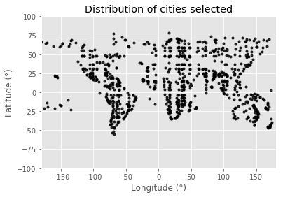
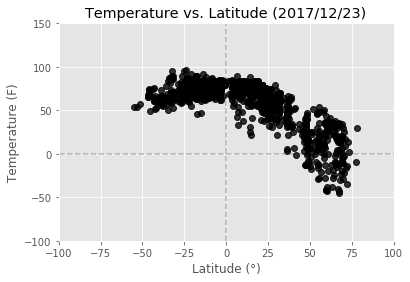
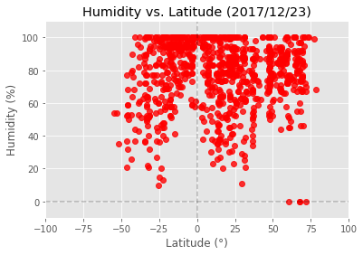
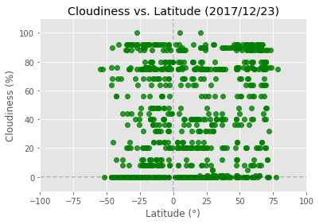
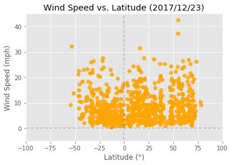

# WeatherPy
In this exercise I utilized Python libraries (requests, citipy, pandas, numpy, matplotlib.pyplot, datetime), JSON traversals, and the OpenWeatherMap API to answer a fundamental question: "What's the weather like as we approach the equator?" Weather data were collected for over nine hundred randomly selected cities across the world.

## Three observable trends based on the data below

1. Weather data collected today (2017/12/22) from over 548 cities around the world, indicate that temperatures are higher for cities at/near the equator (ranging from 50 to 100F), with temperatures dropping off at latitudes lower than -35 degrees and higher than +20 degrees. Cities +60 degrees north of the equator present temperatures as low as -50F. Notice that all plots are skewed with more data points in the northern hemisphere (>0 degrees latitude), because 68% of Earth's dry land is located in the northern hemisphere, whereas the remaining 32% is located in the southern hemisphere. Note also that dry land masses are primarily situated between -60 and +80 degrees latitude.

2. There appears to be no correlation between proximity to the equator and percent humidity, as the majority of cities fell within a 20 to 100% humidity range, independent of their latitude. The only exceptions were a few cities with humidity at 0% in latitudes ranging from +60 to +70 degrees. There also appears to be no correlation between proximity to the equator and cloudiness, as cloud cover varies from 0 to 100% for cities at/near the equator.

3. Wind speed appears to peak between +5 and +20 degrees north of the equator, but it is not clear to me if this is actually a real pattern, as wind speed also peaks at the the lowest (-40 degrees) and highest latitudes (+65 degrees). A larger sample size might helps us determine if there really is a positive or negative correlation between proximity to the equator and wind speed, or not. 


```python
#Dependencies
from citipy import citipy
import pandas as pd
import numpy as np
import matplotlib.pyplot as plt
import requests
import json
from datetime import datetime
```

## Generate Cities List


```python
#Create a list of 500 lat, lng combinations and run these values in a loop to get city names with citipy
lats=np.random.uniform(low=-90, high=90, size=70)
lngs=np.random.uniform(low=-180, high=180, size=70)
#print(lats)
#print(lngs)

# #Select 500 cities using citipy library
city_list =[]
for lat in lats:
    for lng in lngs:
        city = citipy.nearest_city(lat, lng)
        if (city.city_name + "," + city.country_code) not in city_list: 
            city_list.append(city.city_name + "," + city.country_code)
#print(city_list)
print(len(city_list))

#Convert list into a dataframe
city_list_df=pd.DataFrame(city_list)
city_list_df=city_list_df.rename(columns = {0: 'City_Country'})
#city_list_df.head()
```

    967


## Perform API Calls


```python
filename = 'apikey.txt'
```


```python
def get_file_contents(filename):
    """ Given a filename,
        return the contents of that file
    """
    try:
        with open(filename, 'r') as f:
            # It's assumed our file contains a single line, with the API key
            return f.read().strip()
    except FileNotFoundError:
        print("'%s' file not found" % filename)
```


```python
# Save config information for OpenWeatherMap 
api_key = get_file_contents(filename)
#print("Our API key is: %s" % (api_key))
```


```python
url = "http://api.openweathermap.org/data/2.5/weather?"
units="imperial"

# Create blank columns for necessary fields
# city_list_df["Temperature (F)"] = ""
# city_list_df["Humidity (%)"] = ""
# city_list_df["Cloudiness (%)"] = ""
# city_list_df["Wind Speed (mph)"] = ""
# city_list_df["Lat"]= ""
# city_list_df["Lng"]= ""

#Counter
row_count =0

#Loop through and grab data of interest - temp, humidity, cloudiness, and wind speed
for index, row in city_list_df.iterrows():
    
    # Build partial query URL
    #query_url = url + "appid=" + api_key + "&units=" + units + "&q=" + (row["City_Country"])
    query_url= "http://api.openweathermap.org/data/2.5/weather?q=%s&units=%s&mode=json&APPID=%s" % (row["City_Country"], units, api_key) 
        
    #Print log to ensure loop is working correctly
    print("Processing record #" + str(row_count) + " " + row["City_Country"])
    print(query_url)
    row_count += 1

    #Run requests to grab the JSON at the requested URL
    selected_cities = requests.get(query_url).json()
    #print(selected_cities)
    #print(json.dumps(selected_cities, indent=4, sort_keys=True))
    
    #Append the parameters of interest to the appropriate columns
    #Use try/except to skip any cities which return an error message
    try: 
        temp = selected_cities["main"]["temp"]
        humid = selected_cities["main"]["humidity"]
        cloud= selected_cities ["clouds"]["all"]
        wind = selected_cities ["wind"]["speed"]
        lat = selected_cities ["coord"]["lat"]
        lng = selected_cities ["coord"]["lon"]
    
        
        city_list_df.set_value(index, "Temperature (F)", temp)
        city_list_df.set_value(index, "Humidity (%)", humid)
        city_list_df.set_value(index, "Cloudiness (%)", cloud)
        city_list_df.set_value(index, "Wind Speed (mph)", wind) 
        city_list_df.set_value(index, "Lat", lat)
        city_list_df.set_value(index, "Lng", lng)
          
    except:
        print("Error with city data. Skipping")
        continue
      
city_list_df.head()
```

    Processing record #0 el alto,pe
    http://api.openweathermap.org/data/2.5/weather?q=el alto,pe&units=imperial&mode=json&APPID=6561b523131c94ac6ec73a0bab8810da
    Error with city data. Skipping
    Processing record #1 samusu,ws
    http://api.openweathermap.org/data/2.5/weather?q=samusu,ws&units=imperial&mode=json&APPID=6561b523131c94ac6ec73a0bab8810da
    Error with city data. Skipping
    Processing record #2 hithadhoo,mv
    http://api.openweathermap.org/data/2.5/weather?q=hithadhoo,mv&units=imperial&mode=json&APPID=6561b523131c94ac6ec73a0bab8810da
    Processing record #3 malindi,ke
    http://api.openweathermap.org/data/2.5/weather?q=malindi,ke&units=imperial&mode=json&APPID=6561b523131c94ac6ec73a0bab8810da
    Processing record #4 kakonko,tz
    http://api.openweathermap.org/data/2.5/weather?q=kakonko,tz&units=imperial&mode=json&APPID=6561b523131c94ac6ec73a0bab8810da
    Processing record #5 penalva,br
    http://api.openweathermap.org/data/2.5/weather?q=penalva,br&units=imperial&mode=json&APPID=6561b523131c94ac6ec73a0bab8810da
    Processing record #6 iquitos,pe
    http://api.openweathermap.org/data/2.5/weather?q=iquitos,pe&units=imperial&mode=json&APPID=6561b523131c94ac6ec73a0bab8810da
    Processing record #7 vaitupu,wf
    http://api.openweathermap.org/data/2.5/weather?q=vaitupu,wf&units=imperial&mode=json&APPID=6561b523131c94ac6ec73a0bab8810da
    Error with city data. Skipping
    Processing record #8 hambantota,lk
    http://api.openweathermap.org/data/2.5/weather?q=hambantota,lk&units=imperial&mode=json&APPID=6561b523131c94ac6ec73a0bab8810da
    Processing record #9 nabire,id
    http://api.openweathermap.org/data/2.5/weather?q=nabire,id&units=imperial&mode=json&APPID=6561b523131c94ac6ec73a0bab8810da
    Processing record #10 codajas,br
    http://api.openweathermap.org/data/2.5/weather?q=codajas,br&units=imperial&mode=json&APPID=6561b523131c94ac6ec73a0bab8810da
    Processing record #11 bandundu,cd
    http://api.openweathermap.org/data/2.5/weather?q=bandundu,cd&units=imperial&mode=json&APPID=6561b523131c94ac6ec73a0bab8810da
    Processing record #12 touros,br
    http://api.openweathermap.org/data/2.5/weather?q=touros,br&units=imperial&mode=json&APPID=6561b523131c94ac6ec73a0bab8810da
    Processing record #13 tabou,ci
    http://api.openweathermap.org/data/2.5/weather?q=tabou,ci&units=imperial&mode=json&APPID=6561b523131c94ac6ec73a0bab8810da
    Processing record #14 samalaeulu,ws
    http://api.openweathermap.org/data/2.5/weather?q=samalaeulu,ws&units=imperial&mode=json&APPID=6561b523131c94ac6ec73a0bab8810da
    Error with city data. Skipping
    Processing record #15 auki,sb
    http://api.openweathermap.org/data/2.5/weather?q=auki,sb&units=imperial&mode=json&APPID=6561b523131c94ac6ec73a0bab8810da
    Processing record #16 vanimo,pg
    http://api.openweathermap.org/data/2.5/weather?q=vanimo,pg&units=imperial&mode=json&APPID=6561b523131c94ac6ec73a0bab8810da
    Processing record #17 manacapuru,br
    http://api.openweathermap.org/data/2.5/weather?q=manacapuru,br&units=imperial&mode=json&APPID=6561b523131c94ac6ec73a0bab8810da
    Processing record #18 sungaipenuh,id
    http://api.openweathermap.org/data/2.5/weather?q=sungaipenuh,id&units=imperial&mode=json&APPID=6561b523131c94ac6ec73a0bab8810da
    Processing record #19 gamba,ga
    http://api.openweathermap.org/data/2.5/weather?q=gamba,ga&units=imperial&mode=json&APPID=6561b523131c94ac6ec73a0bab8810da
    Processing record #20 sao paulo de olivenca,br
    http://api.openweathermap.org/data/2.5/weather?q=sao paulo de olivenca,br&units=imperial&mode=json&APPID=6561b523131c94ac6ec73a0bab8810da
    Processing record #21 mushie,cd
    http://api.openweathermap.org/data/2.5/weather?q=mushie,cd&units=imperial&mode=json&APPID=6561b523131c94ac6ec73a0bab8810da
    Processing record #22 sibolga,id
    http://api.openweathermap.org/data/2.5/weather?q=sibolga,id&units=imperial&mode=json&APPID=6561b523131c94ac6ec73a0bab8810da
    Processing record #23 utiroa,ki
    http://api.openweathermap.org/data/2.5/weather?q=utiroa,ki&units=imperial&mode=json&APPID=6561b523131c94ac6ec73a0bab8810da
    Error with city data. Skipping
    Processing record #24 georgetown,sh
    http://api.openweathermap.org/data/2.5/weather?q=georgetown,sh&units=imperial&mode=json&APPID=6561b523131c94ac6ec73a0bab8810da
    Processing record #25 faanui,pf
    http://api.openweathermap.org/data/2.5/weather?q=faanui,pf&units=imperial&mode=json&APPID=6561b523131c94ac6ec73a0bab8810da
    Processing record #26 monduli,tz
    http://api.openweathermap.org/data/2.5/weather?q=monduli,tz&units=imperial&mode=json&APPID=6561b523131c94ac6ec73a0bab8810da
    Processing record #27 puerto ayora,ec
    http://api.openweathermap.org/data/2.5/weather?q=puerto ayora,ec&units=imperial&mode=json&APPID=6561b523131c94ac6ec73a0bab8810da
    Processing record #28 padang,id
    http://api.openweathermap.org/data/2.5/weather?q=padang,id&units=imperial&mode=json&APPID=6561b523131c94ac6ec73a0bab8810da
    Processing record #29 voi,ke
    http://api.openweathermap.org/data/2.5/weather?q=voi,ke&units=imperial&mode=json&APPID=6561b523131c94ac6ec73a0bab8810da
    Processing record #30 atuona,pf
    http://api.openweathermap.org/data/2.5/weather?q=atuona,pf&units=imperial&mode=json&APPID=6561b523131c94ac6ec73a0bab8810da
    Processing record #31 barawe,so
    http://api.openweathermap.org/data/2.5/weather?q=barawe,so&units=imperial&mode=json&APPID=6561b523131c94ac6ec73a0bab8810da
    Error with city data. Skipping
    Processing record #32 kendari,id
    http://api.openweathermap.org/data/2.5/weather?q=kendari,id&units=imperial&mode=json&APPID=6561b523131c94ac6ec73a0bab8810da
    Processing record #33 tefe,br
    http://api.openweathermap.org/data/2.5/weather?q=tefe,br&units=imperial&mode=json&APPID=6561b523131c94ac6ec73a0bab8810da
    Processing record #34 angoram,pg
    http://api.openweathermap.org/data/2.5/weather?q=angoram,pg&units=imperial&mode=json&APPID=6561b523131c94ac6ec73a0bab8810da
    Processing record #35 santa ines,br
    http://api.openweathermap.org/data/2.5/weather?q=santa ines,br&units=imperial&mode=json&APPID=6561b523131c94ac6ec73a0bab8810da
    Error with city data. Skipping
    Processing record #36 lorengau,pg
    http://api.openweathermap.org/data/2.5/weather?q=lorengau,pg&units=imperial&mode=json&APPID=6561b523131c94ac6ec73a0bab8810da
    Processing record #37 namatanai,pg
    http://api.openweathermap.org/data/2.5/weather?q=namatanai,pg&units=imperial&mode=json&APPID=6561b523131c94ac6ec73a0bab8810da
    Processing record #38 kavieng,pg
    http://api.openweathermap.org/data/2.5/weather?q=kavieng,pg&units=imperial&mode=json&APPID=6561b523131c94ac6ec73a0bab8810da
    Processing record #39 victoria,sc
    http://api.openweathermap.org/data/2.5/weather?q=victoria,sc&units=imperial&mode=json&APPID=6561b523131c94ac6ec73a0bab8810da
    Processing record #40 barabai,id
    http://api.openweathermap.org/data/2.5/weather?q=barabai,id&units=imperial&mode=json&APPID=6561b523131c94ac6ec73a0bab8810da
    Processing record #41 pasaje,ec
    http://api.openweathermap.org/data/2.5/weather?q=pasaje,ec&units=imperial&mode=json&APPID=6561b523131c94ac6ec73a0bab8810da
    Processing record #42 saleaula,ws
    http://api.openweathermap.org/data/2.5/weather?q=saleaula,ws&units=imperial&mode=json&APPID=6561b523131c94ac6ec73a0bab8810da
    Error with city data. Skipping
    Processing record #43 mto wa mbu,tz
    http://api.openweathermap.org/data/2.5/weather?q=mto wa mbu,tz&units=imperial&mode=json&APPID=6561b523131c94ac6ec73a0bab8810da
    Processing record #44 palembang,id
    http://api.openweathermap.org/data/2.5/weather?q=palembang,id&units=imperial&mode=json&APPID=6561b523131c94ac6ec73a0bab8810da
    Processing record #45 uvira,cd
    http://api.openweathermap.org/data/2.5/weather?q=uvira,cd&units=imperial&mode=json&APPID=6561b523131c94ac6ec73a0bab8810da
    Processing record #46 buala,sb
    http://api.openweathermap.org/data/2.5/weather?q=buala,sb&units=imperial&mode=json&APPID=6561b523131c94ac6ec73a0bab8810da
    Processing record #47 qaanaaq,gl
    http://api.openweathermap.org/data/2.5/weather?q=qaanaaq,gl&units=imperial&mode=json&APPID=6561b523131c94ac6ec73a0bab8810da
    Processing record #48 barrow,us
    http://api.openweathermap.org/data/2.5/weather?q=barrow,us&units=imperial&mode=json&APPID=6561b523131c94ac6ec73a0bab8810da
    Processing record #49 dikson,ru
    http://api.openweathermap.org/data/2.5/weather?q=dikson,ru&units=imperial&mode=json&APPID=6561b523131c94ac6ec73a0bab8810da
    Processing record #50 tumannyy,ru
    http://api.openweathermap.org/data/2.5/weather?q=tumannyy,ru&units=imperial&mode=json&APPID=6561b523131c94ac6ec73a0bab8810da
    Error with city data. Skipping
    Processing record #51 berlevag,no
    http://api.openweathermap.org/data/2.5/weather?q=berlevag,no&units=imperial&mode=json&APPID=6561b523131c94ac6ec73a0bab8810da
    Processing record #52 upernavik,gl
    http://api.openweathermap.org/data/2.5/weather?q=upernavik,gl&units=imperial&mode=json&APPID=6561b523131c94ac6ec73a0bab8810da
    Processing record #53 mys shmidta,ru
    http://api.openweathermap.org/data/2.5/weather?q=mys shmidta,ru&units=imperial&mode=json&APPID=6561b523131c94ac6ec73a0bab8810da
    Error with city data. Skipping
    Processing record #54 nizhneyansk,ru
    http://api.openweathermap.org/data/2.5/weather?q=nizhneyansk,ru&units=imperial&mode=json&APPID=6561b523131c94ac6ec73a0bab8810da
    Error with city data. Skipping
    Processing record #55 narsaq,gl
    http://api.openweathermap.org/data/2.5/weather?q=narsaq,gl&units=imperial&mode=json&APPID=6561b523131c94ac6ec73a0bab8810da
    Processing record #56 longyearbyen,sj
    http://api.openweathermap.org/data/2.5/weather?q=longyearbyen,sj&units=imperial&mode=json&APPID=6561b523131c94ac6ec73a0bab8810da
    Processing record #57 illoqqortoormiut,gl
    http://api.openweathermap.org/data/2.5/weather?q=illoqqortoormiut,gl&units=imperial&mode=json&APPID=6561b523131c94ac6ec73a0bab8810da
    Error with city data. Skipping
    Processing record #58 barentsburg,sj
    http://api.openweathermap.org/data/2.5/weather?q=barentsburg,sj&units=imperial&mode=json&APPID=6561b523131c94ac6ec73a0bab8810da
    Error with city data. Skipping
    Processing record #59 pevek,ru
    http://api.openweathermap.org/data/2.5/weather?q=pevek,ru&units=imperial&mode=json&APPID=6561b523131c94ac6ec73a0bab8810da
    Processing record #60 khatanga,ru
    http://api.openweathermap.org/data/2.5/weather?q=khatanga,ru&units=imperial&mode=json&APPID=6561b523131c94ac6ec73a0bab8810da
    Processing record #61 vardo,no
    http://api.openweathermap.org/data/2.5/weather?q=vardo,no&units=imperial&mode=json&APPID=6561b523131c94ac6ec73a0bab8810da
    Processing record #62 yellowknife,ca
    http://api.openweathermap.org/data/2.5/weather?q=yellowknife,ca&units=imperial&mode=json&APPID=6561b523131c94ac6ec73a0bab8810da
    Processing record #63 belushya guba,ru
    http://api.openweathermap.org/data/2.5/weather?q=belushya guba,ru&units=imperial&mode=json&APPID=6561b523131c94ac6ec73a0bab8810da
    Error with city data. Skipping
    Processing record #64 tiksi,ru
    http://api.openweathermap.org/data/2.5/weather?q=tiksi,ru&units=imperial&mode=json&APPID=6561b523131c94ac6ec73a0bab8810da
    Processing record #65 chokurdakh,ru
    http://api.openweathermap.org/data/2.5/weather?q=chokurdakh,ru&units=imperial&mode=json&APPID=6561b523131c94ac6ec73a0bab8810da
    Processing record #66 amderma,ru
    http://api.openweathermap.org/data/2.5/weather?q=amderma,ru&units=imperial&mode=json&APPID=6561b523131c94ac6ec73a0bab8810da
    Error with city data. Skipping
    Processing record #67 saskylakh,ru
    http://api.openweathermap.org/data/2.5/weather?q=saskylakh,ru&units=imperial&mode=json&APPID=6561b523131c94ac6ec73a0bab8810da
    Processing record #68 tuktoyaktuk,ca
    http://api.openweathermap.org/data/2.5/weather?q=tuktoyaktuk,ca&units=imperial&mode=json&APPID=6561b523131c94ac6ec73a0bab8810da
    Processing record #69 cherskiy,ru
    http://api.openweathermap.org/data/2.5/weather?q=cherskiy,ru&units=imperial&mode=json&APPID=6561b523131c94ac6ec73a0bab8810da
    Processing record #70 santa fe,cu
    http://api.openweathermap.org/data/2.5/weather?q=santa fe,cu&units=imperial&mode=json&APPID=6561b523131c94ac6ec73a0bab8810da
    Processing record #71 kapaa,us
    http://api.openweathermap.org/data/2.5/weather?q=kapaa,us&units=imperial&mode=json&APPID=6561b523131c94ac6ec73a0bab8810da
    Processing record #72 kundla,in
    http://api.openweathermap.org/data/2.5/weather?q=kundla,in&units=imperial&mode=json&APPID=6561b523131c94ac6ec73a0bab8810da
    Processing record #73 mecca,sa
    http://api.openweathermap.org/data/2.5/weather?q=mecca,sa&units=imperial&mode=json&APPID=6561b523131c94ac6ec73a0bab8810da
    Processing record #74 marawi,sd
    http://api.openweathermap.org/data/2.5/weather?q=marawi,sd&units=imperial&mode=json&APPID=6561b523131c94ac6ec73a0bab8810da
    Processing record #75 bathsheba,bb
    http://api.openweathermap.org/data/2.5/weather?q=bathsheba,bb&units=imperial&mode=json&APPID=6561b523131c94ac6ec73a0bab8810da
    Processing record #76 baracoa,cu
    http://api.openweathermap.org/data/2.5/weather?q=baracoa,cu&units=imperial&mode=json&APPID=6561b523131c94ac6ec73a0bab8810da
    Processing record #77 deogarh,in
    http://api.openweathermap.org/data/2.5/weather?q=deogarh,in&units=imperial&mode=json&APPID=6561b523131c94ac6ec73a0bab8810da
    Processing record #78 nishihara,jp
    http://api.openweathermap.org/data/2.5/weather?q=nishihara,jp&units=imperial&mode=json&APPID=6561b523131c94ac6ec73a0bab8810da
    Processing record #79 the valley,ai
    http://api.openweathermap.org/data/2.5/weather?q=the valley,ai&units=imperial&mode=json&APPID=6561b523131c94ac6ec73a0bab8810da
    Processing record #80 faya,td
    http://api.openweathermap.org/data/2.5/weather?q=faya,td&units=imperial&mode=json&APPID=6561b523131c94ac6ec73a0bab8810da
    Error with city data. Skipping
    Processing record #81 nilagiri,in
    http://api.openweathermap.org/data/2.5/weather?q=nilagiri,in&units=imperial&mode=json&APPID=6561b523131c94ac6ec73a0bab8810da
    Processing record #82 ponta do sol,cv
    http://api.openweathermap.org/data/2.5/weather?q=ponta do sol,cv&units=imperial&mode=json&APPID=6561b523131c94ac6ec73a0bab8810da
    Processing record #83 taoudenni,ml
    http://api.openweathermap.org/data/2.5/weather?q=taoudenni,ml&units=imperial&mode=json&APPID=6561b523131c94ac6ec73a0bab8810da
    Processing record #84 butaritari,ki
    http://api.openweathermap.org/data/2.5/weather?q=butaritari,ki&units=imperial&mode=json&APPID=6561b523131c94ac6ec73a0bab8810da
    Processing record #85 naze,jp
    http://api.openweathermap.org/data/2.5/weather?q=naze,jp&units=imperial&mode=json&APPID=6561b523131c94ac6ec73a0bab8810da
    Processing record #86 dwarka,in
    http://api.openweathermap.org/data/2.5/weather?q=dwarka,in&units=imperial&mode=json&APPID=6561b523131c94ac6ec73a0bab8810da
    Processing record #87 baleshwar,in
    http://api.openweathermap.org/data/2.5/weather?q=baleshwar,in&units=imperial&mode=json&APPID=6561b523131c94ac6ec73a0bab8810da
    Processing record #88 codrington,ag
    http://api.openweathermap.org/data/2.5/weather?q=codrington,ag&units=imperial&mode=json&APPID=6561b523131c94ac6ec73a0bab8810da
    Error with city data. Skipping
    Processing record #89 yunjinghong,cn
    http://api.openweathermap.org/data/2.5/weather?q=yunjinghong,cn&units=imperial&mode=json&APPID=6561b523131c94ac6ec73a0bab8810da
    Error with city data. Skipping
    Processing record #90 arlit,ne
    http://api.openweathermap.org/data/2.5/weather?q=arlit,ne&units=imperial&mode=json&APPID=6561b523131c94ac6ec73a0bab8810da
    Processing record #91 cockburn town,tc
    http://api.openweathermap.org/data/2.5/weather?q=cockburn town,tc&units=imperial&mode=json&APPID=6561b523131c94ac6ec73a0bab8810da
    Processing record #92 teknaf,bd
    http://api.openweathermap.org/data/2.5/weather?q=teknaf,bd&units=imperial&mode=json&APPID=6561b523131c94ac6ec73a0bab8810da
    Processing record #93 nouadhibou,mr
    http://api.openweathermap.org/data/2.5/weather?q=nouadhibou,mr&units=imperial&mode=json&APPID=6561b523131c94ac6ec73a0bab8810da
    Processing record #94 hilo,us
    http://api.openweathermap.org/data/2.5/weather?q=hilo,us&units=imperial&mode=json&APPID=6561b523131c94ac6ec73a0bab8810da
    Processing record #95 sawakin,sd
    http://api.openweathermap.org/data/2.5/weather?q=sawakin,sd&units=imperial&mode=json&APPID=6561b523131c94ac6ec73a0bab8810da
    Processing record #96 vega de alatorre,mx
    http://api.openweathermap.org/data/2.5/weather?q=vega de alatorre,mx&units=imperial&mode=json&APPID=6561b523131c94ac6ec73a0bab8810da
    Processing record #97 todos santos,mx
    http://api.openweathermap.org/data/2.5/weather?q=todos santos,mx&units=imperial&mode=json&APPID=6561b523131c94ac6ec73a0bab8810da
    Processing record #98 san diego de la union,mx
    http://api.openweathermap.org/data/2.5/weather?q=san diego de la union,mx&units=imperial&mode=json&APPID=6561b523131c94ac6ec73a0bab8810da
    Processing record #99 taunggyi,mm
    http://api.openweathermap.org/data/2.5/weather?q=taunggyi,mm&units=imperial&mode=json&APPID=6561b523131c94ac6ec73a0bab8810da
    Processing record #100 jiddah,sa
    http://api.openweathermap.org/data/2.5/weather?q=jiddah,sa&units=imperial&mode=json&APPID=6561b523131c94ac6ec73a0bab8810da
    Error with city data. Skipping
    Processing record #101 riyadh,sa
    http://api.openweathermap.org/data/2.5/weather?q=riyadh,sa&units=imperial&mode=json&APPID=6561b523131c94ac6ec73a0bab8810da
    Processing record #102 aiea,us
    http://api.openweathermap.org/data/2.5/weather?q=aiea,us&units=imperial&mode=json&APPID=6561b523131c94ac6ec73a0bab8810da
    Processing record #103 ishigaki,jp
    http://api.openweathermap.org/data/2.5/weather?q=ishigaki,jp&units=imperial&mode=json&APPID=6561b523131c94ac6ec73a0bab8810da
    Processing record #104 road town,vg
    http://api.openweathermap.org/data/2.5/weather?q=road town,vg&units=imperial&mode=json&APPID=6561b523131c94ac6ec73a0bab8810da
    Processing record #105 kosamba,in
    http://api.openweathermap.org/data/2.5/weather?q=kosamba,in&units=imperial&mode=json&APPID=6561b523131c94ac6ec73a0bab8810da
    Processing record #106 katsuura,jp
    http://api.openweathermap.org/data/2.5/weather?q=katsuura,jp&units=imperial&mode=json&APPID=6561b523131c94ac6ec73a0bab8810da
    Processing record #107 sur,om
    http://api.openweathermap.org/data/2.5/weather?q=sur,om&units=imperial&mode=json&APPID=6561b523131c94ac6ec73a0bab8810da
    Processing record #108 jiazi,cn
    http://api.openweathermap.org/data/2.5/weather?q=jiazi,cn&units=imperial&mode=json&APPID=6561b523131c94ac6ec73a0bab8810da
    Processing record #109 trinidad,cu
    http://api.openweathermap.org/data/2.5/weather?q=trinidad,cu&units=imperial&mode=json&APPID=6561b523131c94ac6ec73a0bab8810da
    Processing record #110 makaha,us
    http://api.openweathermap.org/data/2.5/weather?q=makaha,us&units=imperial&mode=json&APPID=6561b523131c94ac6ec73a0bab8810da
    Processing record #111 viet tri,vn
    http://api.openweathermap.org/data/2.5/weather?q=viet tri,vn&units=imperial&mode=json&APPID=6561b523131c94ac6ec73a0bab8810da
    Processing record #112 san blas,mx
    http://api.openweathermap.org/data/2.5/weather?q=san blas,mx&units=imperial&mode=json&APPID=6561b523131c94ac6ec73a0bab8810da
    Processing record #113 constitucion,mx
    http://api.openweathermap.org/data/2.5/weather?q=constitucion,mx&units=imperial&mode=json&APPID=6561b523131c94ac6ec73a0bab8810da
    Processing record #114 iralaya,hn
    http://api.openweathermap.org/data/2.5/weather?q=iralaya,hn&units=imperial&mode=json&APPID=6561b523131c94ac6ec73a0bab8810da
    Processing record #115 malwan,in
    http://api.openweathermap.org/data/2.5/weather?q=malwan,in&units=imperial&mode=json&APPID=6561b523131c94ac6ec73a0bab8810da
    Error with city data. Skipping
    Processing record #116 ginda,er
    http://api.openweathermap.org/data/2.5/weather?q=ginda,er&units=imperial&mode=json&APPID=6561b523131c94ac6ec73a0bab8810da
    Error with city data. Skipping
    Processing record #117 umm durman,sd
    http://api.openweathermap.org/data/2.5/weather?q=umm durman,sd&units=imperial&mode=json&APPID=6561b523131c94ac6ec73a0bab8810da
    Error with city data. Skipping
    Processing record #118 cayenne,gf
    http://api.openweathermap.org/data/2.5/weather?q=cayenne,gf&units=imperial&mode=json&APPID=6561b523131c94ac6ec73a0bab8810da
    Processing record #119 les cayes,ht
    http://api.openweathermap.org/data/2.5/weather?q=les cayes,ht&units=imperial&mode=json&APPID=6561b523131c94ac6ec73a0bab8810da
    Processing record #120 yarada,in
    http://api.openweathermap.org/data/2.5/weather?q=yarada,in&units=imperial&mode=json&APPID=6561b523131c94ac6ec73a0bab8810da
    Processing record #121 meyungs,pw
    http://api.openweathermap.org/data/2.5/weather?q=meyungs,pw&units=imperial&mode=json&APPID=6561b523131c94ac6ec73a0bab8810da
    Error with city data. Skipping
    Processing record #122 pointe michel,dm
    http://api.openweathermap.org/data/2.5/weather?q=pointe michel,dm&units=imperial&mode=json&APPID=6561b523131c94ac6ec73a0bab8810da
    Processing record #123 ati,td
    http://api.openweathermap.org/data/2.5/weather?q=ati,td&units=imperial&mode=json&APPID=6561b523131c94ac6ec73a0bab8810da
    Processing record #124 narasannapeta,in
    http://api.openweathermap.org/data/2.5/weather?q=narasannapeta,in&units=imperial&mode=json&APPID=6561b523131c94ac6ec73a0bab8810da
    Processing record #125 porto novo,cv
    http://api.openweathermap.org/data/2.5/weather?q=porto novo,cv&units=imperial&mode=json&APPID=6561b523131c94ac6ec73a0bab8810da
    Processing record #126 sokolo,ml
    http://api.openweathermap.org/data/2.5/weather?q=sokolo,ml&units=imperial&mode=json&APPID=6561b523131c94ac6ec73a0bab8810da
    Processing record #127 airai,pw
    http://api.openweathermap.org/data/2.5/weather?q=airai,pw&units=imperial&mode=json&APPID=6561b523131c94ac6ec73a0bab8810da
    Error with city data. Skipping
    Processing record #128 sainte-marie,mq
    http://api.openweathermap.org/data/2.5/weather?q=sainte-marie,mq&units=imperial&mode=json&APPID=6561b523131c94ac6ec73a0bab8810da
    Processing record #129 lop buri,th
    http://api.openweathermap.org/data/2.5/weather?q=lop buri,th&units=imperial&mode=json&APPID=6561b523131c94ac6ec73a0bab8810da
    Processing record #130 tanout,ne
    http://api.openweathermap.org/data/2.5/weather?q=tanout,ne&units=imperial&mode=json&APPID=6561b523131c94ac6ec73a0bab8810da
    Processing record #131 oranjestad,aw
    http://api.openweathermap.org/data/2.5/weather?q=oranjestad,aw&units=imperial&mode=json&APPID=6561b523131c94ac6ec73a0bab8810da
    Processing record #132 moussoro,td
    http://api.openweathermap.org/data/2.5/weather?q=moussoro,td&units=imperial&mode=json&APPID=6561b523131c94ac6ec73a0bab8810da
    Processing record #133 labutta,mm
    http://api.openweathermap.org/data/2.5/weather?q=labutta,mm&units=imperial&mode=json&APPID=6561b523131c94ac6ec73a0bab8810da
    Error with city data. Skipping
    Processing record #134 pout,sn
    http://api.openweathermap.org/data/2.5/weather?q=pout,sn&units=imperial&mode=json&APPID=6561b523131c94ac6ec73a0bab8810da
    Processing record #135 teseney,er
    http://api.openweathermap.org/data/2.5/weather?q=teseney,er&units=imperial&mode=json&APPID=6561b523131c94ac6ec73a0bab8810da
    Processing record #136 salina cruz,mx
    http://api.openweathermap.org/data/2.5/weather?q=salina cruz,mx&units=imperial&mode=json&APPID=6561b523131c94ac6ec73a0bab8810da
    Processing record #137 cabo san lucas,mx
    http://api.openweathermap.org/data/2.5/weather?q=cabo san lucas,mx&units=imperial&mode=json&APPID=6561b523131c94ac6ec73a0bab8810da
    Processing record #138 tenenkou,ml
    http://api.openweathermap.org/data/2.5/weather?q=tenenkou,ml&units=imperial&mode=json&APPID=6561b523131c94ac6ec73a0bab8810da
    Processing record #139 acapulco,mx
    http://api.openweathermap.org/data/2.5/weather?q=acapulco,mx&units=imperial&mode=json&APPID=6561b523131c94ac6ec73a0bab8810da
    Processing record #140 ye,mm
    http://api.openweathermap.org/data/2.5/weather?q=ye,mm&units=imperial&mode=json&APPID=6561b523131c94ac6ec73a0bab8810da
    Error with city data. Skipping
    Processing record #141 addi ugri,er
    http://api.openweathermap.org/data/2.5/weather?q=addi ugri,er&units=imperial&mode=json&APPID=6561b523131c94ac6ec73a0bab8810da
    Error with city data. Skipping
    Processing record #142 khombole,sn
    http://api.openweathermap.org/data/2.5/weather?q=khombole,sn&units=imperial&mode=json&APPID=6561b523131c94ac6ec73a0bab8810da
    Processing record #143 vila do maio,cv
    http://api.openweathermap.org/data/2.5/weather?q=vila do maio,cv&units=imperial&mode=json&APPID=6561b523131c94ac6ec73a0bab8810da
    Processing record #144 yarim,ye
    http://api.openweathermap.org/data/2.5/weather?q=yarim,ye&units=imperial&mode=json&APPID=6561b523131c94ac6ec73a0bab8810da
    Processing record #145 pandan,ph
    http://api.openweathermap.org/data/2.5/weather?q=pandan,ph&units=imperial&mode=json&APPID=6561b523131c94ac6ec73a0bab8810da
    Processing record #146 charlestown,kn
    http://api.openweathermap.org/data/2.5/weather?q=charlestown,kn&units=imperial&mode=json&APPID=6561b523131c94ac6ec73a0bab8810da
    Processing record #147 mormugao,in
    http://api.openweathermap.org/data/2.5/weather?q=mormugao,in&units=imperial&mode=json&APPID=6561b523131c94ac6ec73a0bab8810da
    Error with city data. Skipping
    Processing record #148 sinnamary,gf
    http://api.openweathermap.org/data/2.5/weather?q=sinnamary,gf&units=imperial&mode=json&APPID=6561b523131c94ac6ec73a0bab8810da
    Processing record #149 salalah,om
    http://api.openweathermap.org/data/2.5/weather?q=salalah,om&units=imperial&mode=json&APPID=6561b523131c94ac6ec73a0bab8810da
    Processing record #150 lahij,ye
    http://api.openweathermap.org/data/2.5/weather?q=lahij,ye&units=imperial&mode=json&APPID=6561b523131c94ac6ec73a0bab8810da
    Processing record #151 palauig,ph
    http://api.openweathermap.org/data/2.5/weather?q=palauig,ph&units=imperial&mode=json&APPID=6561b523131c94ac6ec73a0bab8810da
    Processing record #152 san andres,co
    http://api.openweathermap.org/data/2.5/weather?q=san andres,co&units=imperial&mode=json&APPID=6561b523131c94ac6ec73a0bab8810da
    Processing record #153 kassala,sd
    http://api.openweathermap.org/data/2.5/weather?q=kassala,sd&units=imperial&mode=json&APPID=6561b523131c94ac6ec73a0bab8810da
    Processing record #154 det udom,th
    http://api.openweathermap.org/data/2.5/weather?q=det udom,th&units=imperial&mode=json&APPID=6561b523131c94ac6ec73a0bab8810da
    Processing record #155 umm kaddadah,sd
    http://api.openweathermap.org/data/2.5/weather?q=umm kaddadah,sd&units=imperial&mode=json&APPID=6561b523131c94ac6ec73a0bab8810da
    Processing record #156 coahuayana,mx
    http://api.openweathermap.org/data/2.5/weather?q=coahuayana,mx&units=imperial&mode=json&APPID=6561b523131c94ac6ec73a0bab8810da
    Processing record #157 praia,cv
    http://api.openweathermap.org/data/2.5/weather?q=praia,cv&units=imperial&mode=json&APPID=6561b523131c94ac6ec73a0bab8810da
    Processing record #158 punta arenas,cl
    http://api.openweathermap.org/data/2.5/weather?q=punta arenas,cl&units=imperial&mode=json&APPID=6561b523131c94ac6ec73a0bab8810da
    Processing record #159 avarua,ck
    http://api.openweathermap.org/data/2.5/weather?q=avarua,ck&units=imperial&mode=json&APPID=6561b523131c94ac6ec73a0bab8810da
    Processing record #160 saint-philippe,re
    http://api.openweathermap.org/data/2.5/weather?q=saint-philippe,re&units=imperial&mode=json&APPID=6561b523131c94ac6ec73a0bab8810da
    Processing record #161 port alfred,za
    http://api.openweathermap.org/data/2.5/weather?q=port alfred,za&units=imperial&mode=json&APPID=6561b523131c94ac6ec73a0bab8810da
    Processing record #162 port elizabeth,za
    http://api.openweathermap.org/data/2.5/weather?q=port elizabeth,za&units=imperial&mode=json&APPID=6561b523131c94ac6ec73a0bab8810da
    Processing record #163 mar del plata,ar
    http://api.openweathermap.org/data/2.5/weather?q=mar del plata,ar&units=imperial&mode=json&APPID=6561b523131c94ac6ec73a0bab8810da
    Processing record #164 vaini,to
    http://api.openweathermap.org/data/2.5/weather?q=vaini,to&units=imperial&mode=json&APPID=6561b523131c94ac6ec73a0bab8810da
    Processing record #165 busselton,au
    http://api.openweathermap.org/data/2.5/weather?q=busselton,au&units=imperial&mode=json&APPID=6561b523131c94ac6ec73a0bab8810da
    Processing record #166 new norfolk,au
    http://api.openweathermap.org/data/2.5/weather?q=new norfolk,au&units=imperial&mode=json&APPID=6561b523131c94ac6ec73a0bab8810da
    Processing record #167 ushuaia,ar
    http://api.openweathermap.org/data/2.5/weather?q=ushuaia,ar&units=imperial&mode=json&APPID=6561b523131c94ac6ec73a0bab8810da
    Processing record #168 bredasdorp,za
    http://api.openweathermap.org/data/2.5/weather?q=bredasdorp,za&units=imperial&mode=json&APPID=6561b523131c94ac6ec73a0bab8810da
    Processing record #169 chuy,uy
    http://api.openweathermap.org/data/2.5/weather?q=chuy,uy&units=imperial&mode=json&APPID=6561b523131c94ac6ec73a0bab8810da
    Processing record #170 cape town,za
    http://api.openweathermap.org/data/2.5/weather?q=cape town,za&units=imperial&mode=json&APPID=6561b523131c94ac6ec73a0bab8810da
    Processing record #171 bluff,nz
    http://api.openweathermap.org/data/2.5/weather?q=bluff,nz&units=imperial&mode=json&APPID=6561b523131c94ac6ec73a0bab8810da
    Processing record #172 hermanus,za
    http://api.openweathermap.org/data/2.5/weather?q=hermanus,za&units=imperial&mode=json&APPID=6561b523131c94ac6ec73a0bab8810da
    Processing record #173 kaitangata,nz
    http://api.openweathermap.org/data/2.5/weather?q=kaitangata,nz&units=imperial&mode=json&APPID=6561b523131c94ac6ec73a0bab8810da
    Processing record #174 arraial do cabo,br
    http://api.openweathermap.org/data/2.5/weather?q=arraial do cabo,br&units=imperial&mode=json&APPID=6561b523131c94ac6ec73a0bab8810da
    Processing record #175 mataura,pf
    http://api.openweathermap.org/data/2.5/weather?q=mataura,pf&units=imperial&mode=json&APPID=6561b523131c94ac6ec73a0bab8810da
    Error with city data. Skipping
    Processing record #176 rikitea,pf
    http://api.openweathermap.org/data/2.5/weather?q=rikitea,pf&units=imperial&mode=json&APPID=6561b523131c94ac6ec73a0bab8810da
    Processing record #177 castro,cl
    http://api.openweathermap.org/data/2.5/weather?q=castro,cl&units=imperial&mode=json&APPID=6561b523131c94ac6ec73a0bab8810da
    Processing record #178 jamestown,sh
    http://api.openweathermap.org/data/2.5/weather?q=jamestown,sh&units=imperial&mode=json&APPID=6561b523131c94ac6ec73a0bab8810da
    Processing record #179 cidreira,br
    http://api.openweathermap.org/data/2.5/weather?q=cidreira,br&units=imperial&mode=json&APPID=6561b523131c94ac6ec73a0bab8810da
    Processing record #180 east london,za
    http://api.openweathermap.org/data/2.5/weather?q=east london,za&units=imperial&mode=json&APPID=6561b523131c94ac6ec73a0bab8810da
    Processing record #181 albany,au
    http://api.openweathermap.org/data/2.5/weather?q=albany,au&units=imperial&mode=json&APPID=6561b523131c94ac6ec73a0bab8810da
    Processing record #182 hobart,au
    http://api.openweathermap.org/data/2.5/weather?q=hobart,au&units=imperial&mode=json&APPID=6561b523131c94ac6ec73a0bab8810da
    Processing record #183 taolanaro,mg
    http://api.openweathermap.org/data/2.5/weather?q=taolanaro,mg&units=imperial&mode=json&APPID=6561b523131c94ac6ec73a0bab8810da
    Error with city data. Skipping
    Processing record #184 tuatapere,nz
    http://api.openweathermap.org/data/2.5/weather?q=tuatapere,nz&units=imperial&mode=json&APPID=6561b523131c94ac6ec73a0bab8810da
    Processing record #185 attawapiskat,ca
    http://api.openweathermap.org/data/2.5/weather?q=attawapiskat,ca&units=imperial&mode=json&APPID=6561b523131c94ac6ec73a0bab8810da
    Error with city data. Skipping
    Processing record #186 nome,us
    http://api.openweathermap.org/data/2.5/weather?q=nome,us&units=imperial&mode=json&APPID=6561b523131c94ac6ec73a0bab8810da
    Processing record #187 yar-sale,ru
    http://api.openweathermap.org/data/2.5/weather?q=yar-sale,ru&units=imperial&mode=json&APPID=6561b523131c94ac6ec73a0bab8810da
    Processing record #188 ostrovnoy,ru
    http://api.openweathermap.org/data/2.5/weather?q=ostrovnoy,ru&units=imperial&mode=json&APPID=6561b523131c94ac6ec73a0bab8810da
    Processing record #189 pyaozerskiy,ru
    http://api.openweathermap.org/data/2.5/weather?q=pyaozerskiy,ru&units=imperial&mode=json&APPID=6561b523131c94ac6ec73a0bab8810da
    Processing record #190 qaqortoq,gl
    http://api.openweathermap.org/data/2.5/weather?q=qaqortoq,gl&units=imperial&mode=json&APPID=6561b523131c94ac6ec73a0bab8810da
    Processing record #191 iqaluit,ca
    http://api.openweathermap.org/data/2.5/weather?q=iqaluit,ca&units=imperial&mode=json&APPID=6561b523131c94ac6ec73a0bab8810da
    Processing record #192 egvekinot,ru
    http://api.openweathermap.org/data/2.5/weather?q=egvekinot,ru&units=imperial&mode=json&APPID=6561b523131c94ac6ec73a0bab8810da
    Processing record #193 igarka,ru
    http://api.openweathermap.org/data/2.5/weather?q=igarka,ru&units=imperial&mode=json&APPID=6561b523131c94ac6ec73a0bab8810da
    Processing record #194 verkhoyansk,ru
    http://api.openweathermap.org/data/2.5/weather?q=verkhoyansk,ru&units=imperial&mode=json&APPID=6561b523131c94ac6ec73a0bab8810da
    Processing record #195 pangnirtung,ca
    http://api.openweathermap.org/data/2.5/weather?q=pangnirtung,ca&units=imperial&mode=json&APPID=6561b523131c94ac6ec73a0bab8810da
    Processing record #196 beisfjord,no
    http://api.openweathermap.org/data/2.5/weather?q=beisfjord,no&units=imperial&mode=json&APPID=6561b523131c94ac6ec73a0bab8810da
    Processing record #197 tasiilaq,gl
    http://api.openweathermap.org/data/2.5/weather?q=tasiilaq,gl&units=imperial&mode=json&APPID=6561b523131c94ac6ec73a0bab8810da
    Processing record #198 klaksvik,fo
    http://api.openweathermap.org/data/2.5/weather?q=klaksvik,fo&units=imperial&mode=json&APPID=6561b523131c94ac6ec73a0bab8810da
    Processing record #199 bilibino,ru
    http://api.openweathermap.org/data/2.5/weather?q=bilibino,ru&units=imperial&mode=json&APPID=6561b523131c94ac6ec73a0bab8810da
    Processing record #200 deputatskiy,ru
    http://api.openweathermap.org/data/2.5/weather?q=deputatskiy,ru&units=imperial&mode=json&APPID=6561b523131c94ac6ec73a0bab8810da
    Processing record #201 aksarka,ru
    http://api.openweathermap.org/data/2.5/weather?q=aksarka,ru&units=imperial&mode=json&APPID=6561b523131c94ac6ec73a0bab8810da
    Processing record #202 turukhansk,ru
    http://api.openweathermap.org/data/2.5/weather?q=turukhansk,ru&units=imperial&mode=json&APPID=6561b523131c94ac6ec73a0bab8810da
    Processing record #203 tura,ru
    http://api.openweathermap.org/data/2.5/weather?q=tura,ru&units=imperial&mode=json&APPID=6561b523131c94ac6ec73a0bab8810da
    Processing record #204 rorvik,no
    http://api.openweathermap.org/data/2.5/weather?q=rorvik,no&units=imperial&mode=json&APPID=6561b523131c94ac6ec73a0bab8810da
    Processing record #205 straumen,no
    http://api.openweathermap.org/data/2.5/weather?q=straumen,no&units=imperial&mode=json&APPID=6561b523131c94ac6ec73a0bab8810da
    Processing record #206 svetlogorsk,ru
    http://api.openweathermap.org/data/2.5/weather?q=svetlogorsk,ru&units=imperial&mode=json&APPID=6561b523131c94ac6ec73a0bab8810da
    Processing record #207 komsomolskiy,ru
    http://api.openweathermap.org/data/2.5/weather?q=komsomolskiy,ru&units=imperial&mode=json&APPID=6561b523131c94ac6ec73a0bab8810da
    Processing record #208 husavik,is
    http://api.openweathermap.org/data/2.5/weather?q=husavik,is&units=imperial&mode=json&APPID=6561b523131c94ac6ec73a0bab8810da
    Processing record #209 college,us
    http://api.openweathermap.org/data/2.5/weather?q=college,us&units=imperial&mode=json&APPID=6561b523131c94ac6ec73a0bab8810da
    Processing record #210 solovetskiy,ru
    http://api.openweathermap.org/data/2.5/weather?q=solovetskiy,ru&units=imperial&mode=json&APPID=6561b523131c94ac6ec73a0bab8810da
    Error with city data. Skipping
    Processing record #211 thompson,ca
    http://api.openweathermap.org/data/2.5/weather?q=thompson,ca&units=imperial&mode=json&APPID=6561b523131c94ac6ec73a0bab8810da
    Processing record #212 fairbanks,us
    http://api.openweathermap.org/data/2.5/weather?q=fairbanks,us&units=imperial&mode=json&APPID=6561b523131c94ac6ec73a0bab8810da
    Processing record #213 hvammstangi,is
    http://api.openweathermap.org/data/2.5/weather?q=hvammstangi,is&units=imperial&mode=json&APPID=6561b523131c94ac6ec73a0bab8810da
    Error with city data. Skipping
    Processing record #214 leshukonskoye,ru
    http://api.openweathermap.org/data/2.5/weather?q=leshukonskoye,ru&units=imperial&mode=json&APPID=6561b523131c94ac6ec73a0bab8810da
    Processing record #215 zhigansk,ru
    http://api.openweathermap.org/data/2.5/weather?q=zhigansk,ru&units=imperial&mode=json&APPID=6561b523131c94ac6ec73a0bab8810da
    Processing record #216 staryy nadym,ru
    http://api.openweathermap.org/data/2.5/weather?q=staryy nadym,ru&units=imperial&mode=json&APPID=6561b523131c94ac6ec73a0bab8810da
    Processing record #217 khonuu,ru
    http://api.openweathermap.org/data/2.5/weather?q=khonuu,ru&units=imperial&mode=json&APPID=6561b523131c94ac6ec73a0bab8810da
    Error with city data. Skipping
    Processing record #218 qasigiannguit,gl
    http://api.openweathermap.org/data/2.5/weather?q=qasigiannguit,gl&units=imperial&mode=json&APPID=6561b523131c94ac6ec73a0bab8810da
    Processing record #219 belaya gora,ru
    http://api.openweathermap.org/data/2.5/weather?q=belaya gora,ru&units=imperial&mode=json&APPID=6561b523131c94ac6ec73a0bab8810da
    Processing record #220 bolungarvik,is
    http://api.openweathermap.org/data/2.5/weather?q=bolungarvik,is&units=imperial&mode=json&APPID=6561b523131c94ac6ec73a0bab8810da
    Error with city data. Skipping
    Processing record #221 srednekolymsk,ru
    http://api.openweathermap.org/data/2.5/weather?q=srednekolymsk,ru&units=imperial&mode=json&APPID=6561b523131c94ac6ec73a0bab8810da
    Processing record #222 zyryanka,ru
    http://api.openweathermap.org/data/2.5/weather?q=zyryanka,ru&units=imperial&mode=json&APPID=6561b523131c94ac6ec73a0bab8810da
    Processing record #223 verkhnyaya inta,ru
    http://api.openweathermap.org/data/2.5/weather?q=verkhnyaya inta,ru&units=imperial&mode=json&APPID=6561b523131c94ac6ec73a0bab8810da
    Processing record #224 batagay,ru
    http://api.openweathermap.org/data/2.5/weather?q=batagay,ru&units=imperial&mode=json&APPID=6561b523131c94ac6ec73a0bab8810da
    Processing record #225 nyurba,ru
    http://api.openweathermap.org/data/2.5/weather?q=nyurba,ru&units=imperial&mode=json&APPID=6561b523131c94ac6ec73a0bab8810da
    Processing record #226 lavrentiya,ru
    http://api.openweathermap.org/data/2.5/weather?q=lavrentiya,ru&units=imperial&mode=json&APPID=6561b523131c94ac6ec73a0bab8810da
    Processing record #227 mayo,ca
    http://api.openweathermap.org/data/2.5/weather?q=mayo,ca&units=imperial&mode=json&APPID=6561b523131c94ac6ec73a0bab8810da
    Processing record #228 kuusamo,fi
    http://api.openweathermap.org/data/2.5/weather?q=kuusamo,fi&units=imperial&mode=json&APPID=6561b523131c94ac6ec73a0bab8810da
    Processing record #229 alakurtti,ru
    http://api.openweathermap.org/data/2.5/weather?q=alakurtti,ru&units=imperial&mode=json&APPID=6561b523131c94ac6ec73a0bab8810da
    Processing record #230 lovozero,ru
    http://api.openweathermap.org/data/2.5/weather?q=lovozero,ru&units=imperial&mode=json&APPID=6561b523131c94ac6ec73a0bab8810da
    Processing record #231 kemijarvi,fi
    http://api.openweathermap.org/data/2.5/weather?q=kemijarvi,fi&units=imperial&mode=json&APPID=6561b523131c94ac6ec73a0bab8810da
    Error with city data. Skipping
    Processing record #232 ilulissat,gl
    http://api.openweathermap.org/data/2.5/weather?q=ilulissat,gl&units=imperial&mode=json&APPID=6561b523131c94ac6ec73a0bab8810da
    Processing record #233 talnakh,ru
    http://api.openweathermap.org/data/2.5/weather?q=talnakh,ru&units=imperial&mode=json&APPID=6561b523131c94ac6ec73a0bab8810da
    Processing record #234 aklavik,ca
    http://api.openweathermap.org/data/2.5/weather?q=aklavik,ca&units=imperial&mode=json&APPID=6561b523131c94ac6ec73a0bab8810da
    Processing record #235 mehamn,no
    http://api.openweathermap.org/data/2.5/weather?q=mehamn,no&units=imperial&mode=json&APPID=6561b523131c94ac6ec73a0bab8810da
    Processing record #236 norman wells,ca
    http://api.openweathermap.org/data/2.5/weather?q=norman wells,ca&units=imperial&mode=json&APPID=6561b523131c94ac6ec73a0bab8810da
    Processing record #237 mahebourg,mu
    http://api.openweathermap.org/data/2.5/weather?q=mahebourg,mu&units=imperial&mode=json&APPID=6561b523131c94ac6ec73a0bab8810da
    Processing record #238 umzimvubu,za
    http://api.openweathermap.org/data/2.5/weather?q=umzimvubu,za&units=imperial&mode=json&APPID=6561b523131c94ac6ec73a0bab8810da
    Error with city data. Skipping
    Processing record #239 port lincoln,au
    http://api.openweathermap.org/data/2.5/weather?q=port lincoln,au&units=imperial&mode=json&APPID=6561b523131c94ac6ec73a0bab8810da
    Processing record #240 viedma,ar
    http://api.openweathermap.org/data/2.5/weather?q=viedma,ar&units=imperial&mode=json&APPID=6561b523131c94ac6ec73a0bab8810da
    Processing record #241 saldanha,za
    http://api.openweathermap.org/data/2.5/weather?q=saldanha,za&units=imperial&mode=json&APPID=6561b523131c94ac6ec73a0bab8810da
    Processing record #242 te anau,nz
    http://api.openweathermap.org/data/2.5/weather?q=te anau,nz&units=imperial&mode=json&APPID=6561b523131c94ac6ec73a0bab8810da
    Processing record #243 portland,au
    http://api.openweathermap.org/data/2.5/weather?q=portland,au&units=imperial&mode=json&APPID=6561b523131c94ac6ec73a0bab8810da
    Processing record #244 souillac,mu
    http://api.openweathermap.org/data/2.5/weather?q=souillac,mu&units=imperial&mode=json&APPID=6561b523131c94ac6ec73a0bab8810da
    Processing record #245 san carlos de bariloche,ar
    http://api.openweathermap.org/data/2.5/weather?q=san carlos de bariloche,ar&units=imperial&mode=json&APPID=6561b523131c94ac6ec73a0bab8810da
    Processing record #246 methven,nz
    http://api.openweathermap.org/data/2.5/weather?q=methven,nz&units=imperial&mode=json&APPID=6561b523131c94ac6ec73a0bab8810da
    Processing record #247 tsihombe,mg
    http://api.openweathermap.org/data/2.5/weather?q=tsihombe,mg&units=imperial&mode=json&APPID=6561b523131c94ac6ec73a0bab8810da
    Error with city data. Skipping
    Processing record #248 esperance,au
    http://api.openweathermap.org/data/2.5/weather?q=esperance,au&units=imperial&mode=json&APPID=6561b523131c94ac6ec73a0bab8810da
    Processing record #249 rawson,ar
    http://api.openweathermap.org/data/2.5/weather?q=rawson,ar&units=imperial&mode=json&APPID=6561b523131c94ac6ec73a0bab8810da
    Processing record #250 rocha,uy
    http://api.openweathermap.org/data/2.5/weather?q=rocha,uy&units=imperial&mode=json&APPID=6561b523131c94ac6ec73a0bab8810da
    Processing record #251 mount gambier,au
    http://api.openweathermap.org/data/2.5/weather?q=mount gambier,au&units=imperial&mode=json&APPID=6561b523131c94ac6ec73a0bab8810da
    Processing record #252 oxford,nz
    http://api.openweathermap.org/data/2.5/weather?q=oxford,nz&units=imperial&mode=json&APPID=6561b523131c94ac6ec73a0bab8810da
    Processing record #253 talcahuano,cl
    http://api.openweathermap.org/data/2.5/weather?q=talcahuano,cl&units=imperial&mode=json&APPID=6561b523131c94ac6ec73a0bab8810da
    Processing record #254 bambous virieux,mu
    http://api.openweathermap.org/data/2.5/weather?q=bambous virieux,mu&units=imperial&mode=json&APPID=6561b523131c94ac6ec73a0bab8810da
    Processing record #255 richards bay,za
    http://api.openweathermap.org/data/2.5/weather?q=richards bay,za&units=imperial&mode=json&APPID=6561b523131c94ac6ec73a0bab8810da
    Processing record #256 margate,za
    http://api.openweathermap.org/data/2.5/weather?q=margate,za&units=imperial&mode=json&APPID=6561b523131c94ac6ec73a0bab8810da
    Processing record #257 laguna,br
    http://api.openweathermap.org/data/2.5/weather?q=laguna,br&units=imperial&mode=json&APPID=6561b523131c94ac6ec73a0bab8810da
    Error with city data. Skipping
    Processing record #258 valparaiso,cl
    http://api.openweathermap.org/data/2.5/weather?q=valparaiso,cl&units=imperial&mode=json&APPID=6561b523131c94ac6ec73a0bab8810da
    Processing record #259 carnarvon,au
    http://api.openweathermap.org/data/2.5/weather?q=carnarvon,au&units=imperial&mode=json&APPID=6561b523131c94ac6ec73a0bab8810da
    Processing record #260 flinders,au
    http://api.openweathermap.org/data/2.5/weather?q=flinders,au&units=imperial&mode=json&APPID=6561b523131c94ac6ec73a0bab8810da
    Processing record #261 san francisco,ar
    http://api.openweathermap.org/data/2.5/weather?q=san francisco,ar&units=imperial&mode=json&APPID=6561b523131c94ac6ec73a0bab8810da
    Processing record #262 vredendal,za
    http://api.openweathermap.org/data/2.5/weather?q=vredendal,za&units=imperial&mode=json&APPID=6561b523131c94ac6ec73a0bab8810da
    Processing record #263 ahipara,nz
    http://api.openweathermap.org/data/2.5/weather?q=ahipara,nz&units=imperial&mode=json&APPID=6561b523131c94ac6ec73a0bab8810da
    Processing record #264 port augusta,au
    http://api.openweathermap.org/data/2.5/weather?q=port augusta,au&units=imperial&mode=json&APPID=6561b523131c94ac6ec73a0bab8810da
    Processing record #265 parana,ar
    http://api.openweathermap.org/data/2.5/weather?q=parana,ar&units=imperial&mode=json&APPID=6561b523131c94ac6ec73a0bab8810da
    Processing record #266 geraldton,au
    http://api.openweathermap.org/data/2.5/weather?q=geraldton,au&units=imperial&mode=json&APPID=6561b523131c94ac6ec73a0bab8810da
    Processing record #267 luderitz,na
    http://api.openweathermap.org/data/2.5/weather?q=luderitz,na&units=imperial&mode=json&APPID=6561b523131c94ac6ec73a0bab8810da
    Processing record #268 san juan,ar
    http://api.openweathermap.org/data/2.5/weather?q=san juan,ar&units=imperial&mode=json&APPID=6561b523131c94ac6ec73a0bab8810da
    Processing record #269 lebu,cl
    http://api.openweathermap.org/data/2.5/weather?q=lebu,cl&units=imperial&mode=json&APPID=6561b523131c94ac6ec73a0bab8810da
    Processing record #270 vila velha,br
    http://api.openweathermap.org/data/2.5/weather?q=vila velha,br&units=imperial&mode=json&APPID=6561b523131c94ac6ec73a0bab8810da
    Processing record #271 alta gracia,ar
    http://api.openweathermap.org/data/2.5/weather?q=alta gracia,ar&units=imperial&mode=json&APPID=6561b523131c94ac6ec73a0bab8810da
    Processing record #272 griffith,au
    http://api.openweathermap.org/data/2.5/weather?q=griffith,au&units=imperial&mode=json&APPID=6561b523131c94ac6ec73a0bab8810da
    Processing record #273 dubbo,au
    http://api.openweathermap.org/data/2.5/weather?q=dubbo,au&units=imperial&mode=json&APPID=6561b523131c94ac6ec73a0bab8810da
    Processing record #274 sao joao da barra,br
    http://api.openweathermap.org/data/2.5/weather?q=sao joao da barra,br&units=imperial&mode=json&APPID=6561b523131c94ac6ec73a0bab8810da
    Processing record #275 port macquarie,au
    http://api.openweathermap.org/data/2.5/weather?q=port macquarie,au&units=imperial&mode=json&APPID=6561b523131c94ac6ec73a0bab8810da
    Processing record #276 muswellbrook,au
    http://api.openweathermap.org/data/2.5/weather?q=muswellbrook,au&units=imperial&mode=json&APPID=6561b523131c94ac6ec73a0bab8810da
    Processing record #277 northam,au
    http://api.openweathermap.org/data/2.5/weather?q=northam,au&units=imperial&mode=json&APPID=6561b523131c94ac6ec73a0bab8810da
    Processing record #278 constitucion,cl
    http://api.openweathermap.org/data/2.5/weather?q=constitucion,cl&units=imperial&mode=json&APPID=6561b523131c94ac6ec73a0bab8810da
    Processing record #279 umtata,za
    http://api.openweathermap.org/data/2.5/weather?q=umtata,za&units=imperial&mode=json&APPID=6561b523131c94ac6ec73a0bab8810da
    Processing record #280 alofi,nu
    http://api.openweathermap.org/data/2.5/weather?q=alofi,nu&units=imperial&mode=json&APPID=6561b523131c94ac6ec73a0bab8810da
    Processing record #281 ballina,au
    http://api.openweathermap.org/data/2.5/weather?q=ballina,au&units=imperial&mode=json&APPID=6561b523131c94ac6ec73a0bab8810da
    Processing record #282 kruisfontein,za
    http://api.openweathermap.org/data/2.5/weather?q=kruisfontein,za&units=imperial&mode=json&APPID=6561b523131c94ac6ec73a0bab8810da
    Processing record #283 rio grande,br
    http://api.openweathermap.org/data/2.5/weather?q=rio grande,br&units=imperial&mode=json&APPID=6561b523131c94ac6ec73a0bab8810da
    Processing record #284 carahue,cl
    http://api.openweathermap.org/data/2.5/weather?q=carahue,cl&units=imperial&mode=json&APPID=6561b523131c94ac6ec73a0bab8810da
    Processing record #285 punta alta,ar
    http://api.openweathermap.org/data/2.5/weather?q=punta alta,ar&units=imperial&mode=json&APPID=6561b523131c94ac6ec73a0bab8810da
    Processing record #286 hokitika,nz
    http://api.openweathermap.org/data/2.5/weather?q=hokitika,nz&units=imperial&mode=json&APPID=6561b523131c94ac6ec73a0bab8810da
    Processing record #287 tres arroyos,ar
    http://api.openweathermap.org/data/2.5/weather?q=tres arroyos,ar&units=imperial&mode=json&APPID=6561b523131c94ac6ec73a0bab8810da
    Processing record #288 neuquen,ar
    http://api.openweathermap.org/data/2.5/weather?q=neuquen,ar&units=imperial&mode=json&APPID=6561b523131c94ac6ec73a0bab8810da
    Processing record #289 takaka,nz
    http://api.openweathermap.org/data/2.5/weather?q=takaka,nz&units=imperial&mode=json&APPID=6561b523131c94ac6ec73a0bab8810da
    Processing record #290 ancud,cl
    http://api.openweathermap.org/data/2.5/weather?q=ancud,cl&units=imperial&mode=json&APPID=6561b523131c94ac6ec73a0bab8810da
    Processing record #291 bahia blanca,ar
    http://api.openweathermap.org/data/2.5/weather?q=bahia blanca,ar&units=imperial&mode=json&APPID=6561b523131c94ac6ec73a0bab8810da
    Processing record #292 crib point,au
    http://api.openweathermap.org/data/2.5/weather?q=crib point,au&units=imperial&mode=json&APPID=6561b523131c94ac6ec73a0bab8810da
    Processing record #293 sale,au
    http://api.openweathermap.org/data/2.5/weather?q=sale,au&units=imperial&mode=json&APPID=6561b523131c94ac6ec73a0bab8810da
    Processing record #294 batemans bay,au
    http://api.openweathermap.org/data/2.5/weather?q=batemans bay,au&units=imperial&mode=json&APPID=6561b523131c94ac6ec73a0bab8810da
    Processing record #295 lakes entrance,au
    http://api.openweathermap.org/data/2.5/weather?q=lakes entrance,au&units=imperial&mode=json&APPID=6561b523131c94ac6ec73a0bab8810da
    Processing record #296 okato,nz
    http://api.openweathermap.org/data/2.5/weather?q=okato,nz&units=imperial&mode=json&APPID=6561b523131c94ac6ec73a0bab8810da
    Processing record #297 timmins,ca
    http://api.openweathermap.org/data/2.5/weather?q=timmins,ca&units=imperial&mode=json&APPID=6561b523131c94ac6ec73a0bab8810da
    Processing record #298 bethel,us
    http://api.openweathermap.org/data/2.5/weather?q=bethel,us&units=imperial&mode=json&APPID=6561b523131c94ac6ec73a0bab8810da
    Processing record #299 atasu,kz
    http://api.openweathermap.org/data/2.5/weather?q=atasu,kz&units=imperial&mode=json&APPID=6561b523131c94ac6ec73a0bab8810da
    Processing record #300 gukovo,ru
    http://api.openweathermap.org/data/2.5/weather?q=gukovo,ru&units=imperial&mode=json&APPID=6561b523131c94ac6ec73a0bab8810da
    Processing record #301 lysa hora,ua
    http://api.openweathermap.org/data/2.5/weather?q=lysa hora,ua&units=imperial&mode=json&APPID=6561b523131c94ac6ec73a0bab8810da
    Processing record #302 torbay,ca
    http://api.openweathermap.org/data/2.5/weather?q=torbay,ca&units=imperial&mode=json&APPID=6561b523131c94ac6ec73a0bab8810da
    Processing record #303 la tuque,ca
    http://api.openweathermap.org/data/2.5/weather?q=la tuque,ca&units=imperial&mode=json&APPID=6561b523131c94ac6ec73a0bab8810da
    Processing record #304 provideniya,ru
    http://api.openweathermap.org/data/2.5/weather?q=provideniya,ru&units=imperial&mode=json&APPID=6561b523131c94ac6ec73a0bab8810da
    Processing record #305 zaysan,kz
    http://api.openweathermap.org/data/2.5/weather?q=zaysan,kz&units=imperial&mode=json&APPID=6561b523131c94ac6ec73a0bab8810da
    Processing record #306 smidovich,ru
    http://api.openweathermap.org/data/2.5/weather?q=smidovich,ru&units=imperial&mode=json&APPID=6561b523131c94ac6ec73a0bab8810da
    Processing record #307 cap-aux-meules,ca
    http://api.openweathermap.org/data/2.5/weather?q=cap-aux-meules,ca&units=imperial&mode=json&APPID=6561b523131c94ac6ec73a0bab8810da
    Processing record #308 galanta,sk
    http://api.openweathermap.org/data/2.5/weather?q=galanta,sk&units=imperial&mode=json&APPID=6561b523131c94ac6ec73a0bab8810da
    Processing record #309 altay,cn
    http://api.openweathermap.org/data/2.5/weather?q=altay,cn&units=imperial&mode=json&APPID=6561b523131c94ac6ec73a0bab8810da
    Processing record #310 lagoa,pt
    http://api.openweathermap.org/data/2.5/weather?q=lagoa,pt&units=imperial&mode=json&APPID=6561b523131c94ac6ec73a0bab8810da
    Processing record #311 plouzane,fr
    http://api.openweathermap.org/data/2.5/weather?q=plouzane,fr&units=imperial&mode=json&APPID=6561b523131c94ac6ec73a0bab8810da
    Processing record #312 nikolskoye,ru
    http://api.openweathermap.org/data/2.5/weather?q=nikolskoye,ru&units=imperial&mode=json&APPID=6561b523131c94ac6ec73a0bab8810da
    Processing record #313 svetlaya,ru
    http://api.openweathermap.org/data/2.5/weather?q=svetlaya,ru&units=imperial&mode=json&APPID=6561b523131c94ac6ec73a0bab8810da
    Processing record #314 zhezkazgan,kz
    http://api.openweathermap.org/data/2.5/weather?q=zhezkazgan,kz&units=imperial&mode=json&APPID=6561b523131c94ac6ec73a0bab8810da
    Processing record #315 channel-port aux basques,ca
    http://api.openweathermap.org/data/2.5/weather?q=channel-port aux basques,ca&units=imperial&mode=json&APPID=6561b523131c94ac6ec73a0bab8810da
    Processing record #316 moron,mn
    http://api.openweathermap.org/data/2.5/weather?q=moron,mn&units=imperial&mode=json&APPID=6561b523131c94ac6ec73a0bab8810da
    Processing record #317 sigmaringen,de
    http://api.openweathermap.org/data/2.5/weather?q=sigmaringen,de&units=imperial&mode=json&APPID=6561b523131c94ac6ec73a0bab8810da
    Processing record #318 riviere-du-loup,ca
    http://api.openweathermap.org/data/2.5/weather?q=riviere-du-loup,ca&units=imperial&mode=json&APPID=6561b523131c94ac6ec73a0bab8810da
    Processing record #319 himberg,at
    http://api.openweathermap.org/data/2.5/weather?q=himberg,at&units=imperial&mode=json&APPID=6561b523131c94ac6ec73a0bab8810da
    Processing record #320 ulaangom,mn
    http://api.openweathermap.org/data/2.5/weather?q=ulaangom,mn&units=imperial&mode=json&APPID=6561b523131c94ac6ec73a0bab8810da
    Processing record #321 dingle,ie
    http://api.openweathermap.org/data/2.5/weather?q=dingle,ie&units=imperial&mode=json&APPID=6561b523131c94ac6ec73a0bab8810da
    Processing record #322 kodiak,us
    http://api.openweathermap.org/data/2.5/weather?q=kodiak,us&units=imperial&mode=json&APPID=6561b523131c94ac6ec73a0bab8810da
    Processing record #323 ternuvate,ua
    http://api.openweathermap.org/data/2.5/weather?q=ternuvate,ua&units=imperial&mode=json&APPID=6561b523131c94ac6ec73a0bab8810da
    Processing record #324 bemidji,us
    http://api.openweathermap.org/data/2.5/weather?q=bemidji,us&units=imperial&mode=json&APPID=6561b523131c94ac6ec73a0bab8810da
    Processing record #325 kalispell,us
    http://api.openweathermap.org/data/2.5/weather?q=kalispell,us&units=imperial&mode=json&APPID=6561b523131c94ac6ec73a0bab8810da
    Processing record #326 minot,us
    http://api.openweathermap.org/data/2.5/weather?q=minot,us&units=imperial&mode=json&APPID=6561b523131c94ac6ec73a0bab8810da
    Processing record #327 kungurtug,ru
    http://api.openweathermap.org/data/2.5/weather?q=kungurtug,ru&units=imperial&mode=json&APPID=6561b523131c94ac6ec73a0bab8810da
    Processing record #328 rozsypne,ua
    http://api.openweathermap.org/data/2.5/weather?q=rozsypne,ua&units=imperial&mode=json&APPID=6561b523131c94ac6ec73a0bab8810da
    Processing record #329 praia da vitoria,pt
    http://api.openweathermap.org/data/2.5/weather?q=praia da vitoria,pt&units=imperial&mode=json&APPID=6561b523131c94ac6ec73a0bab8810da
    Processing record #330 nizhniy baskunchak,ru
    http://api.openweathermap.org/data/2.5/weather?q=nizhniy baskunchak,ru&units=imperial&mode=json&APPID=6561b523131c94ac6ec73a0bab8810da
    Processing record #331 yian,cn
    http://api.openweathermap.org/data/2.5/weather?q=yian,cn&units=imperial&mode=json&APPID=6561b523131c94ac6ec73a0bab8810da
    Error with city data. Skipping
    Processing record #332 grande-riviere,ca
    http://api.openweathermap.org/data/2.5/weather?q=grande-riviere,ca&units=imperial&mode=json&APPID=6561b523131c94ac6ec73a0bab8810da
    Error with city data. Skipping
    Processing record #333 poronaysk,ru
    http://api.openweathermap.org/data/2.5/weather?q=poronaysk,ru&units=imperial&mode=json&APPID=6561b523131c94ac6ec73a0bab8810da
    Processing record #334 vostok,ru
    http://api.openweathermap.org/data/2.5/weather?q=vostok,ru&units=imperial&mode=json&APPID=6561b523131c94ac6ec73a0bab8810da
    Processing record #335 kazalinsk,kz
    http://api.openweathermap.org/data/2.5/weather?q=kazalinsk,kz&units=imperial&mode=json&APPID=6561b523131c94ac6ec73a0bab8810da
    Error with city data. Skipping
    Processing record #336 tambovka,ru
    http://api.openweathermap.org/data/2.5/weather?q=tambovka,ru&units=imperial&mode=json&APPID=6561b523131c94ac6ec73a0bab8810da
    Processing record #337 mukhen,ru
    http://api.openweathermap.org/data/2.5/weather?q=mukhen,ru&units=imperial&mode=json&APPID=6561b523131c94ac6ec73a0bab8810da
    Processing record #338 manzhouli,cn
    http://api.openweathermap.org/data/2.5/weather?q=manzhouli,cn&units=imperial&mode=json&APPID=6561b523131c94ac6ec73a0bab8810da
    Processing record #339 kirkland lake,ca
    http://api.openweathermap.org/data/2.5/weather?q=kirkland lake,ca&units=imperial&mode=json&APPID=6561b523131c94ac6ec73a0bab8810da
    Processing record #340 novomykolayivka,ua
    http://api.openweathermap.org/data/2.5/weather?q=novomykolayivka,ua&units=imperial&mode=json&APPID=6561b523131c94ac6ec73a0bab8810da
    Processing record #341 erdenet,mn
    http://api.openweathermap.org/data/2.5/weather?q=erdenet,mn&units=imperial&mode=json&APPID=6561b523131c94ac6ec73a0bab8810da
    Processing record #342 sitka,us
    http://api.openweathermap.org/data/2.5/weather?q=sitka,us&units=imperial&mode=json&APPID=6561b523131c94ac6ec73a0bab8810da
    Processing record #343 velyka kisnytsya,ua
    http://api.openweathermap.org/data/2.5/weather?q=velyka kisnytsya,ua&units=imperial&mode=json&APPID=6561b523131c94ac6ec73a0bab8810da
    Error with city data. Skipping
    Processing record #344 petropavlovsk-kamchatskiy,ru
    http://api.openweathermap.org/data/2.5/weather?q=petropavlovsk-kamchatskiy,ru&units=imperial&mode=json&APPID=6561b523131c94ac6ec73a0bab8810da
    Processing record #345 assiniboia,ca
    http://api.openweathermap.org/data/2.5/weather?q=assiniboia,ca&units=imperial&mode=json&APPID=6561b523131c94ac6ec73a0bab8810da
    Processing record #346 spokane,us
    http://api.openweathermap.org/data/2.5/weather?q=spokane,us&units=imperial&mode=json&APPID=6561b523131c94ac6ec73a0bab8810da
    Processing record #347 los algarrobos,pa
    http://api.openweathermap.org/data/2.5/weather?q=los algarrobos,pa&units=imperial&mode=json&APPID=6561b523131c94ac6ec73a0bab8810da
    Processing record #348 makakilo city,us
    http://api.openweathermap.org/data/2.5/weather?q=makakilo city,us&units=imperial&mode=json&APPID=6561b523131c94ac6ec73a0bab8810da
    Processing record #349 kulhudhuffushi,mv
    http://api.openweathermap.org/data/2.5/weather?q=kulhudhuffushi,mv&units=imperial&mode=json&APPID=6561b523131c94ac6ec73a0bab8810da
    Processing record #350 goba,et
    http://api.openweathermap.org/data/2.5/weather?q=goba,et&units=imperial&mode=json&APPID=6561b523131c94ac6ec73a0bab8810da
    Processing record #351 yirol,sd
    http://api.openweathermap.org/data/2.5/weather?q=yirol,sd&units=imperial&mode=json&APPID=6561b523131c94ac6ec73a0bab8810da
    Error with city data. Skipping
    Processing record #352 saint-georges,gf
    http://api.openweathermap.org/data/2.5/weather?q=saint-georges,gf&units=imperial&mode=json&APPID=6561b523131c94ac6ec73a0bab8810da
    Error with city data. Skipping
    Processing record #353 el carmen,co
    http://api.openweathermap.org/data/2.5/weather?q=el carmen,co&units=imperial&mode=json&APPID=6561b523131c94ac6ec73a0bab8810da
    Processing record #354 kalmunai,lk
    http://api.openweathermap.org/data/2.5/weather?q=kalmunai,lk&units=imperial&mode=json&APPID=6561b523131c94ac6ec73a0bab8810da
    Processing record #355 kloulklubed,pw
    http://api.openweathermap.org/data/2.5/weather?q=kloulklubed,pw&units=imperial&mode=json&APPID=6561b523131c94ac6ec73a0bab8810da
    Processing record #356 upata,ve
    http://api.openweathermap.org/data/2.5/weather?q=upata,ve&units=imperial&mode=json&APPID=6561b523131c94ac6ec73a0bab8810da
    Processing record #357 bossangoa,cf
    http://api.openweathermap.org/data/2.5/weather?q=bossangoa,cf&units=imperial&mode=json&APPID=6561b523131c94ac6ec73a0bab8810da
    Processing record #358 trairi,br
    http://api.openweathermap.org/data/2.5/weather?q=trairi,br&units=imperial&mode=json&APPID=6561b523131c94ac6ec73a0bab8810da
    Processing record #359 daloa,ci
    http://api.openweathermap.org/data/2.5/weather?q=daloa,ci&units=imperial&mode=json&APPID=6561b523131c94ac6ec73a0bab8810da
    Processing record #360 mabaruma,gy
    http://api.openweathermap.org/data/2.5/weather?q=mabaruma,gy&units=imperial&mode=json&APPID=6561b523131c94ac6ec73a0bab8810da
    Processing record #361 sadao,th
    http://api.openweathermap.org/data/2.5/weather?q=sadao,th&units=imperial&mode=json&APPID=6561b523131c94ac6ec73a0bab8810da
    Processing record #362 otukpo,ng
    http://api.openweathermap.org/data/2.5/weather?q=otukpo,ng&units=imperial&mode=json&APPID=6561b523131c94ac6ec73a0bab8810da
    Processing record #363 cravo norte,co
    http://api.openweathermap.org/data/2.5/weather?q=cravo norte,co&units=imperial&mode=json&APPID=6561b523131c94ac6ec73a0bab8810da
    Processing record #364 bozoum,cf
    http://api.openweathermap.org/data/2.5/weather?q=bozoum,cf&units=imperial&mode=json&APPID=6561b523131c94ac6ec73a0bab8810da
    Processing record #365 sabang,id
    http://api.openweathermap.org/data/2.5/weather?q=sabang,id&units=imperial&mode=json&APPID=6561b523131c94ac6ec73a0bab8810da
    Processing record #366 goderich,sl
    http://api.openweathermap.org/data/2.5/weather?q=goderich,sl&units=imperial&mode=json&APPID=6561b523131c94ac6ec73a0bab8810da
    Error with city data. Skipping
    Processing record #367 bonga,et
    http://api.openweathermap.org/data/2.5/weather?q=bonga,et&units=imperial&mode=json&APPID=6561b523131c94ac6ec73a0bab8810da
    Processing record #368 champerico,gt
    http://api.openweathermap.org/data/2.5/weather?q=champerico,gt&units=imperial&mode=json&APPID=6561b523131c94ac6ec73a0bab8810da
    Processing record #369 san patricio,mx
    http://api.openweathermap.org/data/2.5/weather?q=san patricio,mx&units=imperial&mode=json&APPID=6561b523131c94ac6ec73a0bab8810da
    Processing record #370 toumodi,ci
    http://api.openweathermap.org/data/2.5/weather?q=toumodi,ci&units=imperial&mode=json&APPID=6561b523131c94ac6ec73a0bab8810da
    Processing record #371 puerto escondido,mx
    http://api.openweathermap.org/data/2.5/weather?q=puerto escondido,mx&units=imperial&mode=json&APPID=6561b523131c94ac6ec73a0bab8810da
    Processing record #372 lhokseumawe,id
    http://api.openweathermap.org/data/2.5/weather?q=lhokseumawe,id&units=imperial&mode=json&APPID=6561b523131c94ac6ec73a0bab8810da
    Processing record #373 wendo,et
    http://api.openweathermap.org/data/2.5/weather?q=wendo,et&units=imperial&mode=json&APPID=6561b523131c94ac6ec73a0bab8810da
    Processing record #374 bubaque,gw
    http://api.openweathermap.org/data/2.5/weather?q=bubaque,gw&units=imperial&mode=json&APPID=6561b523131c94ac6ec73a0bab8810da
    Processing record #375 hobyo,so
    http://api.openweathermap.org/data/2.5/weather?q=hobyo,so&units=imperial&mode=json&APPID=6561b523131c94ac6ec73a0bab8810da
    Processing record #376 columbio,ph
    http://api.openweathermap.org/data/2.5/weather?q=columbio,ph&units=imperial&mode=json&APPID=6561b523131c94ac6ec73a0bab8810da
    Processing record #377 ciudad bolivar,ve
    http://api.openweathermap.org/data/2.5/weather?q=ciudad bolivar,ve&units=imperial&mode=json&APPID=6561b523131c94ac6ec73a0bab8810da
    Processing record #378 bandarbeyla,so
    http://api.openweathermap.org/data/2.5/weather?q=bandarbeyla,so&units=imperial&mode=json&APPID=6561b523131c94ac6ec73a0bab8810da
    Processing record #379 kudat,my
    http://api.openweathermap.org/data/2.5/weather?q=kudat,my&units=imperial&mode=json&APPID=6561b523131c94ac6ec73a0bab8810da
    Processing record #380 pedasi,pa
    http://api.openweathermap.org/data/2.5/weather?q=pedasi,pa&units=imperial&mode=json&APPID=6561b523131c94ac6ec73a0bab8810da
    Processing record #381 mizan teferi,et
    http://api.openweathermap.org/data/2.5/weather?q=mizan teferi,et&units=imperial&mode=json&APPID=6561b523131c94ac6ec73a0bab8810da
    Processing record #382 ca mau,vn
    http://api.openweathermap.org/data/2.5/weather?q=ca mau,vn&units=imperial&mode=json&APPID=6561b523131c94ac6ec73a0bab8810da
    Processing record #383 tonj,sd
    http://api.openweathermap.org/data/2.5/weather?q=tonj,sd&units=imperial&mode=json&APPID=6561b523131c94ac6ec73a0bab8810da
    Error with city data. Skipping
    Processing record #384 nanakuli,us
    http://api.openweathermap.org/data/2.5/weather?q=nanakuli,us&units=imperial&mode=json&APPID=6561b523131c94ac6ec73a0bab8810da
    Processing record #385 ixtapa,mx
    http://api.openweathermap.org/data/2.5/weather?q=ixtapa,mx&units=imperial&mode=json&APPID=6561b523131c94ac6ec73a0bab8810da
    Processing record #386 kankon,in
    http://api.openweathermap.org/data/2.5/weather?q=kankon,in&units=imperial&mode=json&APPID=6561b523131c94ac6ec73a0bab8810da
    Processing record #387 abiy adi,et
    http://api.openweathermap.org/data/2.5/weather?q=abiy adi,et&units=imperial&mode=json&APPID=6561b523131c94ac6ec73a0bab8810da
    Error with city data. Skipping
    Processing record #388 umm ruwabah,sd
    http://api.openweathermap.org/data/2.5/weather?q=umm ruwabah,sd&units=imperial&mode=json&APPID=6561b523131c94ac6ec73a0bab8810da
    Error with city data. Skipping
    Processing record #389 manaure,co
    http://api.openweathermap.org/data/2.5/weather?q=manaure,co&units=imperial&mode=json&APPID=6561b523131c94ac6ec73a0bab8810da
    Processing record #390 yanam,in
    http://api.openweathermap.org/data/2.5/weather?q=yanam,in&units=imperial&mode=json&APPID=6561b523131c94ac6ec73a0bab8810da
    Processing record #391 chateaubelair,vc
    http://api.openweathermap.org/data/2.5/weather?q=chateaubelair,vc&units=imperial&mode=json&APPID=6561b523131c94ac6ec73a0bab8810da
    Processing record #392 markala,ml
    http://api.openweathermap.org/data/2.5/weather?q=markala,ml&units=imperial&mode=json&APPID=6561b523131c94ac6ec73a0bab8810da
    Processing record #393 kavaratti,in
    http://api.openweathermap.org/data/2.5/weather?q=kavaratti,in&units=imperial&mode=json&APPID=6561b523131c94ac6ec73a0bab8810da
    Processing record #394 micoud,lc
    http://api.openweathermap.org/data/2.5/weather?q=micoud,lc&units=imperial&mode=json&APPID=6561b523131c94ac6ec73a0bab8810da
    Processing record #395 phra pradaeng,th
    http://api.openweathermap.org/data/2.5/weather?q=phra pradaeng,th&units=imperial&mode=json&APPID=6561b523131c94ac6ec73a0bab8810da
    Processing record #396 zinder,ne
    http://api.openweathermap.org/data/2.5/weather?q=zinder,ne&units=imperial&mode=json&APPID=6561b523131c94ac6ec73a0bab8810da
    Processing record #397 port blair,in
    http://api.openweathermap.org/data/2.5/weather?q=port blair,in&units=imperial&mode=json&APPID=6561b523131c94ac6ec73a0bab8810da
    Processing record #398 brufut,gm
    http://api.openweathermap.org/data/2.5/weather?q=brufut,gm&units=imperial&mode=json&APPID=6561b523131c94ac6ec73a0bab8810da
    Processing record #399 doka,sd
    http://api.openweathermap.org/data/2.5/weather?q=doka,sd&units=imperial&mode=json&APPID=6561b523131c94ac6ec73a0bab8810da
    Processing record #400 san,ml
    http://api.openweathermap.org/data/2.5/weather?q=san,ml&units=imperial&mode=json&APPID=6561b523131c94ac6ec73a0bab8810da
    Processing record #401 dawei,mm
    http://api.openweathermap.org/data/2.5/weather?q=dawei,mm&units=imperial&mode=json&APPID=6561b523131c94ac6ec73a0bab8810da
    Processing record #402 aksum,et
    http://api.openweathermap.org/data/2.5/weather?q=aksum,et&units=imperial&mode=json&APPID=6561b523131c94ac6ec73a0bab8810da
    Processing record #403 barra,gm
    http://api.openweathermap.org/data/2.5/weather?q=barra,gm&units=imperial&mode=json&APPID=6561b523131c94ac6ec73a0bab8810da
    Processing record #404 aden,ye
    http://api.openweathermap.org/data/2.5/weather?q=aden,ye&units=imperial&mode=json&APPID=6561b523131c94ac6ec73a0bab8810da
    Processing record #405 gigmoto,ph
    http://api.openweathermap.org/data/2.5/weather?q=gigmoto,ph&units=imperial&mode=json&APPID=6561b523131c94ac6ec73a0bab8810da
    Processing record #406 la asuncion,ve
    http://api.openweathermap.org/data/2.5/weather?q=la asuncion,ve&units=imperial&mode=json&APPID=6561b523131c94ac6ec73a0bab8810da
    Processing record #407 honavar,in
    http://api.openweathermap.org/data/2.5/weather?q=honavar,in&units=imperial&mode=json&APPID=6561b523131c94ac6ec73a0bab8810da
    Processing record #408 bosaso,so
    http://api.openweathermap.org/data/2.5/weather?q=bosaso,so&units=imperial&mode=json&APPID=6561b523131c94ac6ec73a0bab8810da
    Processing record #409 cabra,ph
    http://api.openweathermap.org/data/2.5/weather?q=cabra,ph&units=imperial&mode=json&APPID=6561b523131c94ac6ec73a0bab8810da
    Processing record #410 kampong thum,kh
    http://api.openweathermap.org/data/2.5/weather?q=kampong thum,kh&units=imperial&mode=json&APPID=6561b523131c94ac6ec73a0bab8810da
    Processing record #411 abu zabad,sd
    http://api.openweathermap.org/data/2.5/weather?q=abu zabad,sd&units=imperial&mode=json&APPID=6561b523131c94ac6ec73a0bab8810da
    Processing record #412 key west,us
    http://api.openweathermap.org/data/2.5/weather?q=key west,us&units=imperial&mode=json&APPID=6561b523131c94ac6ec73a0bab8810da
    Processing record #413 sanchor,in
    http://api.openweathermap.org/data/2.5/weather?q=sanchor,in&units=imperial&mode=json&APPID=6561b523131c94ac6ec73a0bab8810da
    Processing record #414 umm lajj,sa
    http://api.openweathermap.org/data/2.5/weather?q=umm lajj,sa&units=imperial&mode=json&APPID=6561b523131c94ac6ec73a0bab8810da
    Processing record #415 esna,eg
    http://api.openweathermap.org/data/2.5/weather?q=esna,eg&units=imperial&mode=json&APPID=6561b523131c94ac6ec73a0bab8810da
    Error with city data. Skipping
    Processing record #416 cockburn town,bs
    http://api.openweathermap.org/data/2.5/weather?q=cockburn town,bs&units=imperial&mode=json&APPID=6561b523131c94ac6ec73a0bab8810da
    Processing record #417 islampur,in
    http://api.openweathermap.org/data/2.5/weather?q=islampur,in&units=imperial&mode=json&APPID=6561b523131c94ac6ec73a0bab8810da
    Processing record #418 sabha,ly
    http://api.openweathermap.org/data/2.5/weather?q=sabha,ly&units=imperial&mode=json&APPID=6561b523131c94ac6ec73a0bab8810da
    Processing record #419 amarpur,in
    http://api.openweathermap.org/data/2.5/weather?q=amarpur,in&units=imperial&mode=json&APPID=6561b523131c94ac6ec73a0bab8810da
    Processing record #420 shingu,jp
    http://api.openweathermap.org/data/2.5/weather?q=shingu,jp&units=imperial&mode=json&APPID=6561b523131c94ac6ec73a0bab8810da
    Processing record #421 daro,pk
    http://api.openweathermap.org/data/2.5/weather?q=daro,pk&units=imperial&mode=json&APPID=6561b523131c94ac6ec73a0bab8810da
    Error with city data. Skipping
    Processing record #422 godda,in
    http://api.openweathermap.org/data/2.5/weather?q=godda,in&units=imperial&mode=json&APPID=6561b523131c94ac6ec73a0bab8810da
    Processing record #423 dali,cn
    http://api.openweathermap.org/data/2.5/weather?q=dali,cn&units=imperial&mode=json&APPID=6561b523131c94ac6ec73a0bab8810da
    Processing record #424 gat,ly
    http://api.openweathermap.org/data/2.5/weather?q=gat,ly&units=imperial&mode=json&APPID=6561b523131c94ac6ec73a0bab8810da
    Error with city data. Skipping
    Processing record #425 marzuq,ly
    http://api.openweathermap.org/data/2.5/weather?q=marzuq,ly&units=imperial&mode=json&APPID=6561b523131c94ac6ec73a0bab8810da
    Error with city data. Skipping
    Processing record #426 haflong,in
    http://api.openweathermap.org/data/2.5/weather?q=haflong,in&units=imperial&mode=json&APPID=6561b523131c94ac6ec73a0bab8810da
    Processing record #427 arona,es
    http://api.openweathermap.org/data/2.5/weather?q=arona,es&units=imperial&mode=json&APPID=6561b523131c94ac6ec73a0bab8810da
    Processing record #428 matamoros,mx
    http://api.openweathermap.org/data/2.5/weather?q=matamoros,mx&units=imperial&mode=json&APPID=6561b523131c94ac6ec73a0bab8810da
    Processing record #429 saltillo,mx
    http://api.openweathermap.org/data/2.5/weather?q=saltillo,mx&units=imperial&mode=json&APPID=6561b523131c94ac6ec73a0bab8810da
    Processing record #430 myitkyina,mm
    http://api.openweathermap.org/data/2.5/weather?q=myitkyina,mm&units=imperial&mode=json&APPID=6561b523131c94ac6ec73a0bab8810da
    Processing record #431 los llanos de aridane,es
    http://api.openweathermap.org/data/2.5/weather?q=los llanos de aridane,es&units=imperial&mode=json&APPID=6561b523131c94ac6ec73a0bab8810da
    Processing record #432 hirara,jp
    http://api.openweathermap.org/data/2.5/weather?q=hirara,jp&units=imperial&mode=json&APPID=6561b523131c94ac6ec73a0bab8810da
    Processing record #433 sheoganj,in
    http://api.openweathermap.org/data/2.5/weather?q=sheoganj,in&units=imperial&mode=json&APPID=6561b523131c94ac6ec73a0bab8810da
    Processing record #434 hasaki,jp
    http://api.openweathermap.org/data/2.5/weather?q=hasaki,jp&units=imperial&mode=json&APPID=6561b523131c94ac6ec73a0bab8810da
    Processing record #435 chabahar,ir
    http://api.openweathermap.org/data/2.5/weather?q=chabahar,ir&units=imperial&mode=json&APPID=6561b523131c94ac6ec73a0bab8810da
    Processing record #436 longyan,cn
    http://api.openweathermap.org/data/2.5/weather?q=longyan,cn&units=imperial&mode=json&APPID=6561b523131c94ac6ec73a0bab8810da
    Processing record #437 key largo,us
    http://api.openweathermap.org/data/2.5/weather?q=key largo,us&units=imperial&mode=json&APPID=6561b523131c94ac6ec73a0bab8810da
    Processing record #438 xingyi,cn
    http://api.openweathermap.org/data/2.5/weather?q=xingyi,cn&units=imperial&mode=json&APPID=6561b523131c94ac6ec73a0bab8810da
    Processing record #439 asyut,eg
    http://api.openweathermap.org/data/2.5/weather?q=asyut,eg&units=imperial&mode=json&APPID=6561b523131c94ac6ec73a0bab8810da
    Processing record #440 santa catarina de tepehuanes,mx
    http://api.openweathermap.org/data/2.5/weather?q=santa catarina de tepehuanes,mx&units=imperial&mode=json&APPID=6561b523131c94ac6ec73a0bab8810da
    Processing record #441 guerrero negro,mx
    http://api.openweathermap.org/data/2.5/weather?q=guerrero negro,mx&units=imperial&mode=json&APPID=6561b523131c94ac6ec73a0bab8810da
    Processing record #442 clyde river,ca
    http://api.openweathermap.org/data/2.5/weather?q=clyde river,ca&units=imperial&mode=json&APPID=6561b523131c94ac6ec73a0bab8810da
    Processing record #443 dudinka,ru
    http://api.openweathermap.org/data/2.5/weather?q=dudinka,ru&units=imperial&mode=json&APPID=6561b523131c94ac6ec73a0bab8810da
    Processing record #444 ust-kuyga,ru
    http://api.openweathermap.org/data/2.5/weather?q=ust-kuyga,ru&units=imperial&mode=json&APPID=6561b523131c94ac6ec73a0bab8810da
    Processing record #445 finnsnes,no
    http://api.openweathermap.org/data/2.5/weather?q=finnsnes,no&units=imperial&mode=json&APPID=6561b523131c94ac6ec73a0bab8810da
    Processing record #446 kayerkan,ru
    http://api.openweathermap.org/data/2.5/weather?q=kayerkan,ru&units=imperial&mode=json&APPID=6561b523131c94ac6ec73a0bab8810da
    Processing record #447 sorland,no
    http://api.openweathermap.org/data/2.5/weather?q=sorland,no&units=imperial&mode=json&APPID=6561b523131c94ac6ec73a0bab8810da
    Processing record #448 andenes,no
    http://api.openweathermap.org/data/2.5/weather?q=andenes,no&units=imperial&mode=json&APPID=6561b523131c94ac6ec73a0bab8810da
    Processing record #449 rajula,in
    http://api.openweathermap.org/data/2.5/weather?q=rajula,in&units=imperial&mode=json&APPID=6561b523131c94ac6ec73a0bab8810da
    Processing record #450 talcher,in
    http://api.openweathermap.org/data/2.5/weather?q=talcher,in&units=imperial&mode=json&APPID=6561b523131c94ac6ec73a0bab8810da
    Processing record #451 basudebpur,in
    http://api.openweathermap.org/data/2.5/weather?q=basudebpur,in&units=imperial&mode=json&APPID=6561b523131c94ac6ec73a0bab8810da
    Processing record #452 nam tha,la
    http://api.openweathermap.org/data/2.5/weather?q=nam tha,la&units=imperial&mode=json&APPID=6561b523131c94ac6ec73a0bab8810da
    Error with city data. Skipping
    Processing record #453 sosua,do
    http://api.openweathermap.org/data/2.5/weather?q=sosua,do&units=imperial&mode=json&APPID=6561b523131c94ac6ec73a0bab8810da
    Processing record #454 guanajuato,mx
    http://api.openweathermap.org/data/2.5/weather?q=guanajuato,mx&units=imperial&mode=json&APPID=6561b523131c94ac6ec73a0bab8810da
    Processing record #455 santa maria,cv
    http://api.openweathermap.org/data/2.5/weather?q=santa maria,cv&units=imperial&mode=json&APPID=6561b523131c94ac6ec73a0bab8810da
    Processing record #456 honolulu,us
    http://api.openweathermap.org/data/2.5/weather?q=honolulu,us&units=imperial&mode=json&APPID=6561b523131c94ac6ec73a0bab8810da
    Processing record #457 basco,ph
    http://api.openweathermap.org/data/2.5/weather?q=basco,ph&units=imperial&mode=json&APPID=6561b523131c94ac6ec73a0bab8810da
    Processing record #458 bardoli,in
    http://api.openweathermap.org/data/2.5/weather?q=bardoli,in&units=imperial&mode=json&APPID=6561b523131c94ac6ec73a0bab8810da
    Processing record #459 sinkat,sd
    http://api.openweathermap.org/data/2.5/weather?q=sinkat,sd&units=imperial&mode=json&APPID=6561b523131c94ac6ec73a0bab8810da
    Error with city data. Skipping
    Processing record #460 hoa binh,vn
    http://api.openweathermap.org/data/2.5/weather?q=hoa binh,vn&units=imperial&mode=json&APPID=6561b523131c94ac6ec73a0bab8810da
    Processing record #461 bucerias,mx
    http://api.openweathermap.org/data/2.5/weather?q=bucerias,mx&units=imperial&mode=json&APPID=6561b523131c94ac6ec73a0bab8810da
    Processing record #462 lakeside,us
    http://api.openweathermap.org/data/2.5/weather?q=lakeside,us&units=imperial&mode=json&APPID=6561b523131c94ac6ec73a0bab8810da
    Processing record #463 multan,pk
    http://api.openweathermap.org/data/2.5/weather?q=multan,pk&units=imperial&mode=json&APPID=6561b523131c94ac6ec73a0bab8810da
    Processing record #464 sakakah,sa
    http://api.openweathermap.org/data/2.5/weather?q=sakakah,sa&units=imperial&mode=json&APPID=6561b523131c94ac6ec73a0bab8810da
    Error with city data. Skipping
    Processing record #465 qalyub,eg
    http://api.openweathermap.org/data/2.5/weather?q=qalyub,eg&units=imperial&mode=json&APPID=6561b523131c94ac6ec73a0bab8810da
    Processing record #466 ribeira grande,pt
    http://api.openweathermap.org/data/2.5/weather?q=ribeira grande,pt&units=imperial&mode=json&APPID=6561b523131c94ac6ec73a0bab8810da
    Processing record #467 marsh harbour,bs
    http://api.openweathermap.org/data/2.5/weather?q=marsh harbour,bs&units=imperial&mode=json&APPID=6561b523131c94ac6ec73a0bab8810da
    Processing record #468 pokhara,np
    http://api.openweathermap.org/data/2.5/weather?q=pokhara,np&units=imperial&mode=json&APPID=6561b523131c94ac6ec73a0bab8810da
    Processing record #469 nichinan,jp
    http://api.openweathermap.org/data/2.5/weather?q=nichinan,jp&units=imperial&mode=json&APPID=6561b523131c94ac6ec73a0bab8810da
    Processing record #470 saint george,bm
    http://api.openweathermap.org/data/2.5/weather?q=saint george,bm&units=imperial&mode=json&APPID=6561b523131c94ac6ec73a0bab8810da
    Processing record #471 surt,ly
    http://api.openweathermap.org/data/2.5/weather?q=surt,ly&units=imperial&mode=json&APPID=6561b523131c94ac6ec73a0bab8810da
    Processing record #472 khandbari,np
    http://api.openweathermap.org/data/2.5/weather?q=khandbari,np&units=imperial&mode=json&APPID=6561b523131c94ac6ec73a0bab8810da
    Processing record #473 marrakesh,ma
    http://api.openweathermap.org/data/2.5/weather?q=marrakesh,ma&units=imperial&mode=json&APPID=6561b523131c94ac6ec73a0bab8810da
    Processing record #474 severo-kurilsk,ru
    http://api.openweathermap.org/data/2.5/weather?q=severo-kurilsk,ru&units=imperial&mode=json&APPID=6561b523131c94ac6ec73a0bab8810da
    Processing record #475 harnai,pk
    http://api.openweathermap.org/data/2.5/weather?q=harnai,pk&units=imperial&mode=json&APPID=6561b523131c94ac6ec73a0bab8810da
    Processing record #476 yaan,cn
    http://api.openweathermap.org/data/2.5/weather?q=yaan,cn&units=imperial&mode=json&APPID=6561b523131c94ac6ec73a0bab8810da
    Error with city data. Skipping
    Processing record #477 nalut,ly
    http://api.openweathermap.org/data/2.5/weather?q=nalut,ly&units=imperial&mode=json&APPID=6561b523131c94ac6ec73a0bab8810da
    Processing record #478 hamilton,bm
    http://api.openweathermap.org/data/2.5/weather?q=hamilton,bm&units=imperial&mode=json&APPID=6561b523131c94ac6ec73a0bab8810da
    Processing record #479 waddan,ly
    http://api.openweathermap.org/data/2.5/weather?q=waddan,ly&units=imperial&mode=json&APPID=6561b523131c94ac6ec73a0bab8810da
    Processing record #480 lasa,cn
    http://api.openweathermap.org/data/2.5/weather?q=lasa,cn&units=imperial&mode=json&APPID=6561b523131c94ac6ec73a0bab8810da
    Error with city data. Skipping
    Processing record #481 santa cruz de la palma,es
    http://api.openweathermap.org/data/2.5/weather?q=santa cruz de la palma,es&units=imperial&mode=json&APPID=6561b523131c94ac6ec73a0bab8810da
    Processing record #482 kahului,us
    http://api.openweathermap.org/data/2.5/weather?q=kahului,us&units=imperial&mode=json&APPID=6561b523131c94ac6ec73a0bab8810da
    Processing record #483 bayir,jo
    http://api.openweathermap.org/data/2.5/weather?q=bayir,jo&units=imperial&mode=json&APPID=6561b523131c94ac6ec73a0bab8810da
    Error with city data. Skipping
    Processing record #484 liberty,us
    http://api.openweathermap.org/data/2.5/weather?q=liberty,us&units=imperial&mode=json&APPID=6561b523131c94ac6ec73a0bab8810da
    Processing record #485 san felipe,mx
    http://api.openweathermap.org/data/2.5/weather?q=san felipe,mx&units=imperial&mode=json&APPID=6561b523131c94ac6ec73a0bab8810da
    Processing record #486 mrirt,ma
    http://api.openweathermap.org/data/2.5/weather?q=mrirt,ma&units=imperial&mode=json&APPID=6561b523131c94ac6ec73a0bab8810da
    Error with city data. Skipping
    Processing record #487 del rio,us
    http://api.openweathermap.org/data/2.5/weather?q=del rio,us&units=imperial&mode=json&APPID=6561b523131c94ac6ec73a0bab8810da
    Processing record #488 tezu,in
    http://api.openweathermap.org/data/2.5/weather?q=tezu,in&units=imperial&mode=json&APPID=6561b523131c94ac6ec73a0bab8810da
    Processing record #489 turayf,sa
    http://api.openweathermap.org/data/2.5/weather?q=turayf,sa&units=imperial&mode=json&APPID=6561b523131c94ac6ec73a0bab8810da
    Processing record #490 tacoronte,es
    http://api.openweathermap.org/data/2.5/weather?q=tacoronte,es&units=imperial&mode=json&APPID=6561b523131c94ac6ec73a0bab8810da
    Processing record #491 khorramshahr,ir
    http://api.openweathermap.org/data/2.5/weather?q=khorramshahr,ir&units=imperial&mode=json&APPID=6561b523131c94ac6ec73a0bab8810da
    Processing record #492 shenjiamen,cn
    http://api.openweathermap.org/data/2.5/weather?q=shenjiamen,cn&units=imperial&mode=json&APPID=6561b523131c94ac6ec73a0bab8810da
    Processing record #493 arifwala,pk
    http://api.openweathermap.org/data/2.5/weather?q=arifwala,pk&units=imperial&mode=json&APPID=6561b523131c94ac6ec73a0bab8810da
    Processing record #494 mirabad,af
    http://api.openweathermap.org/data/2.5/weather?q=mirabad,af&units=imperial&mode=json&APPID=6561b523131c94ac6ec73a0bab8810da
    Processing record #495 abadan,ir
    http://api.openweathermap.org/data/2.5/weather?q=abadan,ir&units=imperial&mode=json&APPID=6561b523131c94ac6ec73a0bab8810da
    Processing record #496 anqing,cn
    http://api.openweathermap.org/data/2.5/weather?q=anqing,cn&units=imperial&mode=json&APPID=6561b523131c94ac6ec73a0bab8810da
    Processing record #497 palm coast,us
    http://api.openweathermap.org/data/2.5/weather?q=palm coast,us&units=imperial&mode=json&APPID=6561b523131c94ac6ec73a0bab8810da
    Processing record #498 wadi musa,jo
    http://api.openweathermap.org/data/2.5/weather?q=wadi musa,jo&units=imperial&mode=json&APPID=6561b523131c94ac6ec73a0bab8810da
    Processing record #499 anju,cn
    http://api.openweathermap.org/data/2.5/weather?q=anju,cn&units=imperial&mode=json&APPID=6561b523131c94ac6ec73a0bab8810da
    Processing record #500 marsa matruh,eg
    http://api.openweathermap.org/data/2.5/weather?q=marsa matruh,eg&units=imperial&mode=json&APPID=6561b523131c94ac6ec73a0bab8810da
    Processing record #501 sentyabrskiy,ru
    http://api.openweathermap.org/data/2.5/weather?q=sentyabrskiy,ru&units=imperial&mode=json&APPID=6561b523131c94ac6ec73a0bab8810da
    Error with city data. Skipping
    Processing record #502 ahumada,mx
    http://api.openweathermap.org/data/2.5/weather?q=ahumada,mx&units=imperial&mode=json&APPID=6561b523131c94ac6ec73a0bab8810da
    Error with city data. Skipping
    Processing record #503 camalu,mx
    http://api.openweathermap.org/data/2.5/weather?q=camalu,mx&units=imperial&mode=json&APPID=6561b523131c94ac6ec73a0bab8810da
    Processing record #504 severodvinsk,ru
    http://api.openweathermap.org/data/2.5/weather?q=severodvinsk,ru&units=imperial&mode=json&APPID=6561b523131c94ac6ec73a0bab8810da
    Processing record #505 olden,no
    http://api.openweathermap.org/data/2.5/weather?q=olden,no&units=imperial&mode=json&APPID=6561b523131c94ac6ec73a0bab8810da
    Processing record #506 rognan,no
    http://api.openweathermap.org/data/2.5/weather?q=rognan,no&units=imperial&mode=json&APPID=6561b523131c94ac6ec73a0bab8810da
    Processing record #507 artyk,ru
    http://api.openweathermap.org/data/2.5/weather?q=artyk,ru&units=imperial&mode=json&APPID=6561b523131c94ac6ec73a0bab8810da
    Error with city data. Skipping
    Processing record #508 verkhnetulomskiy,ru
    http://api.openweathermap.org/data/2.5/weather?q=verkhnetulomskiy,ru&units=imperial&mode=json&APPID=6561b523131c94ac6ec73a0bab8810da
    Processing record #509 bjerkvik,no
    http://api.openweathermap.org/data/2.5/weather?q=bjerkvik,no&units=imperial&mode=json&APPID=6561b523131c94ac6ec73a0bab8810da
    Processing record #510 snezhnogorsk,ru
    http://api.openweathermap.org/data/2.5/weather?q=snezhnogorsk,ru&units=imperial&mode=json&APPID=6561b523131c94ac6ec73a0bab8810da
    Processing record #511 evenskjaer,no
    http://api.openweathermap.org/data/2.5/weather?q=evenskjaer,no&units=imperial&mode=json&APPID=6561b523131c94ac6ec73a0bab8810da
    Error with city data. Skipping
    Processing record #512 bjornevatn,no
    http://api.openweathermap.org/data/2.5/weather?q=bjornevatn,no&units=imperial&mode=json&APPID=6561b523131c94ac6ec73a0bab8810da
    Processing record #513 karaul,ru
    http://api.openweathermap.org/data/2.5/weather?q=karaul,ru&units=imperial&mode=json&APPID=6561b523131c94ac6ec73a0bab8810da
    Error with city data. Skipping
    Processing record #514 tromso,no
    http://api.openweathermap.org/data/2.5/weather?q=tromso,no&units=imperial&mode=json&APPID=6561b523131c94ac6ec73a0bab8810da
    Processing record #515 lima,pe
    http://api.openweathermap.org/data/2.5/weather?q=lima,pe&units=imperial&mode=json&APPID=6561b523131c94ac6ec73a0bab8810da
    Processing record #516 quatre cocos,mu
    http://api.openweathermap.org/data/2.5/weather?q=quatre cocos,mu&units=imperial&mode=json&APPID=6561b523131c94ac6ec73a0bab8810da
    Processing record #517 nampula,mz
    http://api.openweathermap.org/data/2.5/weather?q=nampula,mz&units=imperial&mode=json&APPID=6561b523131c94ac6ec73a0bab8810da
    Processing record #518 nyimba,zm
    http://api.openweathermap.org/data/2.5/weather?q=nyimba,zm&units=imperial&mode=json&APPID=6561b523131c94ac6ec73a0bab8810da
    Processing record #519 sao francisco,br
    http://api.openweathermap.org/data/2.5/weather?q=sao francisco,br&units=imperial&mode=json&APPID=6561b523131c94ac6ec73a0bab8810da
    Processing record #520 coracora,pe
    http://api.openweathermap.org/data/2.5/weather?q=coracora,pe&units=imperial&mode=json&APPID=6561b523131c94ac6ec73a0bab8810da
    Processing record #521 halalo,wf
    http://api.openweathermap.org/data/2.5/weather?q=halalo,wf&units=imperial&mode=json&APPID=6561b523131c94ac6ec73a0bab8810da
    Error with city data. Skipping
    Processing record #522 katherine,au
    http://api.openweathermap.org/data/2.5/weather?q=katherine,au&units=imperial&mode=json&APPID=6561b523131c94ac6ec73a0bab8810da
    Processing record #523 urubicha,bo
    http://api.openweathermap.org/data/2.5/weather?q=urubicha,bo&units=imperial&mode=json&APPID=6561b523131c94ac6ec73a0bab8810da
    Processing record #524 menongue,ao
    http://api.openweathermap.org/data/2.5/weather?q=menongue,ao&units=imperial&mode=json&APPID=6561b523131c94ac6ec73a0bab8810da
    Processing record #525 bengkulu,id
    http://api.openweathermap.org/data/2.5/weather?q=bengkulu,id&units=imperial&mode=json&APPID=6561b523131c94ac6ec73a0bab8810da
    Error with city data. Skipping
    Processing record #526 conde,br
    http://api.openweathermap.org/data/2.5/weather?q=conde,br&units=imperial&mode=json&APPID=6561b523131c94ac6ec73a0bab8810da
    Processing record #527 satitoa,ws
    http://api.openweathermap.org/data/2.5/weather?q=satitoa,ws&units=imperial&mode=json&APPID=6561b523131c94ac6ec73a0bab8810da
    Error with city data. Skipping
    Processing record #528 luganville,vu
    http://api.openweathermap.org/data/2.5/weather?q=luganville,vu&units=imperial&mode=json&APPID=6561b523131c94ac6ec73a0bab8810da
    Processing record #529 alyangula,au
    http://api.openweathermap.org/data/2.5/weather?q=alyangula,au&units=imperial&mode=json&APPID=6561b523131c94ac6ec73a0bab8810da
    Processing record #530 pontes e lacerda,br
    http://api.openweathermap.org/data/2.5/weather?q=pontes e lacerda,br&units=imperial&mode=json&APPID=6561b523131c94ac6ec73a0bab8810da
    Processing record #531 palabuhanratu,id
    http://api.openweathermap.org/data/2.5/weather?q=palabuhanratu,id&units=imperial&mode=json&APPID=6561b523131c94ac6ec73a0bab8810da
    Error with city data. Skipping
    Processing record #532 namibe,ao
    http://api.openweathermap.org/data/2.5/weather?q=namibe,ao&units=imperial&mode=json&APPID=6561b523131c94ac6ec73a0bab8810da
    Processing record #533 putina,pe
    http://api.openweathermap.org/data/2.5/weather?q=putina,pe&units=imperial&mode=json&APPID=6561b523131c94ac6ec73a0bab8810da
    Processing record #534 sola,vu
    http://api.openweathermap.org/data/2.5/weather?q=sola,vu&units=imperial&mode=json&APPID=6561b523131c94ac6ec73a0bab8810da
    Processing record #535 cuamba,mz
    http://api.openweathermap.org/data/2.5/weather?q=cuamba,mz&units=imperial&mode=json&APPID=6561b523131c94ac6ec73a0bab8810da
    Processing record #536 labuhan,id
    http://api.openweathermap.org/data/2.5/weather?q=labuhan,id&units=imperial&mode=json&APPID=6561b523131c94ac6ec73a0bab8810da
    Processing record #537 tautira,pf
    http://api.openweathermap.org/data/2.5/weather?q=tautira,pf&units=imperial&mode=json&APPID=6561b523131c94ac6ec73a0bab8810da
    Processing record #538 antsohihy,mg
    http://api.openweathermap.org/data/2.5/weather?q=antsohihy,mg&units=imperial&mode=json&APPID=6561b523131c94ac6ec73a0bab8810da
    Processing record #539 kununurra,au
    http://api.openweathermap.org/data/2.5/weather?q=kununurra,au&units=imperial&mode=json&APPID=6561b523131c94ac6ec73a0bab8810da
    Processing record #540 trinidad,bo
    http://api.openweathermap.org/data/2.5/weather?q=trinidad,bo&units=imperial&mode=json&APPID=6561b523131c94ac6ec73a0bab8810da
    Processing record #541 mareeba,au
    http://api.openweathermap.org/data/2.5/weather?q=mareeba,au&units=imperial&mode=json&APPID=6561b523131c94ac6ec73a0bab8810da
    Processing record #542 buritis,br
    http://api.openweathermap.org/data/2.5/weather?q=buritis,br&units=imperial&mode=json&APPID=6561b523131c94ac6ec73a0bab8810da
    Processing record #543 cairns,au
    http://api.openweathermap.org/data/2.5/weather?q=cairns,au&units=imperial&mode=json&APPID=6561b523131c94ac6ec73a0bab8810da
    Processing record #544 samarai,pg
    http://api.openweathermap.org/data/2.5/weather?q=samarai,pg&units=imperial&mode=json&APPID=6561b523131c94ac6ec73a0bab8810da
    Processing record #545 grand gaube,mu
    http://api.openweathermap.org/data/2.5/weather?q=grand gaube,mu&units=imperial&mode=json&APPID=6561b523131c94ac6ec73a0bab8810da
    Processing record #546 port hedland,au
    http://api.openweathermap.org/data/2.5/weather?q=port hedland,au&units=imperial&mode=json&APPID=6561b523131c94ac6ec73a0bab8810da
    Processing record #547 pisco,pe
    http://api.openweathermap.org/data/2.5/weather?q=pisco,pe&units=imperial&mode=json&APPID=6561b523131c94ac6ec73a0bab8810da
    Processing record #548 machinga,mw
    http://api.openweathermap.org/data/2.5/weather?q=machinga,mw&units=imperial&mode=json&APPID=6561b523131c94ac6ec73a0bab8810da
    Processing record #549 banjar,id
    http://api.openweathermap.org/data/2.5/weather?q=banjar,id&units=imperial&mode=json&APPID=6561b523131c94ac6ec73a0bab8810da
    Processing record #550 chongwe,zm
    http://api.openweathermap.org/data/2.5/weather?q=chongwe,zm&units=imperial&mode=json&APPID=6561b523131c94ac6ec73a0bab8810da
    Processing record #551 kirakira,sb
    http://api.openweathermap.org/data/2.5/weather?q=kirakira,sb&units=imperial&mode=json&APPID=6561b523131c94ac6ec73a0bab8810da
    Processing record #552 vila,vu
    http://api.openweathermap.org/data/2.5/weather?q=vila,vu&units=imperial&mode=json&APPID=6561b523131c94ac6ec73a0bab8810da
    Error with city data. Skipping
    Processing record #553 isilkul,ru
    http://api.openweathermap.org/data/2.5/weather?q=isilkul,ru&units=imperial&mode=json&APPID=6561b523131c94ac6ec73a0bab8810da
    Processing record #554 tugolesskiy bor,ru
    http://api.openweathermap.org/data/2.5/weather?q=tugolesskiy bor,ru&units=imperial&mode=json&APPID=6561b523131c94ac6ec73a0bab8810da
    Processing record #555 velizh,ru
    http://api.openweathermap.org/data/2.5/weather?q=velizh,ru&units=imperial&mode=json&APPID=6561b523131c94ac6ec73a0bab8810da
    Processing record #556 nanortalik,gl
    http://api.openweathermap.org/data/2.5/weather?q=nanortalik,gl&units=imperial&mode=json&APPID=6561b523131c94ac6ec73a0bab8810da
    Processing record #557 chapais,ca
    http://api.openweathermap.org/data/2.5/weather?q=chapais,ca&units=imperial&mode=json&APPID=6561b523131c94ac6ec73a0bab8810da
    Processing record #558 yurga,ru
    http://api.openweathermap.org/data/2.5/weather?q=yurga,ru&units=imperial&mode=json&APPID=6561b523131c94ac6ec73a0bab8810da
    Processing record #559 chumikan,ru
    http://api.openweathermap.org/data/2.5/weather?q=chumikan,ru&units=imperial&mode=json&APPID=6561b523131c94ac6ec73a0bab8810da
    Processing record #560 saint-augustin,ca
    http://api.openweathermap.org/data/2.5/weather?q=saint-augustin,ca&units=imperial&mode=json&APPID=6561b523131c94ac6ec73a0bab8810da
    Processing record #561 lebork,pl
    http://api.openweathermap.org/data/2.5/weather?q=lebork,pl&units=imperial&mode=json&APPID=6561b523131c94ac6ec73a0bab8810da
    Processing record #562 krapivinskiy,ru
    http://api.openweathermap.org/data/2.5/weather?q=krapivinskiy,ru&units=imperial&mode=json&APPID=6561b523131c94ac6ec73a0bab8810da
    Processing record #563 port ellen,gb
    http://api.openweathermap.org/data/2.5/weather?q=port ellen,gb&units=imperial&mode=json&APPID=6561b523131c94ac6ec73a0bab8810da
    Error with city data. Skipping
    Processing record #564 ayan,ru
    http://api.openweathermap.org/data/2.5/weather?q=ayan,ru&units=imperial&mode=json&APPID=6561b523131c94ac6ec73a0bab8810da
    Error with city data. Skipping
    Processing record #565 chastoozerye,ru
    http://api.openweathermap.org/data/2.5/weather?q=chastoozerye,ru&units=imperial&mode=json&APPID=6561b523131c94ac6ec73a0bab8810da
    Error with city data. Skipping
    Processing record #566 zelenogorskiy,ru
    http://api.openweathermap.org/data/2.5/weather?q=zelenogorskiy,ru&units=imperial&mode=json&APPID=6561b523131c94ac6ec73a0bab8810da
    Processing record #567 pokosnoye,ru
    http://api.openweathermap.org/data/2.5/weather?q=pokosnoye,ru&units=imperial&mode=json&APPID=6561b523131c94ac6ec73a0bab8810da
    Processing record #568 vamdrup,dk
    http://api.openweathermap.org/data/2.5/weather?q=vamdrup,dk&units=imperial&mode=json&APPID=6561b523131c94ac6ec73a0bab8810da
    Processing record #569 port-cartier,ca
    http://api.openweathermap.org/data/2.5/weather?q=port-cartier,ca&units=imperial&mode=json&APPID=6561b523131c94ac6ec73a0bab8810da
    Processing record #570 ustka,pl
    http://api.openweathermap.org/data/2.5/weather?q=ustka,pl&units=imperial&mode=json&APPID=6561b523131c94ac6ec73a0bab8810da
    Processing record #571 zykovo,ru
    http://api.openweathermap.org/data/2.5/weather?q=zykovo,ru&units=imperial&mode=json&APPID=6561b523131c94ac6ec73a0bab8810da
    Processing record #572 dorokhovo,ru
    http://api.openweathermap.org/data/2.5/weather?q=dorokhovo,ru&units=imperial&mode=json&APPID=6561b523131c94ac6ec73a0bab8810da
    Processing record #573 slave lake,ca
    http://api.openweathermap.org/data/2.5/weather?q=slave lake,ca&units=imperial&mode=json&APPID=6561b523131c94ac6ec73a0bab8810da
    Processing record #574 girvan,gb
    http://api.openweathermap.org/data/2.5/weather?q=girvan,gb&units=imperial&mode=json&APPID=6561b523131c94ac6ec73a0bab8810da
    Processing record #575 flin flon,ca
    http://api.openweathermap.org/data/2.5/weather?q=flin flon,ca&units=imperial&mode=json&APPID=6561b523131c94ac6ec73a0bab8810da
    Processing record #576 nizhnyaya poyma,ru
    http://api.openweathermap.org/data/2.5/weather?q=nizhnyaya poyma,ru&units=imperial&mode=json&APPID=6561b523131c94ac6ec73a0bab8810da
    Processing record #577 troitskoye,ru
    http://api.openweathermap.org/data/2.5/weather?q=troitskoye,ru&units=imperial&mode=json&APPID=6561b523131c94ac6ec73a0bab8810da
    Processing record #578 palmer,us
    http://api.openweathermap.org/data/2.5/weather?q=palmer,us&units=imperial&mode=json&APPID=6561b523131c94ac6ec73a0bab8810da
    Processing record #579 vestmannaeyjar,is
    http://api.openweathermap.org/data/2.5/weather?q=vestmannaeyjar,is&units=imperial&mode=json&APPID=6561b523131c94ac6ec73a0bab8810da
    Processing record #580 komsomolskoye,ru
    http://api.openweathermap.org/data/2.5/weather?q=komsomolskoye,ru&units=imperial&mode=json&APPID=6561b523131c94ac6ec73a0bab8810da
    Processing record #581 tynda,ru
    http://api.openweathermap.org/data/2.5/weather?q=tynda,ru&units=imperial&mode=json&APPID=6561b523131c94ac6ec73a0bab8810da
    Processing record #582 havre-saint-pierre,ca
    http://api.openweathermap.org/data/2.5/weather?q=havre-saint-pierre,ca&units=imperial&mode=json&APPID=6561b523131c94ac6ec73a0bab8810da
    Processing record #583 krasnoyarka,ru
    http://api.openweathermap.org/data/2.5/weather?q=krasnoyarka,ru&units=imperial&mode=json&APPID=6561b523131c94ac6ec73a0bab8810da
    Processing record #584 okha,ru
    http://api.openweathermap.org/data/2.5/weather?q=okha,ru&units=imperial&mode=json&APPID=6561b523131c94ac6ec73a0bab8810da
    Processing record #585 sobolevo,ru
    http://api.openweathermap.org/data/2.5/weather?q=sobolevo,ru&units=imperial&mode=json&APPID=6561b523131c94ac6ec73a0bab8810da
    Processing record #586 magadan,ru
    http://api.openweathermap.org/data/2.5/weather?q=magadan,ru&units=imperial&mode=json&APPID=6561b523131c94ac6ec73a0bab8810da
    Processing record #587 argayash,ru
    http://api.openweathermap.org/data/2.5/weather?q=argayash,ru&units=imperial&mode=json&APPID=6561b523131c94ac6ec73a0bab8810da
    Processing record #588 bolshiye kaybitsy,ru
    http://api.openweathermap.org/data/2.5/weather?q=bolshiye kaybitsy,ru&units=imperial&mode=json&APPID=6561b523131c94ac6ec73a0bab8810da
    Error with city data. Skipping
    Processing record #589 chara,ru
    http://api.openweathermap.org/data/2.5/weather?q=chara,ru&units=imperial&mode=json&APPID=6561b523131c94ac6ec73a0bab8810da
    Processing record #590 galchino,ru
    http://api.openweathermap.org/data/2.5/weather?q=galchino,ru&units=imperial&mode=json&APPID=6561b523131c94ac6ec73a0bab8810da
    Error with city data. Skipping
    Processing record #591 zhigalovo,ru
    http://api.openweathermap.org/data/2.5/weather?q=zhigalovo,ru&units=imperial&mode=json&APPID=6561b523131c94ac6ec73a0bab8810da
    Processing record #592 disna,by
    http://api.openweathermap.org/data/2.5/weather?q=disna,by&units=imperial&mode=json&APPID=6561b523131c94ac6ec73a0bab8810da
    Error with city data. Skipping
    Processing record #593 klyuchi,ru
    http://api.openweathermap.org/data/2.5/weather?q=klyuchi,ru&units=imperial&mode=json&APPID=6561b523131c94ac6ec73a0bab8810da
    Processing record #594 la ronge,ca
    http://api.openweathermap.org/data/2.5/weather?q=la ronge,ca&units=imperial&mode=json&APPID=6561b523131c94ac6ec73a0bab8810da
    Processing record #595 grindavik,is
    http://api.openweathermap.org/data/2.5/weather?q=grindavik,is&units=imperial&mode=json&APPID=6561b523131c94ac6ec73a0bab8810da
    Processing record #596 sexsmith,ca
    http://api.openweathermap.org/data/2.5/weather?q=sexsmith,ca&units=imperial&mode=json&APPID=6561b523131c94ac6ec73a0bab8810da
    Processing record #597 coquimbo,cl
    http://api.openweathermap.org/data/2.5/weather?q=coquimbo,cl&units=imperial&mode=json&APPID=6561b523131c94ac6ec73a0bab8810da
    Processing record #598 toliary,mg
    http://api.openweathermap.org/data/2.5/weather?q=toliary,mg&units=imperial&mode=json&APPID=6561b523131c94ac6ec73a0bab8810da
    Error with city data. Skipping
    Processing record #599 nhlangano,sz
    http://api.openweathermap.org/data/2.5/weather?q=nhlangano,sz&units=imperial&mode=json&APPID=6561b523131c94ac6ec73a0bab8810da
    Processing record #600 guaruja,br
    http://api.openweathermap.org/data/2.5/weather?q=guaruja,br&units=imperial&mode=json&APPID=6561b523131c94ac6ec73a0bab8810da
    Processing record #601 vallenar,cl
    http://api.openweathermap.org/data/2.5/weather?q=vallenar,cl&units=imperial&mode=json&APPID=6561b523131c94ac6ec73a0bab8810da
    Processing record #602 grand river south east,mu
    http://api.openweathermap.org/data/2.5/weather?q=grand river south east,mu&units=imperial&mode=json&APPID=6561b523131c94ac6ec73a0bab8810da
    Error with city data. Skipping
    Processing record #603 yulara,au
    http://api.openweathermap.org/data/2.5/weather?q=yulara,au&units=imperial&mode=json&APPID=6561b523131c94ac6ec73a0bab8810da
    Processing record #604 presidencia roque saenz pena,ar
    http://api.openweathermap.org/data/2.5/weather?q=presidencia roque saenz pena,ar&units=imperial&mode=json&APPID=6561b523131c94ac6ec73a0bab8810da
    Processing record #605 keetmanshoop,na
    http://api.openweathermap.org/data/2.5/weather?q=keetmanshoop,na&units=imperial&mode=json&APPID=6561b523131c94ac6ec73a0bab8810da
    Processing record #606 noumea,nc
    http://api.openweathermap.org/data/2.5/weather?q=noumea,nc&units=imperial&mode=json&APPID=6561b523131c94ac6ec73a0bab8810da
    Processing record #607 diego de almagro,cl
    http://api.openweathermap.org/data/2.5/weather?q=diego de almagro,cl&units=imperial&mode=json&APPID=6561b523131c94ac6ec73a0bab8810da
    Processing record #608 bethanien,na
    http://api.openweathermap.org/data/2.5/weather?q=bethanien,na&units=imperial&mode=json&APPID=6561b523131c94ac6ec73a0bab8810da
    Processing record #609 vao,nc
    http://api.openweathermap.org/data/2.5/weather?q=vao,nc&units=imperial&mode=json&APPID=6561b523131c94ac6ec73a0bab8810da
    Processing record #610 xai-xai,mz
    http://api.openweathermap.org/data/2.5/weather?q=xai-xai,mz&units=imperial&mode=json&APPID=6561b523131c94ac6ec73a0bab8810da
    Processing record #611 inhambane,mz
    http://api.openweathermap.org/data/2.5/weather?q=inhambane,mz&units=imperial&mode=json&APPID=6561b523131c94ac6ec73a0bab8810da
    Processing record #612 santiago del estero,ar
    http://api.openweathermap.org/data/2.5/weather?q=santiago del estero,ar&units=imperial&mode=json&APPID=6561b523131c94ac6ec73a0bab8810da
    Processing record #613 roma,au
    http://api.openweathermap.org/data/2.5/weather?q=roma,au&units=imperial&mode=json&APPID=6561b523131c94ac6ec73a0bab8810da
    Processing record #614 porto belo,br
    http://api.openweathermap.org/data/2.5/weather?q=porto belo,br&units=imperial&mode=json&APPID=6561b523131c94ac6ec73a0bab8810da
    Processing record #615 caboolture,au
    http://api.openweathermap.org/data/2.5/weather?q=caboolture,au&units=imperial&mode=json&APPID=6561b523131c94ac6ec73a0bab8810da
    Processing record #616 dalby,au
    http://api.openweathermap.org/data/2.5/weather?q=dalby,au&units=imperial&mode=json&APPID=6561b523131c94ac6ec73a0bab8810da
    Processing record #617 alice springs,au
    http://api.openweathermap.org/data/2.5/weather?q=alice springs,au&units=imperial&mode=json&APPID=6561b523131c94ac6ec73a0bab8810da
    Processing record #618 villiers,za
    http://api.openweathermap.org/data/2.5/weather?q=villiers,za&units=imperial&mode=json&APPID=6561b523131c94ac6ec73a0bab8810da
    Processing record #619 poya,nc
    http://api.openweathermap.org/data/2.5/weather?q=poya,nc&units=imperial&mode=json&APPID=6561b523131c94ac6ec73a0bab8810da
    Processing record #620 rodionovo-nesvetayskaya,ru
    http://api.openweathermap.org/data/2.5/weather?q=rodionovo-nesvetayskaya,ru&units=imperial&mode=json&APPID=6561b523131c94ac6ec73a0bab8810da
    Processing record #621 veselynove,ua
    http://api.openweathermap.org/data/2.5/weather?q=veselynove,ua&units=imperial&mode=json&APPID=6561b523131c94ac6ec73a0bab8810da
    Processing record #622 leninskoye,ru
    http://api.openweathermap.org/data/2.5/weather?q=leninskoye,ru&units=imperial&mode=json&APPID=6561b523131c94ac6ec73a0bab8810da
    Processing record #623 pannonhalma,hu
    http://api.openweathermap.org/data/2.5/weather?q=pannonhalma,hu&units=imperial&mode=json&APPID=6561b523131c94ac6ec73a0bab8810da
    Processing record #624 sydney mines,ca
    http://api.openweathermap.org/data/2.5/weather?q=sydney mines,ca&units=imperial&mode=json&APPID=6561b523131c94ac6ec73a0bab8810da
    Processing record #625 sulgen,ch
    http://api.openweathermap.org/data/2.5/weather?q=sulgen,ch&units=imperial&mode=json&APPID=6561b523131c94ac6ec73a0bab8810da
    Processing record #626 saint-alexandre,ca
    http://api.openweathermap.org/data/2.5/weather?q=saint-alexandre,ca&units=imperial&mode=json&APPID=6561b523131c94ac6ec73a0bab8810da
    Error with city data. Skipping
    Processing record #627 koszeg,hu
    http://api.openweathermap.org/data/2.5/weather?q=koszeg,hu&units=imperial&mode=json&APPID=6561b523131c94ac6ec73a0bab8810da
    Processing record #628 polohy,ua
    http://api.openweathermap.org/data/2.5/weather?q=polohy,ua&units=imperial&mode=json&APPID=6561b523131c94ac6ec73a0bab8810da
    Processing record #629 polson,us
    http://api.openweathermap.org/data/2.5/weather?q=polson,us&units=imperial&mode=json&APPID=6561b523131c94ac6ec73a0bab8810da
    Processing record #630 mandan,us
    http://api.openweathermap.org/data/2.5/weather?q=mandan,us&units=imperial&mode=json&APPID=6561b523131c94ac6ec73a0bab8810da
    Processing record #631 amvrosiyivka,ua
    http://api.openweathermap.org/data/2.5/weather?q=amvrosiyivka,ua&units=imperial&mode=json&APPID=6561b523131c94ac6ec73a0bab8810da
    Processing record #632 fuyu,cn
    http://api.openweathermap.org/data/2.5/weather?q=fuyu,cn&units=imperial&mode=json&APPID=6561b523131c94ac6ec73a0bab8810da
    Processing record #633 caraquet,ca
    http://api.openweathermap.org/data/2.5/weather?q=caraquet,ca&units=imperial&mode=json&APPID=6561b523131c94ac6ec73a0bab8810da
    Processing record #634 saryshagan,kz
    http://api.openweathermap.org/data/2.5/weather?q=saryshagan,kz&units=imperial&mode=json&APPID=6561b523131c94ac6ec73a0bab8810da
    Error with city data. Skipping
    Processing record #635 novikovo,ru
    http://api.openweathermap.org/data/2.5/weather?q=novikovo,ru&units=imperial&mode=json&APPID=6561b523131c94ac6ec73a0bab8810da
    Processing record #636 aksarayskiy,ru
    http://api.openweathermap.org/data/2.5/weather?q=aksarayskiy,ru&units=imperial&mode=json&APPID=6561b523131c94ac6ec73a0bab8810da
    Processing record #637 haileybury,ca
    http://api.openweathermap.org/data/2.5/weather?q=haileybury,ca&units=imperial&mode=json&APPID=6561b523131c94ac6ec73a0bab8810da
    Processing record #638 mala tokmachka,ua
    http://api.openweathermap.org/data/2.5/weather?q=mala tokmachka,ua&units=imperial&mode=json&APPID=6561b523131c94ac6ec73a0bab8810da
    Processing record #639 ulaanbaatar,mn
    http://api.openweathermap.org/data/2.5/weather?q=ulaanbaatar,mn&units=imperial&mode=json&APPID=6561b523131c94ac6ec73a0bab8810da
    Processing record #640 telenesti,md
    http://api.openweathermap.org/data/2.5/weather?q=telenesti,md&units=imperial&mode=json&APPID=6561b523131c94ac6ec73a0bab8810da
    Processing record #641 miles city,us
    http://api.openweathermap.org/data/2.5/weather?q=miles city,us&units=imperial&mode=json&APPID=6561b523131c94ac6ec73a0bab8810da
    Processing record #642 cheney,us
    http://api.openweathermap.org/data/2.5/weather?q=cheney,us&units=imperial&mode=json&APPID=6561b523131c94ac6ec73a0bab8810da
    Processing record #643 huarmey,pe
    http://api.openweathermap.org/data/2.5/weather?q=huarmey,pe&units=imperial&mode=json&APPID=6561b523131c94ac6ec73a0bab8810da
    Processing record #644 pemba,mz
    http://api.openweathermap.org/data/2.5/weather?q=pemba,mz&units=imperial&mode=json&APPID=6561b523131c94ac6ec73a0bab8810da
    Processing record #645 mpika,zm
    http://api.openweathermap.org/data/2.5/weather?q=mpika,zm&units=imperial&mode=json&APPID=6561b523131c94ac6ec73a0bab8810da
    Processing record #646 barreiras,br
    http://api.openweathermap.org/data/2.5/weather?q=barreiras,br&units=imperial&mode=json&APPID=6561b523131c94ac6ec73a0bab8810da
    Processing record #647 pangoa,pe
    http://api.openweathermap.org/data/2.5/weather?q=pangoa,pe&units=imperial&mode=json&APPID=6561b523131c94ac6ec73a0bab8810da
    Processing record #648 jabiru,au
    http://api.openweathermap.org/data/2.5/weather?q=jabiru,au&units=imperial&mode=json&APPID=6561b523131c94ac6ec73a0bab8810da
    Error with city data. Skipping
    Processing record #649 presidente medici,br
    http://api.openweathermap.org/data/2.5/weather?q=presidente medici,br&units=imperial&mode=json&APPID=6561b523131c94ac6ec73a0bab8810da
    Processing record #650 camacupa,ao
    http://api.openweathermap.org/data/2.5/weather?q=camacupa,ao&units=imperial&mode=json&APPID=6561b523131c94ac6ec73a0bab8810da
    Processing record #651 coruripe,br
    http://api.openweathermap.org/data/2.5/weather?q=coruripe,br&units=imperial&mode=json&APPID=6561b523131c94ac6ec73a0bab8810da
    Processing record #652 lata,sb
    http://api.openweathermap.org/data/2.5/weather?q=lata,sb&units=imperial&mode=json&APPID=6561b523131c94ac6ec73a0bab8810da
    Error with city data. Skipping
    Processing record #653 nhulunbuy,au
    http://api.openweathermap.org/data/2.5/weather?q=nhulunbuy,au&units=imperial&mode=json&APPID=6561b523131c94ac6ec73a0bab8810da
    Processing record #654 pimenta bueno,br
    http://api.openweathermap.org/data/2.5/weather?q=pimenta bueno,br&units=imperial&mode=json&APPID=6561b523131c94ac6ec73a0bab8810da
    Processing record #655 benguela,ao
    http://api.openweathermap.org/data/2.5/weather?q=benguela,ao&units=imperial&mode=json&APPID=6561b523131c94ac6ec73a0bab8810da
    Processing record #656 puerto maldonado,pe
    http://api.openweathermap.org/data/2.5/weather?q=puerto maldonado,pe&units=imperial&mode=json&APPID=6561b523131c94ac6ec73a0bab8810da
    Processing record #657 kuito,ao
    http://api.openweathermap.org/data/2.5/weather?q=kuito,ao&units=imperial&mode=json&APPID=6561b523131c94ac6ec73a0bab8810da
    Processing record #658 tingi,tz
    http://api.openweathermap.org/data/2.5/weather?q=tingi,tz&units=imperial&mode=json&APPID=6561b523131c94ac6ec73a0bab8810da
    Processing record #659 masuguru,tz
    http://api.openweathermap.org/data/2.5/weather?q=masuguru,tz&units=imperial&mode=json&APPID=6561b523131c94ac6ec73a0bab8810da
    Processing record #660 ambanja,mg
    http://api.openweathermap.org/data/2.5/weather?q=ambanja,mg&units=imperial&mode=json&APPID=6561b523131c94ac6ec73a0bab8810da
    Processing record #661 soe,id
    http://api.openweathermap.org/data/2.5/weather?q=soe,id&units=imperial&mode=json&APPID=6561b523131c94ac6ec73a0bab8810da
    Processing record #662 rodrigues alves,br
    http://api.openweathermap.org/data/2.5/weather?q=rodrigues alves,br&units=imperial&mode=json&APPID=6561b523131c94ac6ec73a0bab8810da
    Processing record #663 port moresby,pg
    http://api.openweathermap.org/data/2.5/weather?q=port moresby,pg&units=imperial&mode=json&APPID=6561b523131c94ac6ec73a0bab8810da
    Processing record #664 taguatinga,br
    http://api.openweathermap.org/data/2.5/weather?q=taguatinga,br&units=imperial&mode=json&APPID=6561b523131c94ac6ec73a0bab8810da
    Processing record #665 cap malheureux,mu
    http://api.openweathermap.org/data/2.5/weather?q=cap malheureux,mu&units=imperial&mode=json&APPID=6561b523131c94ac6ec73a0bab8810da
    Processing record #666 ambilobe,mg
    http://api.openweathermap.org/data/2.5/weather?q=ambilobe,mg&units=imperial&mode=json&APPID=6561b523131c94ac6ec73a0bab8810da
    Processing record #667 praya,id
    http://api.openweathermap.org/data/2.5/weather?q=praya,id&units=imperial&mode=json&APPID=6561b523131c94ac6ec73a0bab8810da
    Processing record #668 hualmay,pe
    http://api.openweathermap.org/data/2.5/weather?q=hualmay,pe&units=imperial&mode=json&APPID=6561b523131c94ac6ec73a0bab8810da
    Processing record #669 mufulira,zm
    http://api.openweathermap.org/data/2.5/weather?q=mufulira,zm&units=imperial&mode=json&APPID=6561b523131c94ac6ec73a0bab8810da
    Processing record #670 chimbote,pe
    http://api.openweathermap.org/data/2.5/weather?q=chimbote,pe&units=imperial&mode=json&APPID=6561b523131c94ac6ec73a0bab8810da
    Processing record #671 nanyamba,tz
    http://api.openweathermap.org/data/2.5/weather?q=nanyamba,tz&units=imperial&mode=json&APPID=6561b523131c94ac6ec73a0bab8810da
    Processing record #672 kasama,zm
    http://api.openweathermap.org/data/2.5/weather?q=kasama,zm&units=imperial&mode=json&APPID=6561b523131c94ac6ec73a0bab8810da
    Processing record #673 corrente,br
    http://api.openweathermap.org/data/2.5/weather?q=corrente,br&units=imperial&mode=json&APPID=6561b523131c94ac6ec73a0bab8810da
    Processing record #674 mazamari,pe
    http://api.openweathermap.org/data/2.5/weather?q=mazamari,pe&units=imperial&mode=json&APPID=6561b523131c94ac6ec73a0bab8810da
    Processing record #675 maningrida,au
    http://api.openweathermap.org/data/2.5/weather?q=maningrida,au&units=imperial&mode=json&APPID=6561b523131c94ac6ec73a0bab8810da
    Processing record #676 ji-parana,br
    http://api.openweathermap.org/data/2.5/weather?q=ji-parana,br&units=imperial&mode=json&APPID=6561b523131c94ac6ec73a0bab8810da
    Error with city data. Skipping
    Processing record #677 maceio,br
    http://api.openweathermap.org/data/2.5/weather?q=maceio,br&units=imperial&mode=json&APPID=6561b523131c94ac6ec73a0bab8810da
    Processing record #678 luanda,ao
    http://api.openweathermap.org/data/2.5/weather?q=luanda,ao&units=imperial&mode=json&APPID=6561b523131c94ac6ec73a0bab8810da
    Processing record #679 iberia,pe
    http://api.openweathermap.org/data/2.5/weather?q=iberia,pe&units=imperial&mode=json&APPID=6561b523131c94ac6ec73a0bab8810da
    Processing record #680 malanje,ao
    http://api.openweathermap.org/data/2.5/weather?q=malanje,ao&units=imperial&mode=json&APPID=6561b523131c94ac6ec73a0bab8810da
    Processing record #681 songea,tz
    http://api.openweathermap.org/data/2.5/weather?q=songea,tz&units=imperial&mode=json&APPID=6561b523131c94ac6ec73a0bab8810da
    Processing record #682 nachingwea,tz
    http://api.openweathermap.org/data/2.5/weather?q=nachingwea,tz&units=imperial&mode=json&APPID=6561b523131c94ac6ec73a0bab8810da
    Processing record #683 guajara-mirim,br
    http://api.openweathermap.org/data/2.5/weather?q=guajara-mirim,br&units=imperial&mode=json&APPID=6561b523131c94ac6ec73a0bab8810da
    Error with city data. Skipping
    Processing record #684 daru,pg
    http://api.openweathermap.org/data/2.5/weather?q=daru,pg&units=imperial&mode=json&APPID=6561b523131c94ac6ec73a0bab8810da
    Processing record #685 lufilufi,ws
    http://api.openweathermap.org/data/2.5/weather?q=lufilufi,ws&units=imperial&mode=json&APPID=6561b523131c94ac6ec73a0bab8810da
    Processing record #686 mwense,zm
    http://api.openweathermap.org/data/2.5/weather?q=mwense,zm&units=imperial&mode=json&APPID=6561b523131c94ac6ec73a0bab8810da
    Processing record #687 kingsland,us
    http://api.openweathermap.org/data/2.5/weather?q=kingsland,us&units=imperial&mode=json&APPID=6561b523131c94ac6ec73a0bab8810da
    Processing record #688 fatehpur,pk
    http://api.openweathermap.org/data/2.5/weather?q=fatehpur,pk&units=imperial&mode=json&APPID=6561b523131c94ac6ec73a0bab8810da
    Processing record #689 aja,eg
    http://api.openweathermap.org/data/2.5/weather?q=aja,eg&units=imperial&mode=json&APPID=6561b523131c94ac6ec73a0bab8810da
    Processing record #690 havelock,us
    http://api.openweathermap.org/data/2.5/weather?q=havelock,us&units=imperial&mode=json&APPID=6561b523131c94ac6ec73a0bab8810da
    Processing record #691 banepa,np
    http://api.openweathermap.org/data/2.5/weather?q=banepa,np&units=imperial&mode=json&APPID=6561b523131c94ac6ec73a0bab8810da
    Processing record #692 oyama,jp
    http://api.openweathermap.org/data/2.5/weather?q=oyama,jp&units=imperial&mode=json&APPID=6561b523131c94ac6ec73a0bab8810da
    Processing record #693 ziarat,pk
    http://api.openweathermap.org/data/2.5/weather?q=ziarat,pk&units=imperial&mode=json&APPID=6561b523131c94ac6ec73a0bab8810da
    Processing record #694 camara de lobos,pt
    http://api.openweathermap.org/data/2.5/weather?q=camara de lobos,pt&units=imperial&mode=json&APPID=6561b523131c94ac6ec73a0bab8810da
    Processing record #695 lufkin,us
    http://api.openweathermap.org/data/2.5/weather?q=lufkin,us&units=imperial&mode=json&APPID=6561b523131c94ac6ec73a0bab8810da
    Processing record #696 puerto penasco,mx
    http://api.openweathermap.org/data/2.5/weather?q=puerto penasco,mx&units=imperial&mode=json&APPID=6561b523131c94ac6ec73a0bab8810da
    Processing record #697 san angelo,us
    http://api.openweathermap.org/data/2.5/weather?q=san angelo,us&units=imperial&mode=json&APPID=6561b523131c94ac6ec73a0bab8810da
    Processing record #698 canico,pt
    http://api.openweathermap.org/data/2.5/weather?q=canico,pt&units=imperial&mode=json&APPID=6561b523131c94ac6ec73a0bab8810da
    Processing record #699 chak azam sahu,pk
    http://api.openweathermap.org/data/2.5/weather?q=chak azam sahu,pk&units=imperial&mode=json&APPID=6561b523131c94ac6ec73a0bab8810da
    Error with city data. Skipping
    Processing record #700 zabol,ir
    http://api.openweathermap.org/data/2.5/weather?q=zabol,ir&units=imperial&mode=json&APPID=6561b523131c94ac6ec73a0bab8810da
    Processing record #701 saint simons,us
    http://api.openweathermap.org/data/2.5/weather?q=saint simons,us&units=imperial&mode=json&APPID=6561b523131c94ac6ec73a0bab8810da
    Processing record #702 busayra,jo
    http://api.openweathermap.org/data/2.5/weather?q=busayra,jo&units=imperial&mode=json&APPID=6561b523131c94ac6ec73a0bab8810da
    Processing record #703 taihe,cn
    http://api.openweathermap.org/data/2.5/weather?q=taihe,cn&units=imperial&mode=json&APPID=6561b523131c94ac6ec73a0bab8810da
    Processing record #704 praxedis guerrero,mx
    http://api.openweathermap.org/data/2.5/weather?q=praxedis guerrero,mx&units=imperial&mode=json&APPID=6561b523131c94ac6ec73a0bab8810da
    Processing record #705 maneadero,mx
    http://api.openweathermap.org/data/2.5/weather?q=maneadero,mx&units=imperial&mode=json&APPID=6561b523131c94ac6ec73a0bab8810da
    Processing record #706 taltal,cl
    http://api.openweathermap.org/data/2.5/weather?q=taltal,cl&units=imperial&mode=json&APPID=6561b523131c94ac6ec73a0bab8810da
    Processing record #707 witrivier,za
    http://api.openweathermap.org/data/2.5/weather?q=witrivier,za&units=imperial&mode=json&APPID=6561b523131c94ac6ec73a0bab8810da
    Error with city data. Skipping
    Processing record #708 sao sebastiao,br
    http://api.openweathermap.org/data/2.5/weather?q=sao sebastiao,br&units=imperial&mode=json&APPID=6561b523131c94ac6ec73a0bab8810da
    Processing record #709 mariental,na
    http://api.openweathermap.org/data/2.5/weather?q=mariental,na&units=imperial&mode=json&APPID=6561b523131c94ac6ec73a0bab8810da
    Processing record #710 mount isa,au
    http://api.openweathermap.org/data/2.5/weather?q=mount isa,au&units=imperial&mode=json&APPID=6561b523131c94ac6ec73a0bab8810da
    Processing record #711 walvis bay,na
    http://api.openweathermap.org/data/2.5/weather?q=walvis bay,na&units=imperial&mode=json&APPID=6561b523131c94ac6ec73a0bab8810da
    Processing record #712 maltahohe,na
    http://api.openweathermap.org/data/2.5/weather?q=maltahohe,na&units=imperial&mode=json&APPID=6561b523131c94ac6ec73a0bab8810da
    Processing record #713 salta,ar
    http://api.openweathermap.org/data/2.5/weather?q=salta,ar&units=imperial&mode=json&APPID=6561b523131c94ac6ec73a0bab8810da
    Processing record #714 emerald,au
    http://api.openweathermap.org/data/2.5/weather?q=emerald,au&units=imperial&mode=json&APPID=6561b523131c94ac6ec73a0bab8810da
    Processing record #715 peruibe,br
    http://api.openweathermap.org/data/2.5/weather?q=peruibe,br&units=imperial&mode=json&APPID=6561b523131c94ac6ec73a0bab8810da
    Processing record #716 caravelas,br
    http://api.openweathermap.org/data/2.5/weather?q=caravelas,br&units=imperial&mode=json&APPID=6561b523131c94ac6ec73a0bab8810da
    Processing record #717 hervey bay,au
    http://api.openweathermap.org/data/2.5/weather?q=hervey bay,au&units=imperial&mode=json&APPID=6561b523131c94ac6ec73a0bab8810da
    Processing record #718 biloela,au
    http://api.openweathermap.org/data/2.5/weather?q=biloela,au&units=imperial&mode=json&APPID=6561b523131c94ac6ec73a0bab8810da
    Processing record #719 temba,za
    http://api.openweathermap.org/data/2.5/weather?q=temba,za&units=imperial&mode=json&APPID=6561b523131c94ac6ec73a0bab8810da
    Processing record #720 pouembout,nc
    http://api.openweathermap.org/data/2.5/weather?q=pouembout,nc&units=imperial&mode=json&APPID=6561b523131c94ac6ec73a0bab8810da
    Processing record #721 salym,ru
    http://api.openweathermap.org/data/2.5/weather?q=salym,ru&units=imperial&mode=json&APPID=6561b523131c94ac6ec73a0bab8810da
    Processing record #722 vologda,ru
    http://api.openweathermap.org/data/2.5/weather?q=vologda,ru&units=imperial&mode=json&APPID=6561b523131c94ac6ec73a0bab8810da
    Processing record #723 lyuban,ru
    http://api.openweathermap.org/data/2.5/weather?q=lyuban,ru&units=imperial&mode=json&APPID=6561b523131c94ac6ec73a0bab8810da
    Processing record #724 belyy yar,ru
    http://api.openweathermap.org/data/2.5/weather?q=belyy yar,ru&units=imperial&mode=json&APPID=6561b523131c94ac6ec73a0bab8810da
    Processing record #725 ust-maya,ru
    http://api.openweathermap.org/data/2.5/weather?q=ust-maya,ru&units=imperial&mode=json&APPID=6561b523131c94ac6ec73a0bab8810da
    Processing record #726 tumba,se
    http://api.openweathermap.org/data/2.5/weather?q=tumba,se&units=imperial&mode=json&APPID=6561b523131c94ac6ec73a0bab8810da
    Processing record #727 stornoway,gb
    http://api.openweathermap.org/data/2.5/weather?q=stornoway,gb&units=imperial&mode=json&APPID=6561b523131c94ac6ec73a0bab8810da
    Processing record #728 tilichiki,ru
    http://api.openweathermap.org/data/2.5/weather?q=tilichiki,ru&units=imperial&mode=json&APPID=6561b523131c94ac6ec73a0bab8810da
    Processing record #729 solnechnyy,ru
    http://api.openweathermap.org/data/2.5/weather?q=solnechnyy,ru&units=imperial&mode=json&APPID=6561b523131c94ac6ec73a0bab8810da
    Processing record #730 irtyshskiy,ru
    http://api.openweathermap.org/data/2.5/weather?q=irtyshskiy,ru&units=imperial&mode=json&APPID=6561b523131c94ac6ec73a0bab8810da
    Processing record #731 teguldet,ru
    http://api.openweathermap.org/data/2.5/weather?q=teguldet,ru&units=imperial&mode=json&APPID=6561b523131c94ac6ec73a0bab8810da
    Processing record #732 kodinsk,ru
    http://api.openweathermap.org/data/2.5/weather?q=kodinsk,ru&units=imperial&mode=json&APPID=6561b523131c94ac6ec73a0bab8810da
    Processing record #733 ulefoss,no
    http://api.openweathermap.org/data/2.5/weather?q=ulefoss,no&units=imperial&mode=json&APPID=6561b523131c94ac6ec73a0bab8810da
    Processing record #734 katrineholm,se
    http://api.openweathermap.org/data/2.5/weather?q=katrineholm,se&units=imperial&mode=json&APPID=6561b523131c94ac6ec73a0bab8810da
    Processing record #735 lesosibirsk,ru
    http://api.openweathermap.org/data/2.5/weather?q=lesosibirsk,ru&units=imperial&mode=json&APPID=6561b523131c94ac6ec73a0bab8810da
    Processing record #736 homer,us
    http://api.openweathermap.org/data/2.5/weather?q=homer,us&units=imperial&mode=json&APPID=6561b523131c94ac6ec73a0bab8810da
    Processing record #737 ustyuzhna,ru
    http://api.openweathermap.org/data/2.5/weather?q=ustyuzhna,ru&units=imperial&mode=json&APPID=6561b523131c94ac6ec73a0bab8810da
    Processing record #738 hay river,ca
    http://api.openweathermap.org/data/2.5/weather?q=hay river,ca&units=imperial&mode=json&APPID=6561b523131c94ac6ec73a0bab8810da
    Processing record #739 ullapool,gb
    http://api.openweathermap.org/data/2.5/weather?q=ullapool,gb&units=imperial&mode=json&APPID=6561b523131c94ac6ec73a0bab8810da
    Processing record #740 boguchany,ru
    http://api.openweathermap.org/data/2.5/weather?q=boguchany,ru&units=imperial&mode=json&APPID=6561b523131c94ac6ec73a0bab8810da
    Processing record #741 sheksna,ru
    http://api.openweathermap.org/data/2.5/weather?q=sheksna,ru&units=imperial&mode=json&APPID=6561b523131c94ac6ec73a0bab8810da
    Processing record #742 hofn,is
    http://api.openweathermap.org/data/2.5/weather?q=hofn,is&units=imperial&mode=json&APPID=6561b523131c94ac6ec73a0bab8810da
    Processing record #743 bogovarovo,ru
    http://api.openweathermap.org/data/2.5/weather?q=bogovarovo,ru&units=imperial&mode=json&APPID=6561b523131c94ac6ec73a0bab8810da
    Processing record #744 nizhniy kuranakh,ru
    http://api.openweathermap.org/data/2.5/weather?q=nizhniy kuranakh,ru&units=imperial&mode=json&APPID=6561b523131c94ac6ec73a0bab8810da
    Processing record #745 tevriz,ru
    http://api.openweathermap.org/data/2.5/weather?q=tevriz,ru&units=imperial&mode=json&APPID=6561b523131c94ac6ec73a0bab8810da
    Processing record #746 okhotsk,ru
    http://api.openweathermap.org/data/2.5/weather?q=okhotsk,ru&units=imperial&mode=json&APPID=6561b523131c94ac6ec73a0bab8810da
    Processing record #747 arman,ru
    http://api.openweathermap.org/data/2.5/weather?q=arman,ru&units=imperial&mode=json&APPID=6561b523131c94ac6ec73a0bab8810da
    Processing record #748 ola,ru
    http://api.openweathermap.org/data/2.5/weather?q=ola,ru&units=imperial&mode=json&APPID=6561b523131c94ac6ec73a0bab8810da
    Processing record #749 novaya lyalya,ru
    http://api.openweathermap.org/data/2.5/weather?q=novaya lyalya,ru&units=imperial&mode=json&APPID=6561b523131c94ac6ec73a0bab8810da
    Processing record #750 darovskoy,ru
    http://api.openweathermap.org/data/2.5/weather?q=darovskoy,ru&units=imperial&mode=json&APPID=6561b523131c94ac6ec73a0bab8810da
    Processing record #751 kropotkin,ru
    http://api.openweathermap.org/data/2.5/weather?q=kropotkin,ru&units=imperial&mode=json&APPID=6561b523131c94ac6ec73a0bab8810da
    Processing record #752 chagoda,ru
    http://api.openweathermap.org/data/2.5/weather?q=chagoda,ru&units=imperial&mode=json&APPID=6561b523131c94ac6ec73a0bab8810da
    Processing record #753 yantal,ru
    http://api.openweathermap.org/data/2.5/weather?q=yantal,ru&units=imperial&mode=json&APPID=6561b523131c94ac6ec73a0bab8810da
    Processing record #754 haines junction,ca
    http://api.openweathermap.org/data/2.5/weather?q=haines junction,ca&units=imperial&mode=json&APPID=6561b523131c94ac6ec73a0bab8810da
    Processing record #755 kingisepp,ru
    http://api.openweathermap.org/data/2.5/weather?q=kingisepp,ru&units=imperial&mode=json&APPID=6561b523131c94ac6ec73a0bab8810da
    Processing record #756 palana,ru
    http://api.openweathermap.org/data/2.5/weather?q=palana,ru&units=imperial&mode=json&APPID=6561b523131c94ac6ec73a0bab8810da
    Processing record #757 high level,ca
    http://api.openweathermap.org/data/2.5/weather?q=high level,ca&units=imperial&mode=json&APPID=6561b523131c94ac6ec73a0bab8810da
    Processing record #758 naples,us
    http://api.openweathermap.org/data/2.5/weather?q=naples,us&units=imperial&mode=json&APPID=6561b523131c94ac6ec73a0bab8810da
    Processing record #759 barmer,in
    http://api.openweathermap.org/data/2.5/weather?q=barmer,in&units=imperial&mode=json&APPID=6561b523131c94ac6ec73a0bab8810da
    Processing record #760 el balyana,eg
    http://api.openweathermap.org/data/2.5/weather?q=el balyana,eg&units=imperial&mode=json&APPID=6561b523131c94ac6ec73a0bab8810da
    Error with city data. Skipping
    Processing record #761 masaurhi,in
    http://api.openweathermap.org/data/2.5/weather?q=masaurhi,in&units=imperial&mode=json&APPID=6561b523131c94ac6ec73a0bab8810da
    Processing record #762 bhagalpur,in
    http://api.openweathermap.org/data/2.5/weather?q=bhagalpur,in&units=imperial&mode=json&APPID=6561b523131c94ac6ec73a0bab8810da
    Processing record #763 kotri,pk
    http://api.openweathermap.org/data/2.5/weather?q=kotri,pk&units=imperial&mode=json&APPID=6561b523131c94ac6ec73a0bab8810da
    Processing record #764 naugachhia,in
    http://api.openweathermap.org/data/2.5/weather?q=naugachhia,in&units=imperial&mode=json&APPID=6561b523131c94ac6ec73a0bab8810da
    Processing record #765 maibong,in
    http://api.openweathermap.org/data/2.5/weather?q=maibong,in&units=imperial&mode=json&APPID=6561b523131c94ac6ec73a0bab8810da
    Processing record #766 takhatgarh,in
    http://api.openweathermap.org/data/2.5/weather?q=takhatgarh,in&units=imperial&mode=json&APPID=6561b523131c94ac6ec73a0bab8810da
    Processing record #767 key biscayne,us
    http://api.openweathermap.org/data/2.5/weather?q=key biscayne,us&units=imperial&mode=json&APPID=6561b523131c94ac6ec73a0bab8810da
    Processing record #768 bocas del toro,pa
    http://api.openweathermap.org/data/2.5/weather?q=bocas del toro,pa&units=imperial&mode=json&APPID=6561b523131c94ac6ec73a0bab8810da
    Processing record #769 abomsa,et
    http://api.openweathermap.org/data/2.5/weather?q=abomsa,et&units=imperial&mode=json&APPID=6561b523131c94ac6ec73a0bab8810da
    Error with city data. Skipping
    Processing record #770 malakal,sd
    http://api.openweathermap.org/data/2.5/weather?q=malakal,sd&units=imperial&mode=json&APPID=6561b523131c94ac6ec73a0bab8810da
    Error with city data. Skipping
    Processing record #771 bosconia,co
    http://api.openweathermap.org/data/2.5/weather?q=bosconia,co&units=imperial&mode=json&APPID=6561b523131c94ac6ec73a0bab8810da
    Processing record #772 batticaloa,lk
    http://api.openweathermap.org/data/2.5/weather?q=batticaloa,lk&units=imperial&mode=json&APPID=6561b523131c94ac6ec73a0bab8810da
    Processing record #773 point fortin,tt
    http://api.openweathermap.org/data/2.5/weather?q=point fortin,tt&units=imperial&mode=json&APPID=6561b523131c94ac6ec73a0bab8810da
    Processing record #774 goundi,td
    http://api.openweathermap.org/data/2.5/weather?q=goundi,td&units=imperial&mode=json&APPID=6561b523131c94ac6ec73a0bab8810da
    Processing record #775 sao filipe,cv
    http://api.openweathermap.org/data/2.5/weather?q=sao filipe,cv&units=imperial&mode=json&APPID=6561b523131c94ac6ec73a0bab8810da
    Processing record #776 tingrela,ci
    http://api.openweathermap.org/data/2.5/weather?q=tingrela,ci&units=imperial&mode=json&APPID=6561b523131c94ac6ec73a0bab8810da
    Error with city data. Skipping
    Processing record #777 rio claro,tt
    http://api.openweathermap.org/data/2.5/weather?q=rio claro,tt&units=imperial&mode=json&APPID=6561b523131c94ac6ec73a0bab8810da
    Processing record #778 ko samui,th
    http://api.openweathermap.org/data/2.5/weather?q=ko samui,th&units=imperial&mode=json&APPID=6561b523131c94ac6ec73a0bab8810da
    Processing record #779 jos,ng
    http://api.openweathermap.org/data/2.5/weather?q=jos,ng&units=imperial&mode=json&APPID=6561b523131c94ac6ec73a0bab8810da
    Processing record #780 quibor,ve
    http://api.openweathermap.org/data/2.5/weather?q=quibor,ve&units=imperial&mode=json&APPID=6561b523131c94ac6ec73a0bab8810da
    Processing record #781 bousso,td
    http://api.openweathermap.org/data/2.5/weather?q=bousso,td&units=imperial&mode=json&APPID=6561b523131c94ac6ec73a0bab8810da
    Processing record #782 nedjo,et
    http://api.openweathermap.org/data/2.5/weather?q=nedjo,et&units=imperial&mode=json&APPID=6561b523131c94ac6ec73a0bab8810da
    Processing record #783 ferkessedougou,ci
    http://api.openweathermap.org/data/2.5/weather?q=ferkessedougou,ci&units=imperial&mode=json&APPID=6561b523131c94ac6ec73a0bab8810da
    Processing record #784 tecoanapa,mx
    http://api.openweathermap.org/data/2.5/weather?q=tecoanapa,mx&units=imperial&mode=json&APPID=6561b523131c94ac6ec73a0bab8810da
    Processing record #785 ranong,th
    http://api.openweathermap.org/data/2.5/weather?q=ranong,th&units=imperial&mode=json&APPID=6561b523131c94ac6ec73a0bab8810da
    Processing record #786 gebre guracha,et
    http://api.openweathermap.org/data/2.5/weather?q=gebre guracha,et&units=imperial&mode=json&APPID=6561b523131c94ac6ec73a0bab8810da
    Processing record #787 garowe,so
    http://api.openweathermap.org/data/2.5/weather?q=garowe,so&units=imperial&mode=json&APPID=6561b523131c94ac6ec73a0bab8810da
    Processing record #788 macrohon,ph
    http://api.openweathermap.org/data/2.5/weather?q=macrohon,ph&units=imperial&mode=json&APPID=6561b523131c94ac6ec73a0bab8810da
    Processing record #789 barcelona,ve
    http://api.openweathermap.org/data/2.5/weather?q=barcelona,ve&units=imperial&mode=json&APPID=6561b523131c94ac6ec73a0bab8810da
    Processing record #790 tagusao,ph
    http://api.openweathermap.org/data/2.5/weather?q=tagusao,ph&units=imperial&mode=json&APPID=6561b523131c94ac6ec73a0bab8810da
    Processing record #791 portobelo,pa
    http://api.openweathermap.org/data/2.5/weather?q=portobelo,pa&units=imperial&mode=json&APPID=6561b523131c94ac6ec73a0bab8810da
    Processing record #792 rach gia,vn
    http://api.openweathermap.org/data/2.5/weather?q=rach gia,vn&units=imperial&mode=json&APPID=6561b523131c94ac6ec73a0bab8810da
    Processing record #793 babanusah,sd
    http://api.openweathermap.org/data/2.5/weather?q=babanusah,sd&units=imperial&mode=json&APPID=6561b523131c94ac6ec73a0bab8810da
    Error with city data. Skipping
    Processing record #794 bell ville,ar
    http://api.openweathermap.org/data/2.5/weather?q=bell ville,ar&units=imperial&mode=json&APPID=6561b523131c94ac6ec73a0bab8810da
    Processing record #795 port pirie,au
    http://api.openweathermap.org/data/2.5/weather?q=port pirie,au&units=imperial&mode=json&APPID=6561b523131c94ac6ec73a0bab8810da
    Processing record #796 rosario,ar
    http://api.openweathermap.org/data/2.5/weather?q=rosario,ar&units=imperial&mode=json&APPID=6561b523131c94ac6ec73a0bab8810da
    Processing record #797 oranjemund,na
    http://api.openweathermap.org/data/2.5/weather?q=oranjemund,na&units=imperial&mode=json&APPID=6561b523131c94ac6ec73a0bab8810da
    Processing record #798 lujan,ar
    http://api.openweathermap.org/data/2.5/weather?q=lujan,ar&units=imperial&mode=json&APPID=6561b523131c94ac6ec73a0bab8810da
    Processing record #799 ambovombe,mg
    http://api.openweathermap.org/data/2.5/weather?q=ambovombe,mg&units=imperial&mode=json&APPID=6561b523131c94ac6ec73a0bab8810da
    Processing record #800 rio cuarto,ar
    http://api.openweathermap.org/data/2.5/weather?q=rio cuarto,ar&units=imperial&mode=json&APPID=6561b523131c94ac6ec73a0bab8810da
    Processing record #801 forbes,au
    http://api.openweathermap.org/data/2.5/weather?q=forbes,au&units=imperial&mode=json&APPID=6561b523131c94ac6ec73a0bab8810da
    Processing record #802 nelson bay,au
    http://api.openweathermap.org/data/2.5/weather?q=nelson bay,au&units=imperial&mode=json&APPID=6561b523131c94ac6ec73a0bab8810da
    Processing record #803 singleton,au
    http://api.openweathermap.org/data/2.5/weather?q=singleton,au&units=imperial&mode=json&APPID=6561b523131c94ac6ec73a0bab8810da
    Processing record #804 whyalla,au
    http://api.openweathermap.org/data/2.5/weather?q=whyalla,au&units=imperial&mode=json&APPID=6561b523131c94ac6ec73a0bab8810da
    Processing record #805 collie,au
    http://api.openweathermap.org/data/2.5/weather?q=collie,au&units=imperial&mode=json&APPID=6561b523131c94ac6ec73a0bab8810da
    Processing record #806 marcona,pe
    http://api.openweathermap.org/data/2.5/weather?q=marcona,pe&units=imperial&mode=json&APPID=6561b523131c94ac6ec73a0bab8810da
    Error with city data. Skipping
    Processing record #807 giyani,za
    http://api.openweathermap.org/data/2.5/weather?q=giyani,za&units=imperial&mode=json&APPID=6561b523131c94ac6ec73a0bab8810da
    Processing record #808 pindamonhangaba,br
    http://api.openweathermap.org/data/2.5/weather?q=pindamonhangaba,br&units=imperial&mode=json&APPID=6561b523131c94ac6ec73a0bab8810da
    Processing record #809 antofagasta,cl
    http://api.openweathermap.org/data/2.5/weather?q=antofagasta,cl&units=imperial&mode=json&APPID=6561b523131c94ac6ec73a0bab8810da
    Processing record #810 doctor pedro p. pena,py
    http://api.openweathermap.org/data/2.5/weather?q=doctor pedro p. pena,py&units=imperial&mode=json&APPID=6561b523131c94ac6ec73a0bab8810da
    Error with city data. Skipping
    Processing record #811 windhoek,na
    http://api.openweathermap.org/data/2.5/weather?q=windhoek,na&units=imperial&mode=json&APPID=6561b523131c94ac6ec73a0bab8810da
    Processing record #812 moindou,nc
    http://api.openweathermap.org/data/2.5/weather?q=moindou,nc&units=imperial&mode=json&APPID=6561b523131c94ac6ec73a0bab8810da
    Processing record #813 filadelfia,py
    http://api.openweathermap.org/data/2.5/weather?q=filadelfia,py&units=imperial&mode=json&APPID=6561b523131c94ac6ec73a0bab8810da
    Processing record #814 henties bay,na
    http://api.openweathermap.org/data/2.5/weather?q=henties bay,na&units=imperial&mode=json&APPID=6561b523131c94ac6ec73a0bab8810da
    Processing record #815 calama,cl
    http://api.openweathermap.org/data/2.5/weather?q=calama,cl&units=imperial&mode=json&APPID=6561b523131c94ac6ec73a0bab8810da
    Processing record #816 otjimbingwe,na
    http://api.openweathermap.org/data/2.5/weather?q=otjimbingwe,na&units=imperial&mode=json&APPID=6561b523131c94ac6ec73a0bab8810da
    Processing record #817 tadine,nc
    http://api.openweathermap.org/data/2.5/weather?q=tadine,nc&units=imperial&mode=json&APPID=6561b523131c94ac6ec73a0bab8810da
    Processing record #818 avera,pf
    http://api.openweathermap.org/data/2.5/weather?q=avera,pf&units=imperial&mode=json&APPID=6561b523131c94ac6ec73a0bab8810da
    Error with city data. Skipping
    Processing record #819 vondrozo,mg
    http://api.openweathermap.org/data/2.5/weather?q=vondrozo,mg&units=imperial&mode=json&APPID=6561b523131c94ac6ec73a0bab8810da
    Processing record #820 broome,au
    http://api.openweathermap.org/data/2.5/weather?q=broome,au&units=imperial&mode=json&APPID=6561b523131c94ac6ec73a0bab8810da
    Processing record #821 bermejo,bo
    http://api.openweathermap.org/data/2.5/weather?q=bermejo,bo&units=imperial&mode=json&APPID=6561b523131c94ac6ec73a0bab8810da
    Error with city data. Skipping
    Processing record #822 charters towers,au
    http://api.openweathermap.org/data/2.5/weather?q=charters towers,au&units=imperial&mode=json&APPID=6561b523131c94ac6ec73a0bab8810da
    Processing record #823 camanducaia,br
    http://api.openweathermap.org/data/2.5/weather?q=camanducaia,br&units=imperial&mode=json&APPID=6561b523131c94ac6ec73a0bab8810da
    Processing record #824 moranbah,au
    http://api.openweathermap.org/data/2.5/weather?q=moranbah,au&units=imperial&mode=json&APPID=6561b523131c94ac6ec73a0bab8810da
    Processing record #825 gladstone,au
    http://api.openweathermap.org/data/2.5/weather?q=gladstone,au&units=imperial&mode=json&APPID=6561b523131c94ac6ec73a0bab8810da
    Processing record #826 yeppoon,au
    http://api.openweathermap.org/data/2.5/weather?q=yeppoon,au&units=imperial&mode=json&APPID=6561b523131c94ac6ec73a0bab8810da
    Processing record #827 farafangana,mg
    http://api.openweathermap.org/data/2.5/weather?q=farafangana,mg&units=imperial&mode=json&APPID=6561b523131c94ac6ec73a0bab8810da
    Processing record #828 roebourne,au
    http://api.openweathermap.org/data/2.5/weather?q=roebourne,au&units=imperial&mode=json&APPID=6561b523131c94ac6ec73a0bab8810da
    Processing record #829 mathathane,bw
    http://api.openweathermap.org/data/2.5/weather?q=mathathane,bw&units=imperial&mode=json&APPID=6561b523131c94ac6ec73a0bab8810da
    Processing record #830 koumac,nc
    http://api.openweathermap.org/data/2.5/weather?q=koumac,nc&units=imperial&mode=json&APPID=6561b523131c94ac6ec73a0bab8810da
    Processing record #831 isangel,vu
    http://api.openweathermap.org/data/2.5/weather?q=isangel,vu&units=imperial&mode=json&APPID=6561b523131c94ac6ec73a0bab8810da
    Processing record #832 esmeraldas,ec
    http://api.openweathermap.org/data/2.5/weather?q=esmeraldas,ec&units=imperial&mode=json&APPID=6561b523131c94ac6ec73a0bab8810da
    Processing record #833 mahibadhoo,mv
    http://api.openweathermap.org/data/2.5/weather?q=mahibadhoo,mv&units=imperial&mode=json&APPID=6561b523131c94ac6ec73a0bab8810da
    Processing record #834 moyale,et
    http://api.openweathermap.org/data/2.5/weather?q=moyale,et&units=imperial&mode=json&APPID=6561b523131c94ac6ec73a0bab8810da
    Processing record #835 yumbe,ug
    http://api.openweathermap.org/data/2.5/weather?q=yumbe,ug&units=imperial&mode=json&APPID=6561b523131c94ac6ec73a0bab8810da
    Processing record #836 salinopolis,br
    http://api.openweathermap.org/data/2.5/weather?q=salinopolis,br&units=imperial&mode=json&APPID=6561b523131c94ac6ec73a0bab8810da
    Processing record #837 san martin,co
    http://api.openweathermap.org/data/2.5/weather?q=san martin,co&units=imperial&mode=json&APPID=6561b523131c94ac6ec73a0bab8810da
    Processing record #838 boa vista,br
    http://api.openweathermap.org/data/2.5/weather?q=boa vista,br&units=imperial&mode=json&APPID=6561b523131c94ac6ec73a0bab8810da
    Processing record #839 mbaiki,cf
    http://api.openweathermap.org/data/2.5/weather?q=mbaiki,cf&units=imperial&mode=json&APPID=6561b523131c94ac6ec73a0bab8810da
    Processing record #840 wattegama,lk
    http://api.openweathermap.org/data/2.5/weather?q=wattegama,lk&units=imperial&mode=json&APPID=6561b523131c94ac6ec73a0bab8810da
    Processing record #841 jardim,br
    http://api.openweathermap.org/data/2.5/weather?q=jardim,br&units=imperial&mode=json&APPID=6561b523131c94ac6ec73a0bab8810da
    Processing record #842 san-pedro,ci
    http://api.openweathermap.org/data/2.5/weather?q=san-pedro,ci&units=imperial&mode=json&APPID=6561b523131c94ac6ec73a0bab8810da
    Processing record #843 lethem,gy
    http://api.openweathermap.org/data/2.5/weather?q=lethem,gy&units=imperial&mode=json&APPID=6561b523131c94ac6ec73a0bab8810da
    Processing record #844 sabak,my
    http://api.openweathermap.org/data/2.5/weather?q=sabak,my&units=imperial&mode=json&APPID=6561b523131c94ac6ec73a0bab8810da
    Processing record #845 limbe,cm
    http://api.openweathermap.org/data/2.5/weather?q=limbe,cm&units=imperial&mode=json&APPID=6561b523131c94ac6ec73a0bab8810da
    Processing record #846 cumaribo,co
    http://api.openweathermap.org/data/2.5/weather?q=cumaribo,co&units=imperial&mode=json&APPID=6561b523131c94ac6ec73a0bab8810da
    Error with city data. Skipping
    Processing record #847 nola,cf
    http://api.openweathermap.org/data/2.5/weather?q=nola,cf&units=imperial&mode=json&APPID=6561b523131c94ac6ec73a0bab8810da
    Processing record #848 banda aceh,id
    http://api.openweathermap.org/data/2.5/weather?q=banda aceh,id&units=imperial&mode=json&APPID=6561b523131c94ac6ec73a0bab8810da
    Processing record #849 bonthe,sl
    http://api.openweathermap.org/data/2.5/weather?q=bonthe,sl&units=imperial&mode=json&APPID=6561b523131c94ac6ec73a0bab8810da
    Processing record #850 lodwar,ke
    http://api.openweathermap.org/data/2.5/weather?q=lodwar,ke&units=imperial&mode=json&APPID=6561b523131c94ac6ec73a0bab8810da
    Processing record #851 grand-lahou,ci
    http://api.openweathermap.org/data/2.5/weather?q=grand-lahou,ci&units=imperial&mode=json&APPID=6561b523131c94ac6ec73a0bab8810da
    Processing record #852 langsa,id
    http://api.openweathermap.org/data/2.5/weather?q=langsa,id&units=imperial&mode=json&APPID=6561b523131c94ac6ec73a0bab8810da
    Processing record #853 mega,et
    http://api.openweathermap.org/data/2.5/weather?q=mega,et&units=imperial&mode=json&APPID=6561b523131c94ac6ec73a0bab8810da
    Processing record #854 sarangani,ph
    http://api.openweathermap.org/data/2.5/weather?q=sarangani,ph&units=imperial&mode=json&APPID=6561b523131c94ac6ec73a0bab8810da
    Processing record #855 inirida,co
    http://api.openweathermap.org/data/2.5/weather?q=inirida,co&units=imperial&mode=json&APPID=6561b523131c94ac6ec73a0bab8810da
    Processing record #856 sembakung,id
    http://api.openweathermap.org/data/2.5/weather?q=sembakung,id&units=imperial&mode=json&APPID=6561b523131c94ac6ec73a0bab8810da
    Processing record #857 mosquera,co
    http://api.openweathermap.org/data/2.5/weather?q=mosquera,co&units=imperial&mode=json&APPID=6561b523131c94ac6ec73a0bab8810da
    Processing record #858 pekan,my
    http://api.openweathermap.org/data/2.5/weather?q=pekan,my&units=imperial&mode=json&APPID=6561b523131c94ac6ec73a0bab8810da
    Processing record #859 yambio,sd
    http://api.openweathermap.org/data/2.5/weather?q=yambio,sd&units=imperial&mode=json&APPID=6561b523131c94ac6ec73a0bab8810da
    Error with city data. Skipping
    Processing record #860 kieta,pg
    http://api.openweathermap.org/data/2.5/weather?q=kieta,pg&units=imperial&mode=json&APPID=6561b523131c94ac6ec73a0bab8810da
    Processing record #861 coihaique,cl
    http://api.openweathermap.org/data/2.5/weather?q=coihaique,cl&units=imperial&mode=json&APPID=6561b523131c94ac6ec73a0bab8810da
    Processing record #862 comodoro rivadavia,ar
    http://api.openweathermap.org/data/2.5/weather?q=comodoro rivadavia,ar&units=imperial&mode=json&APPID=6561b523131c94ac6ec73a0bab8810da
    Processing record #863 dunedin,nz
    http://api.openweathermap.org/data/2.5/weather?q=dunedin,nz&units=imperial&mode=json&APPID=6561b523131c94ac6ec73a0bab8810da
    Processing record #864 waitati,nz
    http://api.openweathermap.org/data/2.5/weather?q=waitati,nz&units=imperial&mode=json&APPID=6561b523131c94ac6ec73a0bab8810da
    Processing record #865 angoche,mz
    http://api.openweathermap.org/data/2.5/weather?q=angoche,mz&units=imperial&mode=json&APPID=6561b523131c94ac6ec73a0bab8810da
    Processing record #866 bindura,zw
    http://api.openweathermap.org/data/2.5/weather?q=bindura,zw&units=imperial&mode=json&APPID=6561b523131c94ac6ec73a0bab8810da
    Processing record #867 buritizeiro,br
    http://api.openweathermap.org/data/2.5/weather?q=buritizeiro,br&units=imperial&mode=json&APPID=6561b523131c94ac6ec73a0bab8810da
    Processing record #868 camana,pe
    http://api.openweathermap.org/data/2.5/weather?q=camana,pe&units=imperial&mode=json&APPID=6561b523131c94ac6ec73a0bab8810da
    Error with city data. Skipping
    Processing record #869 ngukurr,au
    http://api.openweathermap.org/data/2.5/weather?q=ngukurr,au&units=imperial&mode=json&APPID=6561b523131c94ac6ec73a0bab8810da
    Error with city data. Skipping
    Processing record #870 santa rosa,bo
    http://api.openweathermap.org/data/2.5/weather?q=santa rosa,bo&units=imperial&mode=json&APPID=6561b523131c94ac6ec73a0bab8810da
    Processing record #871 eenhana,na
    http://api.openweathermap.org/data/2.5/weather?q=eenhana,na&units=imperial&mode=json&APPID=6561b523131c94ac6ec73a0bab8810da
    Processing record #872 belmonte,br
    http://api.openweathermap.org/data/2.5/weather?q=belmonte,br&units=imperial&mode=json&APPID=6561b523131c94ac6ec73a0bab8810da
    Processing record #873 norsup,vu
    http://api.openweathermap.org/data/2.5/weather?q=norsup,vu&units=imperial&mode=json&APPID=6561b523131c94ac6ec73a0bab8810da
    Processing record #874 san rafael,bo
    http://api.openweathermap.org/data/2.5/weather?q=san rafael,bo&units=imperial&mode=json&APPID=6561b523131c94ac6ec73a0bab8810da
    Processing record #875 tarata,pe
    http://api.openweathermap.org/data/2.5/weather?q=tarata,pe&units=imperial&mode=json&APPID=6561b523131c94ac6ec73a0bab8810da
    Processing record #876 haapu,pf
    http://api.openweathermap.org/data/2.5/weather?q=haapu,pf&units=imperial&mode=json&APPID=6561b523131c94ac6ec73a0bab8810da
    Error with city data. Skipping
    Processing record #877 quelimane,mz
    http://api.openweathermap.org/data/2.5/weather?q=quelimane,mz&units=imperial&mode=json&APPID=6561b523131c94ac6ec73a0bab8810da
    Processing record #878 mocuba,mz
    http://api.openweathermap.org/data/2.5/weather?q=mocuba,mz&units=imperial&mode=json&APPID=6561b523131c94ac6ec73a0bab8810da
    Processing record #879 tsaratanana,mg
    http://api.openweathermap.org/data/2.5/weather?q=tsaratanana,mg&units=imperial&mode=json&APPID=6561b523131c94ac6ec73a0bab8810da
    Processing record #880 san carlos,bo
    http://api.openweathermap.org/data/2.5/weather?q=san carlos,bo&units=imperial&mode=json&APPID=6561b523131c94ac6ec73a0bab8810da
    Processing record #881 atherton,au
    http://api.openweathermap.org/data/2.5/weather?q=atherton,au&units=imperial&mode=json&APPID=6561b523131c94ac6ec73a0bab8810da
    Processing record #882 joao pinheiro,br
    http://api.openweathermap.org/data/2.5/weather?q=joao pinheiro,br&units=imperial&mode=json&APPID=6561b523131c94ac6ec73a0bab8810da
    Processing record #883 innisfail,au
    http://api.openweathermap.org/data/2.5/weather?q=innisfail,au&units=imperial&mode=json&APPID=6561b523131c94ac6ec73a0bab8810da
    Processing record #884 mackay,au
    http://api.openweathermap.org/data/2.5/weather?q=mackay,au&units=imperial&mode=json&APPID=6561b523131c94ac6ec73a0bab8810da
    Processing record #885 bowen,au
    http://api.openweathermap.org/data/2.5/weather?q=bowen,au&units=imperial&mode=json&APPID=6561b523131c94ac6ec73a0bab8810da
    Processing record #886 amparafaravola,mg
    http://api.openweathermap.org/data/2.5/weather?q=amparafaravola,mg&units=imperial&mode=json&APPID=6561b523131c94ac6ec73a0bab8810da
    Processing record #887 nsanje,mw
    http://api.openweathermap.org/data/2.5/weather?q=nsanje,mw&units=imperial&mode=json&APPID=6561b523131c94ac6ec73a0bab8810da
    Processing record #888 siavonga,zm
    http://api.openweathermap.org/data/2.5/weather?q=siavonga,zm&units=imperial&mode=json&APPID=6561b523131c94ac6ec73a0bab8810da
    Processing record #889 poum,nc
    http://api.openweathermap.org/data/2.5/weather?q=poum,nc&units=imperial&mode=json&APPID=6561b523131c94ac6ec73a0bab8810da
    Processing record #890 terre-de-bas,gp
    http://api.openweathermap.org/data/2.5/weather?q=terre-de-bas,gp&units=imperial&mode=json&APPID=6561b523131c94ac6ec73a0bab8810da
    Processing record #891 ratnagiri,in
    http://api.openweathermap.org/data/2.5/weather?q=ratnagiri,in&units=imperial&mode=json&APPID=6561b523131c94ac6ec73a0bab8810da
    Processing record #892 palasa,in
    http://api.openweathermap.org/data/2.5/weather?q=palasa,in&units=imperial&mode=json&APPID=6561b523131c94ac6ec73a0bab8810da
    Processing record #893 atkinson,dm
    http://api.openweathermap.org/data/2.5/weather?q=atkinson,dm&units=imperial&mode=json&APPID=6561b523131c94ac6ec73a0bab8810da
    Error with city data. Skipping
    Processing record #894 nong bua,th
    http://api.openweathermap.org/data/2.5/weather?q=nong bua,th&units=imperial&mode=json&APPID=6561b523131c94ac6ec73a0bab8810da
    Processing record #895 bani,do
    http://api.openweathermap.org/data/2.5/weather?q=bani,do&units=imperial&mode=json&APPID=6561b523131c94ac6ec73a0bab8810da
    Processing record #896 mao,td
    http://api.openweathermap.org/data/2.5/weather?q=mao,td&units=imperial&mode=json&APPID=6561b523131c94ac6ec73a0bab8810da
    Processing record #897 mekhe,sn
    http://api.openweathermap.org/data/2.5/weather?q=mekhe,sn&units=imperial&mode=json&APPID=6561b523131c94ac6ec73a0bab8810da
    Processing record #898 san mateo del mar,mx
    http://api.openweathermap.org/data/2.5/weather?q=san mateo del mar,mx&units=imperial&mode=json&APPID=6561b523131c94ac6ec73a0bab8810da
    Processing record #899 san jeronimo,mx
    http://api.openweathermap.org/data/2.5/weather?q=san jeronimo,mx&units=imperial&mode=json&APPID=6561b523131c94ac6ec73a0bab8810da
    Processing record #900 kyaikkami,mm
    http://api.openweathermap.org/data/2.5/weather?q=kyaikkami,mm&units=imperial&mode=json&APPID=6561b523131c94ac6ec73a0bab8810da
    Processing record #901 asmara,er
    http://api.openweathermap.org/data/2.5/weather?q=asmara,er&units=imperial&mode=json&APPID=6561b523131c94ac6ec73a0bab8810da
    Processing record #902 kebemer,sn
    http://api.openweathermap.org/data/2.5/weather?q=kebemer,sn&units=imperial&mode=json&APPID=6561b523131c94ac6ec73a0bab8810da
    Error with city data. Skipping
    Processing record #903 sal rei,cv
    http://api.openweathermap.org/data/2.5/weather?q=sal rei,cv&units=imperial&mode=json&APPID=6561b523131c94ac6ec73a0bab8810da
    Processing record #904 sayyan,ye
    http://api.openweathermap.org/data/2.5/weather?q=sayyan,ye&units=imperial&mode=json&APPID=6561b523131c94ac6ec73a0bab8810da
    Processing record #905 middle island,kn
    http://api.openweathermap.org/data/2.5/weather?q=middle island,kn&units=imperial&mode=json&APPID=6561b523131c94ac6ec73a0bab8810da
    Error with city data. Skipping
    Processing record #906 aloleng,ph
    http://api.openweathermap.org/data/2.5/weather?q=aloleng,ph&units=imperial&mode=json&APPID=6561b523131c94ac6ec73a0bab8810da
    Processing record #907 black river,jm
    http://api.openweathermap.org/data/2.5/weather?q=black river,jm&units=imperial&mode=json&APPID=6561b523131c94ac6ec73a0bab8810da
    Processing record #908 phibun mangsahan,th
    http://api.openweathermap.org/data/2.5/weather?q=phibun mangsahan,th&units=imperial&mode=json&APPID=6561b523131c94ac6ec73a0bab8810da
    Processing record #909 manzanillo,mx
    http://api.openweathermap.org/data/2.5/weather?q=manzanillo,mx&units=imperial&mode=json&APPID=6561b523131c94ac6ec73a0bab8810da
    Processing record #910 tarrafal,cv
    http://api.openweathermap.org/data/2.5/weather?q=tarrafal,cv&units=imperial&mode=json&APPID=6561b523131c94ac6ec73a0bab8810da
    Processing record #911 mendoza,ar
    http://api.openweathermap.org/data/2.5/weather?q=mendoza,ar&units=imperial&mode=json&APPID=6561b523131c94ac6ec73a0bab8810da
    Processing record #912 rio tercero,ar
    http://api.openweathermap.org/data/2.5/weather?q=rio tercero,ar&units=imperial&mode=json&APPID=6561b523131c94ac6ec73a0bab8810da
    Processing record #913 parkes,au
    http://api.openweathermap.org/data/2.5/weather?q=parkes,au&units=imperial&mode=json&APPID=6561b523131c94ac6ec73a0bab8810da
    Processing record #914 butterworth,za
    http://api.openweathermap.org/data/2.5/weather?q=butterworth,za&units=imperial&mode=json&APPID=6561b523131c94ac6ec73a0bab8810da
    Processing record #915 babra,in
    http://api.openweathermap.org/data/2.5/weather?q=babra,in&units=imperial&mode=json&APPID=6561b523131c94ac6ec73a0bab8810da
    Processing record #916 aswan,eg
    http://api.openweathermap.org/data/2.5/weather?q=aswan,eg&units=imperial&mode=json&APPID=6561b523131c94ac6ec73a0bab8810da
    Processing record #917 kiri buru,in
    http://api.openweathermap.org/data/2.5/weather?q=kiri buru,in&units=imperial&mode=json&APPID=6561b523131c94ac6ec73a0bab8810da
    Processing record #918 baripada,in
    http://api.openweathermap.org/data/2.5/weather?q=baripada,in&units=imperial&mode=json&APPID=6561b523131c94ac6ec73a0bab8810da
    Processing record #919 jaleswar,in
    http://api.openweathermap.org/data/2.5/weather?q=jaleswar,in&units=imperial&mode=json&APPID=6561b523131c94ac6ec73a0bab8810da
    Processing record #920 bilma,ne
    http://api.openweathermap.org/data/2.5/weather?q=bilma,ne&units=imperial&mode=json&APPID=6561b523131c94ac6ec73a0bab8810da
    Processing record #921 saiha,in
    http://api.openweathermap.org/data/2.5/weather?q=saiha,in&units=imperial&mode=json&APPID=6561b523131c94ac6ec73a0bab8810da
    Processing record #922 nautla,mx
    http://api.openweathermap.org/data/2.5/weather?q=nautla,mx&units=imperial&mode=json&APPID=6561b523131c94ac6ec73a0bab8810da
    Processing record #923 villa de reyes,mx
    http://api.openweathermap.org/data/2.5/weather?q=villa de reyes,mx&units=imperial&mode=json&APPID=6561b523131c94ac6ec73a0bab8810da
    Processing record #924 maymyo,mm
    http://api.openweathermap.org/data/2.5/weather?q=maymyo,mm&units=imperial&mode=json&APPID=6561b523131c94ac6ec73a0bab8810da
    Processing record #925 wahiawa,us
    http://api.openweathermap.org/data/2.5/weather?q=wahiawa,us&units=imperial&mode=json&APPID=6561b523131c94ac6ec73a0bab8810da
    Processing record #926 bharuch,in
    http://api.openweathermap.org/data/2.5/weather?q=bharuch,in&units=imperial&mode=json&APPID=6561b523131c94ac6ec73a0bab8810da
    Processing record #927 huicheng,cn
    http://api.openweathermap.org/data/2.5/weather?q=huicheng,cn&units=imperial&mode=json&APPID=6561b523131c94ac6ec73a0bab8810da
    Processing record #928 condado,cu
    http://api.openweathermap.org/data/2.5/weather?q=condado,cu&units=imperial&mode=json&APPID=6561b523131c94ac6ec73a0bab8810da
    Processing record #929 tuyen quang,vn
    http://api.openweathermap.org/data/2.5/weather?q=tuyen quang,vn&units=imperial&mode=json&APPID=6561b523131c94ac6ec73a0bab8810da
    Processing record #930 tuxpan,mx
    http://api.openweathermap.org/data/2.5/weather?q=tuxpan,mx&units=imperial&mode=json&APPID=6561b523131c94ac6ec73a0bab8810da
    Processing record #931 sechura,pe
    http://api.openweathermap.org/data/2.5/weather?q=sechura,pe&units=imperial&mode=json&APPID=6561b523131c94ac6ec73a0bab8810da
    Processing record #932 vikindu,tz
    http://api.openweathermap.org/data/2.5/weather?q=vikindu,tz&units=imperial&mode=json&APPID=6561b523131c94ac6ec73a0bab8810da
    Processing record #933 usevya,tz
    http://api.openweathermap.org/data/2.5/weather?q=usevya,tz&units=imperial&mode=json&APPID=6561b523131c94ac6ec73a0bab8810da
    Error with city data. Skipping
    Processing record #934 sao raimundo das mangabeiras,br
    http://api.openweathermap.org/data/2.5/weather?q=sao raimundo das mangabeiras,br&units=imperial&mode=json&APPID=6561b523131c94ac6ec73a0bab8810da
    Processing record #935 mancio lima,br
    http://api.openweathermap.org/data/2.5/weather?q=mancio lima,br&units=imperial&mode=json&APPID=6561b523131c94ac6ec73a0bab8810da
    Error with city data. Skipping
    Processing record #936 tual,id
    http://api.openweathermap.org/data/2.5/weather?q=tual,id&units=imperial&mode=json&APPID=6561b523131c94ac6ec73a0bab8810da
    Processing record #937 humaita,br
    http://api.openweathermap.org/data/2.5/weather?q=humaita,br&units=imperial&mode=json&APPID=6561b523131c94ac6ec73a0bab8810da
    Error with city data. Skipping
    Processing record #938 kasongo-lunda,cd
    http://api.openweathermap.org/data/2.5/weather?q=kasongo-lunda,cd&units=imperial&mode=json&APPID=6561b523131c94ac6ec73a0bab8810da
    Processing record #939 cabedelo,br
    http://api.openweathermap.org/data/2.5/weather?q=cabedelo,br&units=imperial&mode=json&APPID=6561b523131c94ac6ec73a0bab8810da
    Processing record #940 merauke,id
    http://api.openweathermap.org/data/2.5/weather?q=merauke,id&units=imperial&mode=json&APPID=6561b523131c94ac6ec73a0bab8810da
    Processing record #941 meulaboh,id
    http://api.openweathermap.org/data/2.5/weather?q=meulaboh,id&units=imperial&mode=json&APPID=6561b523131c94ac6ec73a0bab8810da
    Processing record #942 manicore,br
    http://api.openweathermap.org/data/2.5/weather?q=manicore,br&units=imperial&mode=json&APPID=6561b523131c94ac6ec73a0bab8810da
    Processing record #943 soyo,ao
    http://api.openweathermap.org/data/2.5/weather?q=soyo,ao&units=imperial&mode=json&APPID=6561b523131c94ac6ec73a0bab8810da
    Processing record #944 eirunepe,br
    http://api.openweathermap.org/data/2.5/weather?q=eirunepe,br&units=imperial&mode=json&APPID=6561b523131c94ac6ec73a0bab8810da
    Processing record #945 lolua,tv
    http://api.openweathermap.org/data/2.5/weather?q=lolua,tv&units=imperial&mode=json&APPID=6561b523131c94ac6ec73a0bab8810da
    Error with city data. Skipping
    Processing record #946 kibakwe,tz
    http://api.openweathermap.org/data/2.5/weather?q=kibakwe,tz&units=imperial&mode=json&APPID=6561b523131c94ac6ec73a0bab8810da
    Processing record #947 maneromango,tz
    http://api.openweathermap.org/data/2.5/weather?q=maneromango,tz&units=imperial&mode=json&APPID=6561b523131c94ac6ec73a0bab8810da
    Processing record #948 mutsamudu,km
    http://api.openweathermap.org/data/2.5/weather?q=mutsamudu,km&units=imperial&mode=json&APPID=6561b523131c94ac6ec73a0bab8810da
    Error with city data. Skipping
    Processing record #949 atambua,id
    http://api.openweathermap.org/data/2.5/weather?q=atambua,id&units=imperial&mode=json&APPID=6561b523131c94ac6ec73a0bab8810da
    Processing record #950 labrea,br
    http://api.openweathermap.org/data/2.5/weather?q=labrea,br&units=imperial&mode=json&APPID=6561b523131c94ac6ec73a0bab8810da
    Error with city data. Skipping
    Processing record #951 goroka,pg
    http://api.openweathermap.org/data/2.5/weather?q=goroka,pg&units=imperial&mode=json&APPID=6561b523131c94ac6ec73a0bab8810da
    Processing record #952 bom jardim,br
    http://api.openweathermap.org/data/2.5/weather?q=bom jardim,br&units=imperial&mode=json&APPID=6561b523131c94ac6ec73a0bab8810da
    Processing record #953 finschhafen,pg
    http://api.openweathermap.org/data/2.5/weather?q=finschhafen,pg&units=imperial&mode=json&APPID=6561b523131c94ac6ec73a0bab8810da
    Processing record #954 panguna,pg
    http://api.openweathermap.org/data/2.5/weather?q=panguna,pg&units=imperial&mode=json&APPID=6561b523131c94ac6ec73a0bab8810da
    Processing record #955 kandrian,pg
    http://api.openweathermap.org/data/2.5/weather?q=kandrian,pg&units=imperial&mode=json&APPID=6561b523131c94ac6ec73a0bab8810da
    Processing record #956 sumbawa,id
    http://api.openweathermap.org/data/2.5/weather?q=sumbawa,id&units=imperial&mode=json&APPID=6561b523131c94ac6ec73a0bab8810da
    Error with city data. Skipping
    Processing record #957 eten,pe
    http://api.openweathermap.org/data/2.5/weather?q=eten,pe&units=imperial&mode=json&APPID=6561b523131c94ac6ec73a0bab8810da
    Processing record #958 izazi,tz
    http://api.openweathermap.org/data/2.5/weather?q=izazi,tz&units=imperial&mode=json&APPID=6561b523131c94ac6ec73a0bab8810da
    Processing record #959 manono,cd
    http://api.openweathermap.org/data/2.5/weather?q=manono,cd&units=imperial&mode=json&APPID=6561b523131c94ac6ec73a0bab8810da
    Processing record #960 bara,sd
    http://api.openweathermap.org/data/2.5/weather?q=bara,sd&units=imperial&mode=json&APPID=6561b523131c94ac6ec73a0bab8810da
    Error with city data. Skipping
    Processing record #961 le vauclin,mq
    http://api.openweathermap.org/data/2.5/weather?q=le vauclin,mq&units=imperial&mode=json&APPID=6561b523131c94ac6ec73a0bab8810da
    Processing record #962 vieux-habitants,gp
    http://api.openweathermap.org/data/2.5/weather?q=vieux-habitants,gp&units=imperial&mode=json&APPID=6561b523131c94ac6ec73a0bab8810da
    Processing record #963 varca,in
    http://api.openweathermap.org/data/2.5/weather?q=varca,in&units=imperial&mode=json&APPID=6561b523131c94ac6ec73a0bab8810da
    Processing record #964 bristol,us
    http://api.openweathermap.org/data/2.5/weather?q=bristol,us&units=imperial&mode=json&APPID=6561b523131c94ac6ec73a0bab8810da
    Processing record #965 eskasem,af
    http://api.openweathermap.org/data/2.5/weather?q=eskasem,af&units=imperial&mode=json&APPID=6561b523131c94ac6ec73a0bab8810da
    Error with city data. Skipping
    Processing record #966 viransehir,tr
    http://api.openweathermap.org/data/2.5/weather?q=viransehir,tr&units=imperial&mode=json&APPID=6561b523131c94ac6ec73a0bab8810da
    Processing record #967 serik,tr
    http://api.openweathermap.org/data/2.5/weather?q=serik,tr&units=imperial&mode=json&APPID=6561b523131c94ac6ec73a0bab8810da
    Processing record #968 virginia beach,us
    http://api.openweathermap.org/data/2.5/weather?q=virginia beach,us&units=imperial&mode=json&APPID=6561b523131c94ac6ec73a0bab8810da
    Processing record #969 korla,cn
    http://api.openweathermap.org/data/2.5/weather?q=korla,cn&units=imperial&mode=json&APPID=6561b523131c94ac6ec73a0bab8810da
    Processing record #970 sakaiminato,jp
    http://api.openweathermap.org/data/2.5/weather?q=sakaiminato,jp&units=imperial&mode=json&APPID=6561b523131c94ac6ec73a0bab8810da
    Processing record #971 siderno,it
    http://api.openweathermap.org/data/2.5/weather?q=siderno,it&units=imperial&mode=json&APPID=6561b523131c94ac6ec73a0bab8810da
    Processing record #972 sanlucar de barrameda,es
    http://api.openweathermap.org/data/2.5/weather?q=sanlucar de barrameda,es&units=imperial&mode=json&APPID=6561b523131c94ac6ec73a0bab8810da
    Processing record #973 iiyama,jp
    http://api.openweathermap.org/data/2.5/weather?q=iiyama,jp&units=imperial&mode=json&APPID=6561b523131c94ac6ec73a0bab8810da
    Processing record #974 shaartuz,tj
    http://api.openweathermap.org/data/2.5/weather?q=shaartuz,tj&units=imperial&mode=json&APPID=6561b523131c94ac6ec73a0bab8810da
    Error with city data. Skipping
    Processing record #975 xining,cn
    http://api.openweathermap.org/data/2.5/weather?q=xining,cn&units=imperial&mode=json&APPID=6561b523131c94ac6ec73a0bab8810da
    Processing record #976 bajah,tn
    http://api.openweathermap.org/data/2.5/weather?q=bajah,tn&units=imperial&mode=json&APPID=6561b523131c94ac6ec73a0bab8810da
    Error with city data. Skipping
    Processing record #977 nantucket,us
    http://api.openweathermap.org/data/2.5/weather?q=nantucket,us&units=imperial&mode=json&APPID=6561b523131c94ac6ec73a0bab8810da
    Processing record #978 syracuse,it
    http://api.openweathermap.org/data/2.5/weather?q=syracuse,it&units=imperial&mode=json&APPID=6561b523131c94ac6ec73a0bab8810da
    Error with city data. Skipping
    Processing record #979 yumen,cn
    http://api.openweathermap.org/data/2.5/weather?q=yumen,cn&units=imperial&mode=json&APPID=6561b523131c94ac6ec73a0bab8810da
    Processing record #980 camacha,pt
    http://api.openweathermap.org/data/2.5/weather?q=camacha,pt&units=imperial&mode=json&APPID=6561b523131c94ac6ec73a0bab8810da
    Processing record #981 ahuimanu,us
    http://api.openweathermap.org/data/2.5/weather?q=ahuimanu,us&units=imperial&mode=json&APPID=6561b523131c94ac6ec73a0bab8810da
    Processing record #982 dortyol,tr
    http://api.openweathermap.org/data/2.5/weather?q=dortyol,tr&units=imperial&mode=json&APPID=6561b523131c94ac6ec73a0bab8810da
    Processing record #983 miami,us
    http://api.openweathermap.org/data/2.5/weather?q=miami,us&units=imperial&mode=json&APPID=6561b523131c94ac6ec73a0bab8810da
    Processing record #984 saint george,us
    http://api.openweathermap.org/data/2.5/weather?q=saint george,us&units=imperial&mode=json&APPID=6561b523131c94ac6ec73a0bab8810da
    Processing record #985 ronda,es
    http://api.openweathermap.org/data/2.5/weather?q=ronda,es&units=imperial&mode=json&APPID=6561b523131c94ac6ec73a0bab8810da
    Processing record #986 liberal,us
    http://api.openweathermap.org/data/2.5/weather?q=liberal,us&units=imperial&mode=json&APPID=6561b523131c94ac6ec73a0bab8810da
    Processing record #987 suruc,tr
    http://api.openweathermap.org/data/2.5/weather?q=suruc,tr&units=imperial&mode=json&APPID=6561b523131c94ac6ec73a0bab8810da
    Processing record #988 vila franca do campo,pt
    http://api.openweathermap.org/data/2.5/weather?q=vila franca do campo,pt&units=imperial&mode=json&APPID=6561b523131c94ac6ec73a0bab8810da
    Processing record #989 takab,ir
    http://api.openweathermap.org/data/2.5/weather?q=takab,ir&units=imperial&mode=json&APPID=6561b523131c94ac6ec73a0bab8810da
    Processing record #990 seoul,kr
    http://api.openweathermap.org/data/2.5/weather?q=seoul,kr&units=imperial&mode=json&APPID=6561b523131c94ac6ec73a0bab8810da
    Processing record #991 kamaishi,jp
    http://api.openweathermap.org/data/2.5/weather?q=kamaishi,jp&units=imperial&mode=json&APPID=6561b523131c94ac6ec73a0bab8810da
    Processing record #992 nemuro,jp
    http://api.openweathermap.org/data/2.5/weather?q=nemuro,jp&units=imperial&mode=json&APPID=6561b523131c94ac6ec73a0bab8810da
    Processing record #993 sarakhs,ir
    http://api.openweathermap.org/data/2.5/weather?q=sarakhs,ir&units=imperial&mode=json&APPID=6561b523131c94ac6ec73a0bab8810da
    Processing record #994 zanjan,ir
    http://api.openweathermap.org/data/2.5/weather?q=zanjan,ir&units=imperial&mode=json&APPID=6561b523131c94ac6ec73a0bab8810da
    Processing record #995 nyuzen,jp
    http://api.openweathermap.org/data/2.5/weather?q=nyuzen,jp&units=imperial&mode=json&APPID=6561b523131c94ac6ec73a0bab8810da
    Processing record #996 jinan,cn
    http://api.openweathermap.org/data/2.5/weather?q=jinan,cn&units=imperial&mode=json&APPID=6561b523131c94ac6ec73a0bab8810da
    Processing record #997 martinsville,us
    http://api.openweathermap.org/data/2.5/weather?q=martinsville,us&units=imperial&mode=json&APPID=6561b523131c94ac6ec73a0bab8810da
    Processing record #998 ceyhan,tr
    http://api.openweathermap.org/data/2.5/weather?q=ceyhan,tr&units=imperial&mode=json&APPID=6561b523131c94ac6ec73a0bab8810da
    Processing record #999 baiyin,cn
    http://api.openweathermap.org/data/2.5/weather?q=baiyin,cn&units=imperial&mode=json&APPID=6561b523131c94ac6ec73a0bab8810da
    Processing record #1000 fortuna,us
    http://api.openweathermap.org/data/2.5/weather?q=fortuna,us&units=imperial&mode=json&APPID=6561b523131c94ac6ec73a0bab8810da
    Processing record #1001 marmaris,tr
    http://api.openweathermap.org/data/2.5/weather?q=marmaris,tr&units=imperial&mode=json&APPID=6561b523131c94ac6ec73a0bab8810da
    Processing record #1002 taos,us
    http://api.openweathermap.org/data/2.5/weather?q=taos,us&units=imperial&mode=json&APPID=6561b523131c94ac6ec73a0bab8810da
    Processing record #1003 lindsay,us
    http://api.openweathermap.org/data/2.5/weather?q=lindsay,us&units=imperial&mode=json&APPID=6561b523131c94ac6ec73a0bab8810da
    Processing record #1004 luangwa,zm
    http://api.openweathermap.org/data/2.5/weather?q=luangwa,zm&units=imperial&mode=json&APPID=6561b523131c94ac6ec73a0bab8810da
    Processing record #1005 san ignacio,bo
    http://api.openweathermap.org/data/2.5/weather?q=san ignacio,bo&units=imperial&mode=json&APPID=6561b523131c94ac6ec73a0bab8810da
    Error with city data. Skipping
    Processing record #1006 phalombe,mw
    http://api.openweathermap.org/data/2.5/weather?q=phalombe,mw&units=imperial&mode=json&APPID=6561b523131c94ac6ec73a0bab8810da
    Processing record #1007 lusaka,zm
    http://api.openweathermap.org/data/2.5/weather?q=lusaka,zm&units=imperial&mode=json&APPID=6561b523131c94ac6ec73a0bab8810da
    Processing record #1008 rio gallegos,ar
    http://api.openweathermap.org/data/2.5/weather?q=rio gallegos,ar&units=imperial&mode=json&APPID=6561b523131c94ac6ec73a0bab8810da
    Processing record #1009 santa cruz del norte,cu
    http://api.openweathermap.org/data/2.5/weather?q=santa cruz del norte,cu&units=imperial&mode=json&APPID=6561b523131c94ac6ec73a0bab8810da
    Processing record #1010 radhanpur,in
    http://api.openweathermap.org/data/2.5/weather?q=radhanpur,in&units=imperial&mode=json&APPID=6561b523131c94ac6ec73a0bab8810da
    Processing record #1011 ray,in
    http://api.openweathermap.org/data/2.5/weather?q=ray,in&units=imperial&mode=json&APPID=6561b523131c94ac6ec73a0bab8810da
    Processing record #1012 kulti,in
    http://api.openweathermap.org/data/2.5/weather?q=kulti,in&units=imperial&mode=json&APPID=6561b523131c94ac6ec73a0bab8810da
    Processing record #1013 jati,pk
    http://api.openweathermap.org/data/2.5/weather?q=jati,pk&units=imperial&mode=json&APPID=6561b523131c94ac6ec73a0bab8810da
    Processing record #1014 jamuria,in
    http://api.openweathermap.org/data/2.5/weather?q=jamuria,in&units=imperial&mode=json&APPID=6561b523131c94ac6ec73a0bab8810da
    Processing record #1015 simao,cn
    http://api.openweathermap.org/data/2.5/weather?q=simao,cn&units=imperial&mode=json&APPID=6561b523131c94ac6ec73a0bab8810da
    Processing record #1016 aizawl,in
    http://api.openweathermap.org/data/2.5/weather?q=aizawl,in&units=imperial&mode=json&APPID=6561b523131c94ac6ec73a0bab8810da
    Processing record #1017 nuevo progreso,mx
    http://api.openweathermap.org/data/2.5/weather?q=nuevo progreso,mx&units=imperial&mode=json&APPID=6561b523131c94ac6ec73a0bab8810da
    Processing record #1018 cedral,mx
    http://api.openweathermap.org/data/2.5/weather?q=cedral,mx&units=imperial&mode=json&APPID=6561b523131c94ac6ec73a0bab8810da
    Processing record #1019 banmo,mm
    http://api.openweathermap.org/data/2.5/weather?q=banmo,mm&units=imperial&mode=json&APPID=6561b523131c94ac6ec73a0bab8810da
    Error with city data. Skipping
    Processing record #1020 idar,in
    http://api.openweathermap.org/data/2.5/weather?q=idar,in&units=imperial&mode=json&APPID=6561b523131c94ac6ec73a0bab8810da
    Error with city data. Skipping
    Processing record #1021 chenghai,cn
    http://api.openweathermap.org/data/2.5/weather?q=chenghai,cn&units=imperial&mode=json&APPID=6561b523131c94ac6ec73a0bab8810da
    Processing record #1022 sagua la grande,cu
    http://api.openweathermap.org/data/2.5/weather?q=sagua la grande,cu&units=imperial&mode=json&APPID=6561b523131c94ac6ec73a0bab8810da
    Processing record #1023 ha giang,vn
    http://api.openweathermap.org/data/2.5/weather?q=ha giang,vn&units=imperial&mode=json&APPID=6561b523131c94ac6ec73a0bab8810da
    Processing record #1024 tahta,eg
    http://api.openweathermap.org/data/2.5/weather?q=tahta,eg&units=imperial&mode=json&APPID=6561b523131c94ac6ec73a0bab8810da
    Processing record #1025 tayoltita,mx
    http://api.openweathermap.org/data/2.5/weather?q=tayoltita,mx&units=imperial&mode=json&APPID=6561b523131c94ac6ec73a0bab8810da
    Processing record #1026 marondera,zw
    http://api.openweathermap.org/data/2.5/weather?q=marondera,zw&units=imperial&mode=json&APPID=6561b523131c94ac6ec73a0bab8810da
    Processing record #1027 abaete,br
    http://api.openweathermap.org/data/2.5/weather?q=abaete,br&units=imperial&mode=json&APPID=6561b523131c94ac6ec73a0bab8810da
    Processing record #1028 san julian,bo
    http://api.openweathermap.org/data/2.5/weather?q=san julian,bo&units=imperial&mode=json&APPID=6561b523131c94ac6ec73a0bab8810da
    Error with city data. Skipping
    Processing record #1029 tsumeb,na
    http://api.openweathermap.org/data/2.5/weather?q=tsumeb,na&units=imperial&mode=json&APPID=6561b523131c94ac6ec73a0bab8810da
    Processing record #1030 ouegoa,nc
    http://api.openweathermap.org/data/2.5/weather?q=ouegoa,nc&units=imperial&mode=json&APPID=6561b523131c94ac6ec73a0bab8810da
    Processing record #1031 san jose,bo
    http://api.openweathermap.org/data/2.5/weather?q=san jose,bo&units=imperial&mode=json&APPID=6561b523131c94ac6ec73a0bab8810da
    Processing record #1032 arica,cl
    http://api.openweathermap.org/data/2.5/weather?q=arica,cl&units=imperial&mode=json&APPID=6561b523131c94ac6ec73a0bab8810da
    Processing record #1033 ondangwa,na
    http://api.openweathermap.org/data/2.5/weather?q=ondangwa,na&units=imperial&mode=json&APPID=6561b523131c94ac6ec73a0bab8810da
    Processing record #1034 haapiti,pf
    http://api.openweathermap.org/data/2.5/weather?q=haapiti,pf&units=imperial&mode=json&APPID=6561b523131c94ac6ec73a0bab8810da
    Processing record #1035 anjozorobe,mg
    http://api.openweathermap.org/data/2.5/weather?q=anjozorobe,mg&units=imperial&mode=json&APPID=6561b523131c94ac6ec73a0bab8810da
    Processing record #1036 mairana,bo
    http://api.openweathermap.org/data/2.5/weather?q=mairana,bo&units=imperial&mode=json&APPID=6561b523131c94ac6ec73a0bab8810da
    Processing record #1037 ingham,au
    http://api.openweathermap.org/data/2.5/weather?q=ingham,au&units=imperial&mode=json&APPID=6561b523131c94ac6ec73a0bab8810da
    Processing record #1038 presidente olegario,br
    http://api.openweathermap.org/data/2.5/weather?q=presidente olegario,br&units=imperial&mode=json&APPID=6561b523131c94ac6ec73a0bab8810da
    Processing record #1039 ayr,au
    http://api.openweathermap.org/data/2.5/weather?q=ayr,au&units=imperial&mode=json&APPID=6561b523131c94ac6ec73a0bab8810da
    Processing record #1040 roches noires,mu
    http://api.openweathermap.org/data/2.5/weather?q=roches noires,mu&units=imperial&mode=json&APPID=6561b523131c94ac6ec73a0bab8810da
    Error with city data. Skipping
    Processing record #1041 karratha,au
    http://api.openweathermap.org/data/2.5/weather?q=karratha,au&units=imperial&mode=json&APPID=6561b523131c94ac6ec73a0bab8810da
    Processing record #1042 kwekwe,zw
    http://api.openweathermap.org/data/2.5/weather?q=kwekwe,zw&units=imperial&mode=json&APPID=6561b523131c94ac6ec73a0bab8810da


<div>
<style>
    .dataframe thead tr:only-child th {
        text-align: right;
    }

    .dataframe thead th {
        text-align: left;
    }

    .dataframe tbody tr th {
        vertical-align: top;
    }
</style>
<table border="1" class="dataframe">
  <thead>
    <tr style="text-align: right;">
      <th></th>
      <th>City_Country</th>
      <th>Temperature (F)</th>
      <th>Humidity (%)</th>
      <th>Cloudiness (%)</th>
      <th>Wind Speed (mph)</th>
      <th>Lat</th>
      <th>Lng</th>
    </tr>
  </thead>
  <tbody>
    <tr>
      <th>0</th>
      <td>el alto,pe</td>
      <td>NaN</td>
      <td>NaN</td>
      <td>NaN</td>
      <td>NaN</td>
      <td>NaN</td>
      <td>NaN</td>
    </tr>
    <tr>
      <th>1</th>
      <td>samusu,ws</td>
      <td>NaN</td>
      <td>NaN</td>
      <td>NaN</td>
      <td>NaN</td>
      <td>NaN</td>
      <td>NaN</td>
    </tr>
    <tr>
      <th>2</th>
      <td>hithadhoo,mv</td>
      <td>82.51</td>
      <td>100.0</td>
      <td>80.0</td>
      <td>5.21</td>
      <td>-0.60</td>
      <td>73.08</td>
    </tr>
    <tr>
      <th>3</th>
      <td>malindi,ke</td>
      <td>79.49</td>
      <td>87.0</td>
      <td>0.0</td>
      <td>14.56</td>
      <td>-3.22</td>
      <td>40.12</td>
    </tr>
    <tr>
      <th>4</th>
      <td>kakonko,tz</td>
      <td>61.40</td>
      <td>93.0</td>
      <td>48.0</td>
      <td>6.06</td>
      <td>-3.28</td>
      <td>30.97</td>
    </tr>
  </tbody>
</table>
</div>


```python
#Assess and clean data if necessary 
city_list_df=city_list_df.dropna(how='any')
print(len(city_list_df))
city_list_df.count()
city_list_df.to_csv("city_list_df.csv")

# Visually check distribution of lat/lngs
plt.style.use('ggplot')
plt.scatter(city_list_df["Lng"], 
            city_list_df["Lat"],color="black", linewidths=1,marker=".", alpha=0.8)     
plt.title("Distribution of cities selected")
plt.ylabel("Latitude (\xb0)")
plt.xlabel("Longitude (\xb0)")
plt.xlim([-180,180])
plt.ylim([-100,100])
plt.show()
```

    923





# Scatter plots for each data type

## Temperature (F) vs. Latitude Plot


```python
#Create Temperature vs. Latitude scatterplot
plt.scatter(city_list_df["Lat"], 
            city_list_df["Temperature (F)"],
            color="black", linewidths=1, marker="o", 
            alpha=0.8)

# Incorporate the other graph properties
plt.title("Temperature vs. Latitude" + " "+ "(" + datetime.now().strftime('%Y/%m/%d') + ")")
plt.ylabel("Temperature (F)")
plt.xlabel("Latitude (\xb0)")
plt.hlines(0, -100, 100, alpha=0.25, linestyle='dashed')
plt.vlines(0, -100, 150, alpha=0.25, linestyle='dashed')
plt.grid(True)
plt.xlim([-100,100])
plt.ylim([-100,150])
plt.savefig("Temperature_vs_Latitude.png")
plt.show()
```





## Humidity(%) vs. Latitude Plot


```python
#Create Humidity vs. Latitude scatterplot
current_time = datetime.now().strftime('%Y-%m-%d')
plt.scatter(city_list_df["Lat"], 
            city_list_df["Humidity (%)"],
            color="red", linewidths=1, marker="o", 
            alpha=0.8)

# Incorporate the other graph properties
plt.title("Humidity vs. Latitude" + " "+ "(" + datetime.now().strftime('%Y/%m/%d') + ")")
plt.ylabel("Humidity (%)")
plt.xlabel("Latitude (\xb0)")
plt.hlines(0, -100, 100, alpha=0.25, linestyle='dashed')
plt.vlines(0, -10, 110, alpha=0.25, linestyle='dashed')
plt.grid(True)
plt.xlim([-100,100])
plt.ylim([-10, 110])
plt.savefig("Humidity_vs_Latitude.png")
plt.show()
```





## Cloudiness (%) vs. Latitude Plot


```python
#Create Cloudiness vs. Latitude scatterplot
plt.scatter(city_list_df["Lat"], 
            city_list_df["Cloudiness (%)"],
            color="green", linewidths=1, marker="o", 
            alpha=0.8)

# Incorporate the other graph properties
plt.title("Cloudiness vs. Latitude" + " "+ "(" + datetime.now().strftime('%Y/%m/%d') + ")")
plt.ylabel("Cloudiness (%)")
plt.xlabel("Latitude (\xb0)")
plt.hlines(0, -100, 100, alpha=0.25, linestyle='dashed')
plt.vlines(0, -10, 110, alpha=0.25, linestyle='dashed')
plt.grid(True)
plt.xlim([-100, 100])
plt.ylim([-10, 110])
plt.savefig("Cloudiness_vs_Latitude.png")
plt.show()
```





## Wind Speed (mph) vs. Latitude Plot


```python
#Create Speed vs. Latitude scatterplot
plt.scatter(city_list_df["Lat"], 
            city_list_df["Wind Speed (mph)"],
            color="orange", linewidths=1, marker="o", 
            alpha=0.8)

# Incorporate the other graph properties
plt.title("Wind Speed vs. Latitude" + " "+ "(" + datetime.now().strftime('%Y/%m/%d') + ")")
plt.ylabel("Wind Speed (mph)")
plt.xlabel("Latitude (\xb0)")
plt.hlines(0, -100, 100, alpha=0.25, linestyle='dashed')
plt.vlines(0, -10, 45, alpha=0.25, linestyle='dashed')
plt.grid(True)
plt.xlim([-100, 100])
plt.ylim([-5, 45])
plt.savefig("WindSpeed_vs_Latitude.png")
plt.show()
```





```python

```
